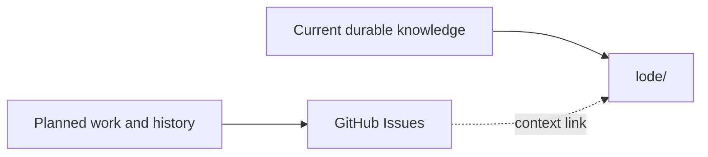

# Agent guidance

## Work tracking

GitHub Issues in [`anpurnama11/my-f1-companion-app`](https://github.com/anpurnama11/my-f1-companion-app/issues)
is the canonical source for planned work, status, blockers, and implementation
history. Use native sub-issues and blocked-by relationships where applicable.

Do not create local Markdown trackers under `lode/plans/` or
`lode/wayfinder/`. The Lode stores current durable knowledge only: terminology,
practices, specifications, focused domain documentation, and load-bearing ADRs.
Link durable Lode documents to GitHub Issues when historical context matters.

