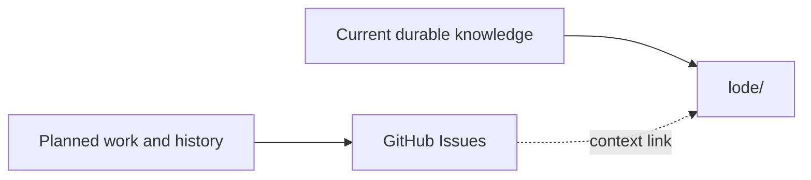

# Agent guidance

## Work tracking

GitHub Issues in [`anpurnama11/my-f1-companion-app`](https://github.com/anpurnama11/my-f1-companion-app/issues)
is the canonical source for planned work, status, blockers, and implementation
history. Use native sub-issues and blocked-by relationships where applicable.

Do not create local Markdown trackers under `lode/plans/` or
`lode/wayfinder/`. The Lode stores current durable knowledge only: terminology,
practices, specifications, focused domain documentation, and load-bearing ADRs.
Link durable Lode documents to GitHub Issues when historical context matters.

## Subagent delegation

When a skill directs you to spawn or delegate work to a subagent, use Herdr as
the delegation mechanism. Create a sibling pane with `herdr_layout`, start the
agent in that pane with `herdr_agent`, and use `herdr_agent` to prompt, wait for,
and read its result. Keep the pane available for follow-up prompts.

### Ephemeral subagents

For throwaway or short-lived subagents (investigations, one-off lookups, transient tasks), pass `--no-session` in `agentArgs` to prevent the subagent from writing a persistent `.jsonl` session file. The output still flows through Herdr into the parent session. Use this when the findings do not need to be recalled independently later.

### Subagent model routing

Choose the Herdr subagent model by workload:

- Cheap exploration and bounded factual work:
  `opencode-go/deepseek-v4-flash`
- Capable implementation, review, and image-input work:
  `opencode-go/minimax-m3`
- Heavy reasoning and difficult implementation:
  `openai-codex/gpt-5.6-sol`

Start with the cheapest model suited to the task. Escalate when it is blocked,
produces incomplete findings, or the task requires deeper reasoning.
