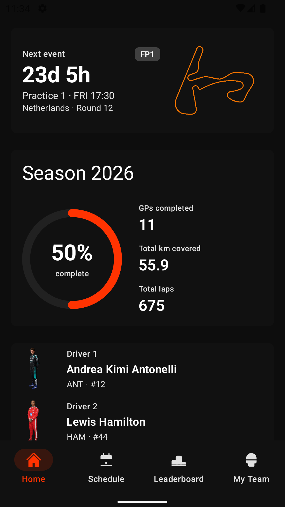
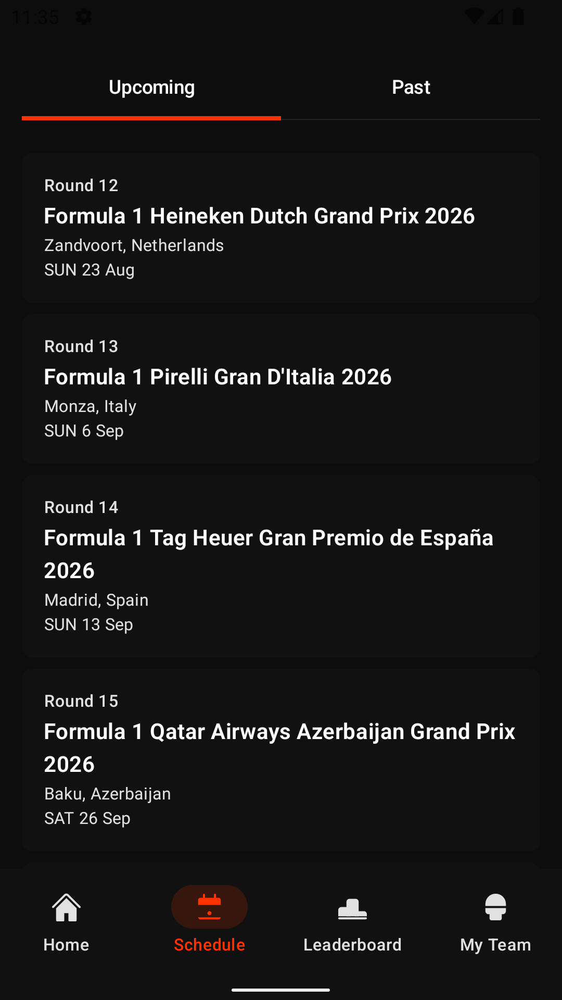
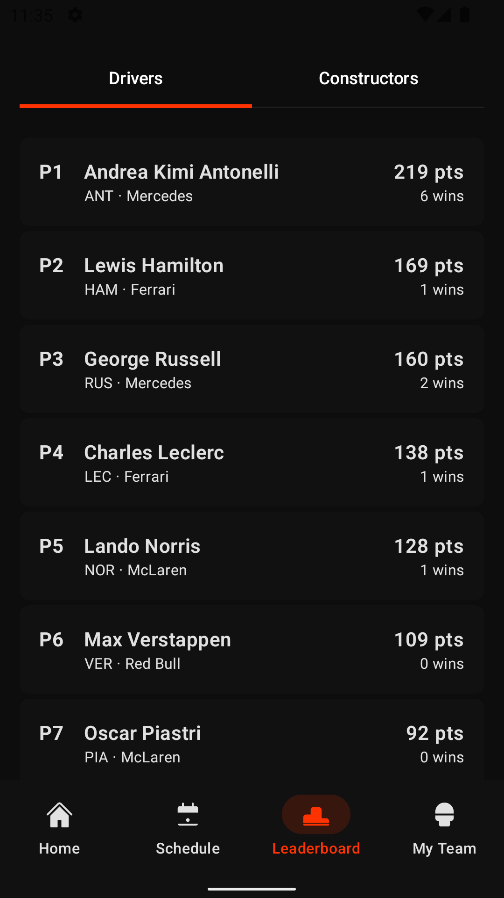

# F1app

A dark-first Android Formula 1 companion for checking the next session, browsing race weekends and results, and following championship standings. Its home-screen countdown widget keeps the next event visible without opening the app.

> [!NOTE]
> F1app is a personal open-source project under active development. It is not affiliated with Formula 1, the FIA, or any Formula 1 team.

## Screenshots

<p align="center">
  
  
  
</p>

## Features

- Next-session countdown with local start times
- Glance home-screen widget with countdown, live, completed, and off-season states
- Upcoming and past round schedules
- Race, qualifying, sprint, sprint qualifying, and practice results
- Driver and constructor championship standings
- Driver, constructor, circuit, and round details
- Two favorite drivers and one favorite constructor
- Offline-friendly snapshots that keep the last successful response visible
- Widget deep links into round details

## Technology

- Kotlin and Jetpack Compose
- Material 3 dark theme
- Navigation 3 with a back stack per top-level tab
- Ktor and kotlinx.serialization
- DataStore for favorites, widget state, and cached snapshots
- WorkManager for background refresh
- Jetpack Glance for the countdown widget
- Coil for remote imagery

The project currently uses a single `:app` module, manual dependency wiring, and MVVM. Domain and data code under `f1/` remains free of Android framework imports to preserve a future Kotlin Multiplatform extraction path.

## Data sources

F1app uses public data and media from several sources:

- [f1api.dev](https://f1api.dev/) for schedules, catalogs, and circuit metadata
- [Jolpica F1](https://jolpi.ca/) for standings and session results
- [F1DB](https://github.com/f1db/f1db) for bundled circuit artwork and reference data
- Wikipedia REST API for selected biography and team summaries
- Formula 1's public Cloudinary media paths for driver and constructor imagery

See [THIRD_PARTY_NOTICES.md](THIRD_PARTY_NOTICES.md) for attribution and usage notes. Availability and accuracy depend on these upstream services.

## Requirements

- Android Studio with Android SDK 37
- JDK 21 for the Gradle daemon toolchain
- An emulator or device running Android 7.0 (API 24) or newer

No API keys are required.

## Build and run

Clone the repository and build the debug APK:

```bash
git clone https://github.com/anpurnama/F1app.git
cd F1app
./gradlew assembleDebug
```

The APK is written to:

```text
app/build/outputs/apk/debug/app-debug.apk
```

You can also open the project in Android Studio and run the `app` configuration.

## Tests

Run JVM unit tests:

```bash
./gradlew testDebugUnitTest
```

Run connected Android tests with an emulator or device available:

```bash
./gradlew connectedDebugAndroidTest
```

## Release signing

Debug builds require no signing setup. Release builds read signing credentials from an ignored root-level `keystore.properties` file; private signing material must never be committed.

## Privacy

F1app has no accounts, analytics, advertising, or telemetry. Favorites and cached responses stay on the device. The app connects to the data and media providers listed above, which may process network metadata according to their own policies.

## Trademark notice

Formula 1, F1, team names, driver names, event names, and related marks belong to their respective owners. This project is unofficial and is not endorsed by or associated with Formula 1, the FIA, Formula One Licensing B.V., or any team.

## License

F1app's source code is available under the [MIT License](LICENSE). Third-party data, artwork, trademarks, and media remain subject to their respective owners' terms and are not relicensed by this repository.
