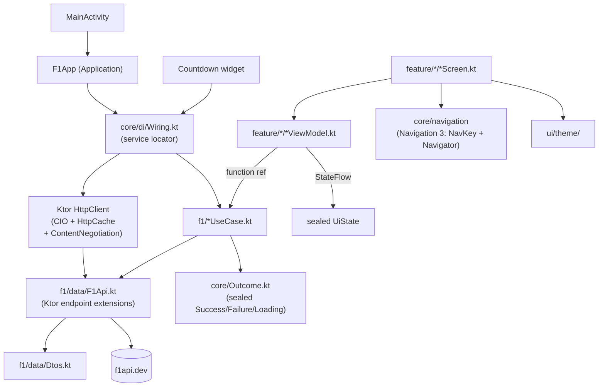

# Architecture

Single `:app` module. Mirrors `PokemonDataViewer`'s shape, with one deliberate divergence:
Ktor Client replaces Retrofit+OkHttp so the domain network layer ports to a future KMP
`:shared` module.

## Decisions

- **Module:** single `:app`. No multi-module pre-split — YAGNI given the scoped build.
  A KMP `:shared` module extraction is *planned* (not started); deferred until KMP is
  greenlit. The domain-purity invariant makes that a move, not a refactor.
- **DI:** manual `Wiring(context)` on a custom `Application`, exposed as `app.wiring`.
  ViewModels via `viewModelFactory { initializer { ... } }`. The widget shares the same
  instance → one service locator, one pattern, no second registry. No Hilt.
- **Architecture:** MVVM. `ViewModel` + sealed `UiState` + `StateFlow`. State derived
  via `combine` of small atoms + `stateIn(WhileSubscribed(5_000))`. **Init-less**:
  first load fires from `Flow.onStart { load() }`, not `init {}`. Re-fires on resume.
  See [../practices.md](../practices.md).
- **Domain seam:** UseCase classes. ViewModels take them as function references
  (`useCase::invoke`); no direct repository access from UI.
- **Result type:** sealed `Outcome<T>` at `core/Outcome.kt`.
- **Navigation:** Jetpack Navigation 3 — `@Serializable` route objects implementing
  `NavKey`, custom `Navigator` + `NavigationState`. Routes:
  `Dashboard` (start), `DriverDetail(id)`, `TeamDetail(id)`, `RoundDetail(year, round)`.
  Navigation is Android-UI-layer; rewrites to SwiftUI nav if/when KMP happens.
- **Network:** Ktor Client, **CIO engine** (KMP-safe, ports to every target
  unchanged). `ContentNegotiation` (`kotlinx.serialization` JSON) + `HttpCache` plugin
  (native HTTP response caching — the same "no Room" cache strategy documented in
  ticket 03's lean). One `HttpClient` instance held by `Wiring`.
- **Why Ktor, not Retrofit:** Retrofit's `@GET`-style API interfaces are JVM-tied and
  do not move into a KMP `commonMain` source set cheaply. Ktor endpoints are plain
  `suspend fun HttpClient.getNextRace(): NextRaceDto = get("...").body()` in pure
  Kotlin → the API definition *itself* satisfies the domain-purity invariant and ports
  for free.

## Domain-purity invariant (hard)

`f1/` — domain models, DTOs, repository interface, use cases, and the Ktor `HttpClient`
API extensions — **must contain zero `android.*` imports**. Platform concerns
(`Context`, `android.util.Log`, dispatchers) are injected as interfaces from `core/`.

This is the cost-free hedge for a future KMP port: `f1/` becomes the `:shared`
module's `commonMain` with zero edits. Violations (e.g. an `android.util.Log` import
in a use case, as PokeDV had in `ToggleIsFavoriteUseCase`) must move behind an
injected logger interface.

## KMP plan (deferred, not started)

- **Module:** extract `:shared` (KMP, `commonMain` contains today's `f1/` package)
  + `:app` (Android, depends on `:shared`) + `:ios` (SwiftUI app, depends on `:shared`).
  One `include(":shared")` + a `git mv` — cheap, deferred.
- **Network:** already Ktor/CIO → no swap.
- **UI:** Compose/ViewModel/Navigation 3 are Android-UI-layer and will be rewritten as
  SwiftUI at port time. That rewrite is inherent to "learn SwiftUI" and not avoided by
  any present-day choice.
- **DI:** `Wiring` stays Android-side; reimplemented trivially in Swift if the iOS
  target needs its own composition root.

## Not in scope of this ticket

- **Room vs HTTP-cache storage** — ticket 03. Current lean: **no Room** (F1app is
  read-only; no favorites/local writes like PokeDV had). `HttpCache` plugin with a long
  `max-stale` window + pull-to-refresh handles offline cold launch and the widget's
  background refresh. One `DataStore` key for the widget's cached next-race timestamp.
- **API scope** (f1api.dev only vs + OpenF1 enrichments) — ticket 04.
- **Widget tech** (Glance vs RemoteViews) — ticket 06.
- **Countdown specifics** — ticket 07.
