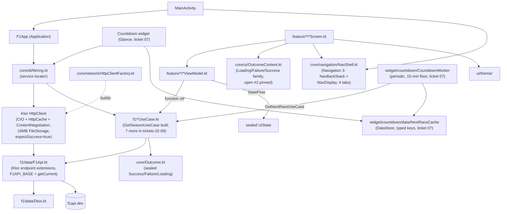

# Architecture

> **STATUS: FOUNDATION SLICE BUILT end-to-end.** The full ticket 01 slice has landed
> via TDD: `core/Outcome.kt`, the pure-Kotlin `f1/` domain package (`F1Api.kt` with
> `F1API_BASE` + `getCurrent(forceRefresh)`; DTOs; `Season` model; `GetSeasonUseCase`
> with `internal SeasonResponseDto.toSeason()` pre-computing aggregates), the
> composition root (`F1App` + `Wiring` + `HttpClientFactory` with the single Ktor
> `HttpClient`), the Navigation 3 4-tab shell (`Routes` + `NavShell` +
> `NavigationBar` + `NavDisplay` on the 1.1.4 `NavBackStack` surface), the shared
> `OutcomeContent` composable family (pinned for open #2), and
> `feature/homepage/HomepageScreen.kt` rendering §2 inside a `PullToRefreshBox` that
> calls `viewModel.refresh()`. 24 JVM unit tests green; debug + release APKs both
> assemble (release = R8-minified, lint-vital clean). The diagrams and package
> layout below describe the system as it is now; later slices extend it.

> The built `HttpClientFactory` sets `expectSuccess = true`; the use case's 4xx/5xx
> catch branches depend on it. Tests on the production client path set the same flag
> on their `MockEngine` clients.

Single `:app` module. Mirrors `PokemonDataViewer`'s shape, with one deliberate divergence:
Ktor Client replaces Retrofit+OkHttp so the domain network layer ports to a future KMP
`:shared` module.

## Decisions

- **Module:** single `:app`. No multi-module pre-split — YAGNI given the scoped build.
  A KMP `:shared` module extraction is *planned* (not started); deferred until KMP is
  greenlit. The domain-purity invariant makes that a move, not a refactor.
- **DI:** manual `Wiring(context)` on a custom `Application`, exposed as `app.wiring`.
  Low-level use cases/cache repositories are private lazy properties on `Wiring`;
  screens request feature-level factory methods such as
  `wiring.homepageViewModelFactory()` instead of assembling factories from
  individual fields. ViewModels still receive narrow function refs/Flows, never
  `Wiring`. The widget shares the same instance → one service locator, one pattern,
  no second registry. Manual `Wiring` only.
- **Architecture:** MVVM. `ViewModel` + sealed `UiState` + `StateFlow`. State derived
  via `combine` of small atoms + `stateIn(WhileSubscribed(5_000))`. **Init-less**:
  first load fires from `Flow.onStart { load() }`, not `init {}`. Re-fires on resume.
  See [../practices.md](../practices.md).
- **Domain seam:** UseCase classes. ViewModels take them as function references
  (`useCase::invoke`); no direct repository access from UI.
- **Result type:** sealed `Outcome<T>` at `core/Outcome.kt`.
- **Navigation:** Jetpack Navigation 3 — `@Serializable` route objects implementing
  `NavKey`, custom `Navigator` + `NavigationState`. Three top-level nav routes:
  `Homepage` (start), `Schedule`, `Leaderboard`; detail routes `DriverDetail(driverId)`,
  `TeamDetail(teamId)`, `RoundDetail(year, round)`, `CircuitDetail(circuitId)`.
  Leaderboard/Schedule rows open detail; `RoundDetail`'s circuit block opens
  `CircuitDetail` (the home for the top-speed + most-wins-at-circuit stats).
  Homepage §3's nearest-GP card also opens `CircuitDetail`. Navigation is
  Android-UI-layer; rewrites to SwiftUI nav if/when KMP happens.
  **Deep link** (ticket 05): Countdown widget builds a `PendingIntent` over
  `Intent.ACTION_VIEW` with data `f1app://round/{year}/{round}` (args from
  `NextRaceCache`); `MainActivity` parses the URI into a `RoundDetail` nav key
  and pushes it on Homepage as backstack root. Custom scheme only — no App
  Links / `autoVerify` (single-app, no public web domain).
- **System bars:** `MainActivity` calls `enableEdgeToEdge()`. Its `NavigationBar`
  needs contrast enforcement disabled to retain the dark bottom-bar surface, but
  `Window.isNavigationBarContrastEnforced` exists only from API 29; the call is
  guarded by `Build.VERSION.SDK_INT >= Build.VERSION_CODES.Q` for the app's API-24
  minimum. Earlier Android versions still receive edge-to-edge without that override.
- **Network:** Ktor Client, **CIO engine** (KMP-safe, ports to every target
  unchanged). `ContentNegotiation` (`kotlinx.serialization` JSON) + `HttpCache` plugin
  (native HTTP response caching — ~10MB file cache, `max-stale` tolerance for offline
  cold launch, `CacheControl.NO_CACHE` per request for pull-to-refresh).
  `Logging` plugin at `LogLevel.BODY` (method+URL+headers+body) via a custom `Logger` →
  `Log.i("F1api", ...)` — Ktor equivalent of OkHttp `HttpLoggingInterceptor.BODY`;
  `ponytail:` no redaction, fine while every source is public race data, downgrade
  before wiring an authenticated source. One
  `HttpClient` instance held by `Wiring`; `const val F1API_BASE = "https://f1api.dev/api"`
  in `f1/data/F1Api.kt`, full URLs per request (no default base URL — second source
  adds its own base const later). `ponytail:` fallback flagged in `HttpClientFactory`
  if f1api.dev sends no cache headers — confirm at build time, add a default response
  lifetime via plugin config or a thin in-memory TTL.
- **Why Ktor, not Retrofit:** Retrofit's `@GET`-style API interfaces are JVM-tied and
  do not move into a KMP `commonMain` source set cheaply. Ktor endpoints are plain
  `suspend fun HttpClient.getNextRace(): NextRaceDto = get("...").body()` in pure
  Kotlin → the API definition *itself* satisfies the domain-purity invariant and ports
  for free.

## Domain-purity invariant (hard)

`f1/` — domain models, DTOs, repository interface, use cases, and the Ktor `HttpClient`
API extensions — **must contain zero `android.*` imports**. Platform concerns
(`Context`, `android.util.Log`, dispatchers) are injected as interfaces from `core/`.

This is the cost-free hedge for a future KMP port: `f1/` becomes the `:shared`
module's `commonMain` with zero edits. Violations (e.g. an `android.util.Log` import
in a use case, as PokeDV had in `ToggleIsFavoriteUseCase`) must move behind an
injected logger interface.

## KMP plan (deferred, not started)

- **Module:** extract `:shared` (KMP, `commonMain` contains today's `f1/` package)
  + `:app` (Android, depends on `:shared`) + `:ios` (SwiftUI app, depends on `:shared`).
  One `include(":shared")` + a `git mv` — cheap, deferred.
- **Network:** already Ktor/CIO → no swap.
- **UI:** Compose/ViewModel/Navigation 3 are Android-UI-layer and will be rewritten as
  SwiftUI at port time. That rewrite is inherent to "learn SwiftUI" and not avoided by
  any present-day choice.
- **DI:** `Wiring` stays Android-side; reimplemented trivially in Swift if the iOS
  target needs its own composition root.

## Not in scope of this ticket

- **Data layer & widget refresh** — **decided (ticket 03 design-locked, not built).** Single-source
  f1api.dev, no `F1Repository` class (`f1/data/F1Api.kt` = Ktor endpoint extensions);
  eight screen-driven use cases compose + map DTO→model; HttpCache + NO_CACHE
  pull-to-refresh (DataStore + HttpCache; WorkManager reserved for widget refresh only);
  one periodic `CountdownWorker`
  (15-min WorkManager floor, network constraint, failure leaves cached value) →
  `GetNextRaceUseCase` → typed DataStore keys in `NextRaceCache` (no JSON blob).
  Three data gaps not served by f1api.dev parked as research tickets 08/09/10; none
  reopen ticket 04.
- **API scope** — **decided (ticket 04 design-locked, not built): multi-source.** One `HttpClient` in
  `Wiring`, three base URL consts (`F1API_BASE`, `JOLPICA_BASE`, `OPENF1_BASE`),
  per-request full URLs, no separate package per source. f1api.dev primary;
  OpenF1 for top speed (`/v1/laps` `st_speed`); jolpica for all-time
  most-wins-at-circuit. 11 use cases (8 original + top-speed + most-wins + podium).
  OpenF1 enrichment (headshot, weather, race-control flags) parks as a bounded
  follow-up — the `session_key` plumbing is contractually scoped by 04+11, so landing
  them is cheaper once 04 is built, but shipping is a separate prioritization.
- **Navigation & deep links** — **built (revision 2, multi-backstack).** Navigation 3 with 7 flat
  `NavKey` routes: `Homepage` (start), `Schedule`, `Leaderboard`, `DriverDetail(driverId)`,
  `TeamDetail(teamId)`, `RoundDetail(year, round)`, `CircuitDetail(circuitId)`.
  Multi-backstack: each tab has its own persistent `NavBackStack`; switching tabs does not
  destroy ViewModel state. Entry decorators (`rememberSaveableStateHolderNavEntryDecorator` +
  `rememberViewModelStoreNavEntryDecorator`) scope composable state and ViewModels per entry.
  `Navigator` dispatches tab switches vs within-stack pushes. Exit-through-home: Homepage entries
  always rendered; back on another tab's root returns to Homepage.
  Countdown widget deep-links to `RoundDetail` via custom scheme
  `f1app://round/{year}/{round}` (`PendingIntent` from `NextRaceCache` args);
  `MainActivity` parses the URI, pushes `RoundDetail` onto Homepage backstack.
  Single-app custom scheme.
- **Widget tech** — **decided (ticket 06 closed): Jetpack Glance.** Countdown widget subclasses `GlanceAppWidget`; `provideGlance` reads `NextRaceCache` via `Wiring` and renders `@Composable` content. `CountdownWorker` calls `CountdownWidget().updateAll(context)` after a successful cache write. The deep-link `PendingIntent` (ticket 05) attaches via Glance `clickable(actionStartActivity(intent))` over `Intent.ACTION_VIEW` with `f1app://round/{year}/{round}`. Colors imported directly from `ui/theme/Color.kt` (`Surface`/`OnSurface`/`Circuits.forId`) — Glance does not consume Compose `MaterialTheme`. `AndroidRemoteViews` interop is the escape hatch if a Glance API gap is hit at build time. RemoteViews is not the choice.
- **Countdown specifics** (1s tick, live/finished display) — ticket 07.
