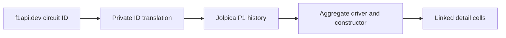

# Most wins at a circuit

Circuit Detail obtains all-time driver and constructor win leaders from Jolpica
`/circuits/{id}/results/1.json`. The endpoint returns one P1 row per Round, so
the app computes both leaders locally in O(n), where n is at most the circuit's
race count. Canonical Ergast IDs allow direct `DriverDetail` and `TeamDetail`
links, unlike names-only alternatives.

## Contract

```kotlin
val winners = dto.mrData.raceTable.races.map { it.results.single() }
val driver = winners.groupingBy { it.driver.driverId }.eachCount()
    .maxBy { it.value }
val constructor = winners.groupingBy { it.constructor.constructorId }.eachCount()
    .maxBy { it.value }
```

- Render both constructor and driver leaders; neither is optional by design.
- Use only the P1 endpoint, not the full-grid `/results.json` endpoint.
- Translate the five f1api.dev/Jolpica circuit-ID differences privately at the
  adapter boundary; the public domain ID remains the f1api.dev ID.
- A failed enrichment does not blank other Circuit Detail sections.
- Ktor `HttpCache` absorbs reopens; user refresh bypasses it with `NO_CACHE`.



## Rationale

Jolpica is one request, carries canonical IDs, and covers full F1 history.
OpenF1 covers only recent seasons. Names-only sources cannot reliably link
retired winners. Fetching every f1api.dev Round would require many requests for
the same answer.

## Related

- [Network sources](../core/network.md)
- [Circuit Detail screen contract](../specs/screens.md)
- [Race-result source ADR](../decisions/0005-session-results-use-two-apis.md)
- [Research decision issue](https://github.com/anpurnama11/my-f1-companion-app/issues/39)
