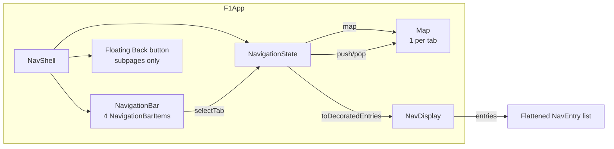

# Navigation 3 — multi-backstack shell

The app's top-level navigation shape. Built with Jetpack Navigation 3
(`androidx.navigation3:navigation3-runtime:1.1.4` + `navigation3-ui:1.1.4` +
`lifecycle-viewmodel-navigation3:2.11.0`).
Source files:
`app/src/main/java/com/anpurnama/f1_app/core/navigation/{Routes,NavShell,NavigationState}.kt`.

## Topology



Each tab has its own persistent [NavBackStack] that is never cleared on tab
switch. ViewModels and composable state survive across tab switches via
decorators.

## Routes

`sealed interface Route : NavKey` in `Routes.kt`. Each route is `@Serializable`.
Top-level tabs are `data object`s; detail routes (when they land) are `data class`es
with parameters that the deserializer reads from `data` on the intent / deeplink.

| Route | Type | Content this slice | Lands |
|---|---|---|---|
| `Route.Homepage` | `data object` | `HomepageScreen` (real, §2 aggregates) | [BUILT] |
| `Route.Schedule` | `data object` | `PlaceholderScreen("Schedule")` | [BUILT] placeholder |
| `Route.Leaderboard` | `data object` | `LeaderboardScreen` | [BUILT] ticket 04 |
| `Route.MyTeam` | `data object` | `PlaceholderScreen("My Team")` | [BUILT] placeholder |
| `Route.DriverDetail(driverId)` | `data class` | `DriverScreen` | [BUILT] ticket 04 |
| `Route.TeamDetail(teamId)` | `data class` | `TeamScreen` | [BUILT] ticket 04 |
| `Route.RoundDetail(year, round)` | `data class` | — | ticket 03 |
| `Route.CircuitDetail(circuitId)` | `data class` | `CircuitScreen` | [BUILT] ticket 06 |

## Nav 3 1.1.4 surface used

- `NavBackStack<T : NavKey>` — `MutableList<T>` backed by `SnapshotStateList<T>` so
  updates auto-recompose. The Android-only `rememberNavBackStack(vararg elements)`
  reflection serializer is used (no `SavedStateConfiguration` needed).
- `NavDisplay(backStack, modifier, onBack, entryProvider = entryProvider { ... })`
  — the 1.1.4 signature, not the older `NavigationState` API. `onBack` pops one
  entry when the back stack has more than one element.
- `entryProvider { entry<Route.Homepage> { HomepageScreen() } }` — reified `entry<T>`
  matches by `K::class`. For `data object` routes the KClass is the singleton
  type; the `content` lambda receives the deserialized instance.

## Multi-backstack approach (revision 2)

**Problem (revision 1):** `backStack.clear()` on tab switch destroyed the
Nav3 entry, which destroyed the entry's ViewModelStoreOwner. Each tab switch
caused a full data re-fetch because ViewModels were recreated from scratch.

**Fix (revision 2):** Replace the single shared [NavBackStack] with one
persistent stack per top-level tab. Switching tabs only changes which stack
`NavDisplay` renders — the inactive stacks stay alive with their ViewModels.

### Key classes

- **[NavigationState]** — holds `Map<Route, NavBackStack<NavKey>>` (one per tab)
  + the currently-active tab. Created by `rememberNavigationState()`.
- **[Navigator]** — thin wrapper dispatching `navigate(route)`: if `route` is a
  top-level tab key, switches tabs; otherwise pushes onto the current stack.
- **View lifecycle:** each tab's entries get their own
  `rememberSaveableStateHolderNavEntryDecorator` + `rememberViewModelStoreNavEntryDecorator`,
  scoping ViewModels and composable state per-entry per-tab.

### Tab switching

A tap on a different tab calls `navigationState.selectTab(route)`, which just
updates the `currentRoute` property. `NavDisplay` recomposes to show the
active stack's entries. The inactive stack's entries remain in their
`NavBackStack` with full ViewModel state.

```kotlin
NavigationBarItem(
    selected = navigationState.currentRoute == dest.route,
    onClick = { navigationState.selectTab(dest.route) },
)
```

### Exit-through-home

`Route.Homepage` is the start route — its entries are always in the rendered
list (for exit-through-home). Back behavior:
- **On Homepage root + back** → `pop()` returns `false` → the system exits the app.
- **On a non-start tab root + back** → `pop()` switches back to Homepage.
- **Any tab with a detail route pushed + back** → pops within that tab's stack.

### Subpage back affordance

Subpages get one shared visual back affordance in `NavShell`, not separate
per-screen top bars. A parent `nestedScroll` observer tracks when the active
page content has moved upward; `navigationState.canPopCurrentStack()` plus a
small scroll threshold shows a floating 48dp circular `BleedingBackButton` only
after the page has scrolled. Tapping it calls the same `navigator.goBack()` path
as system Back, so visual back and predictive/system back cannot diverge.

```kotlin
if (navigationState.canPopCurrentStack() && subpageScrollDistance > 24f) {
    BleedingBackButton(onClick = { navigator.goBack() })
}
```

The scroll distance resets when the active route changes. The button is placed
with `statusBarsPadding()` so it is tappable below status icons, while the page
content still draws behind the status bar.

## `MainActivity`

`MainActivity` is 14 lines:

```kotlin
class MainActivity : ComponentActivity() {
    override fun onCreate(savedInstanceState: Bundle?) {
        super.onCreate(savedInstanceState)
        enableEdgeToEdge()
        setContent { F1appTheme { NavShell() } }
    }
}
```

The manifest declares `android:name=".F1App"` so `LocalContext.current.applicationContext as F1App`
is safe; `HomepageScreen` reads `F1App.wiring.getSeason` from there via
`homepageViewModelFactory(getSeason)`.

## Inset contract (ADR 0008)

`enableEdgeToEdge()` makes the app window draw under the system bars
(mandatory on target SDK 36+). `NavShell` sets
`Scaffold(contentWindowInsets = WindowInsets(0.dp))` so Scaffold never adds a
top safe inset. The bottom bar still contributes its own height through
`innerPadding`.

- **Bottom safe:** `NavDisplay` consumes Scaffold `innerPadding`, which comes
  from the M3 `NavigationBar` in the `bottomBar` slot. The bar handles its own
  navigation-bar inset internally.
- **Top safe at rest, scroll-under bleed:** `NavShell` still does not apply a
  fixed top inset. Scrollable screens add the status-bar inset inside their
  scroll content (`verticalScroll(...).statusBarsPadding()` or a LazyColumn
  top spacer), so first content starts below status icons but can pass behind
  them once the user scrolls up. See
  [lode/decisions/0008-screen-inset-bottom-only-top-bleeds.md](../decisions/0008-screen-inset-bottom-only-top-bleeds.md).
- **Subpage back:** the floating back button pads itself away from status
  icons with `statusBarsPadding()`; it does not force the whole screen below
  the status bar.

`enableEdgeToEdge()` from `ComponentActivity` (not `WindowCompat`)
auto-handles status-bar icon contrast, so the dark `surfaceContainer`
background is safe behind light icons.

## Stand-in icons (ponytail)

`NavigationBarItem.icon` takes a single uppercase letter glyph
(`H` / `S` / `L` / `M`) until the `material-icons-extended` dependency lands.
Real Material vectors swap in when the first screen gets a real icon.

## Out of scope this slice

- Predictive back gestures (Navigation 3 supports them via the default
  `predictivePopTransitionSpec`; no override is needed for the 4-tab shape).
- Custom per-route transition specs (default M3 forward/back fade).
- Deep-link handling (`Intent.ACTION_VIEW` with `f1app://round/...` lands
  in ticket 05 alongside the `RoundDetail` route).
- `SceneStrategy` chains — single-pane is the default and the only scene.

## `decorator order is load-bearing

The doc shows `rememberSaveableStateHolderNavEntryDecorator()` **before**
`rememberViewModelStoreNavEntryDecorator()`. Preserve that order — the
saveable-state holder must wrap the VM store so `SavedStateHandle`/UI state
survives process death.
