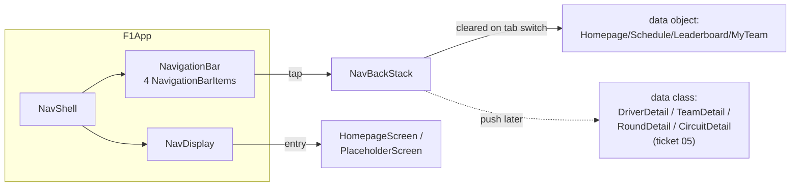

# Navigation 3 — 4-tab shell

The app's top-level navigation shape. Built with Jetpack Navigation 3
(`androidx.navigation3:navigation3-runtime:1.1.4` + `navigation3-ui:1.1.4`).
Source files: `app/src/main/java/com/anpurnama/f1_app/core/navigation/{Routes,NavShell}.kt`.

## Topology



## Routes

`sealed interface Route : NavKey` in `Routes.kt`. Each route is `@Serializable`.
Top-level tabs are `data object`s; detail routes (when they land) are `data class`es
with parameters that the deserializer reads from `data` on the intent / deeplink.

| Route | Type | Content this slice | Lands |
|---|---|---|---|
| `Route.Homepage` | `data object` | `HomepageScreen` (real, §2 aggregates) | [BUILT] |
| `Route.Schedule` | `data object` | `PlaceholderScreen("Schedule")` | [BUILT] placeholder |
| `Route.Leaderboard` | `data object` | `PlaceholderScreen("Leaderboard")` | [BUILT] placeholder |
| `Route.MyTeam` | `data object` | `PlaceholderScreen("My Team")` | [BUILT] placeholder |
| `Route.DriverDetail(driverId)` | `data class` | — | ticket 04 (with standings) |
| `Route.TeamDetail(teamId)` | `data class` | — | ticket 04 |
| `Route.RoundDetail(year, round)` | `data class` | — | ticket 03 |
| `Route.CircuitDetail(circuitId)` | `data class` | — | ticket 06 |

## Nav 3 1.1.4 surface used

- `NavBackStack<T : NavKey>` — `MutableList<T>` backed by `SnapshotStateList<T>` so
  updates auto-recompose. The Android-only `rememberNavBackStack(vararg elements)`
  reflection serializer is used (no `SavedStateConfiguration` needed).
- `NavDisplay(backStack, modifier, onBack, entryProvider = entryProvider { ... })`
  — the 1.1.4 signature, not the older `NavigationState` API. `onBack` pops one
  entry when the back stack has more than one element.
- `entryProvider { entry<Route.Homepage> { HomepageScreen() } }` — reified `entry<T>`
  matches by `K::class`. For `data object` routes the KClass is the singleton
  type; the `content` lambda receives the deserialized instance.

## Bottom-bar contract

A tap on the currently-selected tab is a no-op. A tap on a different tab
clears the back stack and pushes the new top-level route. Detail routes
(when they exist) push on top of the back stack without clearing it, so
system back from a detail returns to the parent tab.

```kotlin
if (current != dest.route) {
    backStack.clear()
    backStack.add(dest.route)
}
```

## `MainActivity`

`MainActivity` is 14 lines:

```kotlin
class MainActivity : ComponentActivity() {
    override fun onCreate(savedInstanceState: Bundle?) {
        super.onCreate(savedInstanceState)
        enableEdgeToEdge()
        setContent { F1appTheme { NavShell() } }
    }
}
```

The manifest declares `android:name=".F1App"` so `LocalContext.current.applicationContext as F1App`
is safe; `HomepageScreen` reads `F1App.wiring.getSeason` from there via
`homepageViewModelFactory(getSeason)`.

## Stand-in icons (ponytail)

`NavigationBarItem.icon` takes a single uppercase letter glyph
(`H` / `S` / `L` / `M`) until the `material-icons-extended` dependency lands.
Real Material vectors swap in when the first screen gets a real icon.

## Out of scope this slice

- Predictive back gestures (Navigation 3 supports them via the default
  `predictivePopTransitionSpec`; no override is needed for the 4-tab shape).
- Custom per-route transition specs (default M3 forward/back fade).
- Deep-link handling (`Intent.ACTION_VIEW` with `f1app://round/...` lands
  in ticket 05 alongside the `RoundDetail` route).
- `SceneStrategy` chains — single-pane is the default and the only scene.
