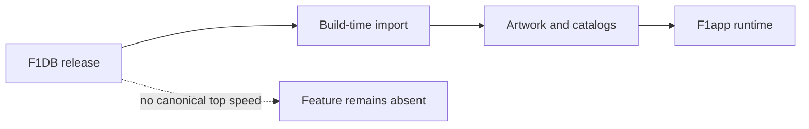

# F1DB coverage

F1DB is a build-time historical source, not a universal source of truth.
Revision-pinned imports currently provide circuit artwork and detail-page
catalogs; future Driver of the Day and historical fastest-lap features may use
its race data.

| Data | Guidance |
|---|---|
| Circuit artwork | Import SVG to transparent local WebP; unknown IDs use a neutral placeholder |
| Driver of the Day | Vote result, not finishing position; missing old races are valid |
| Fastest lap | Keep session context; never call it an all-time circuit record without aggregation |
| Top speed | No reliable F1DB field; absent from v1 |

```kotlin
data class DriverOfTheDay(
    val driverId: String,
    val constructorId: String?,
    val votePercentage: Double?,
)
```



## Invariants and lessons

- Keep source DTOs and ID normalization at the data boundary.
- Preserve image alpha; otherwise Compose tint colors the full square.
- Missing historical vote data is an empty state, not an error.
- Prefer a narrow imported model over shipping raw source datasets.

## Related

- [Detail-page data](f1db-detail-data.md)
- [Session-result source ADR](../decisions/0005-session-results-use-two-apis.md)
- [Circuit most-wins source](../circuit/circuit-most-wins.md)
