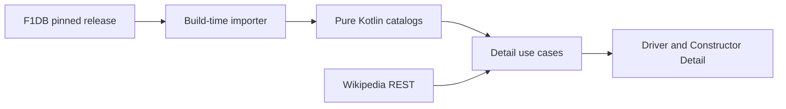

# F1DB detail-page data

F1DB release data is imported at build time for Driver Detail and Constructor
Detail facts that runtime APIs do not provide. The app does not parse F1DB or
call it at runtime. The importer pins a release and emits pure Kotlin catalogs.

## Source contract

| Need | F1DB source |
|---|---|
| Career and per-season totals | drivers, constructors, and season JSON |
| DNFs, top-10s, first entry, first win | race-results aggregation |
| Chassis, power unit, base country | season entrants YAML joined to chassis and engine-manufacturer YAML |
| Circuit artwork | circuit SVG imported as local WebP |

Race-only statistics exclude sprint rows when the UI labels the value “Grands
Prix.” F1DB's precomputed `totalRaceEntries` includes sprint races and therefore
must not be presented under that label.

```kotlin
data class TeamSeasonalFacts(
    val chassis: String,
    val powerUnit: String,
    val baseCountry: String,
)
```

## Invariants

- F1DB identifiers are normalized at the import boundary before joining app IDs.
- Generated catalogs are never hand-edited.
- The importer is rerun for a new pinned F1DB release or season.
- Base city and team principal are intentionally absent; no scraping or manual
  map is introduced for them.
- Wikipedia REST, not F1DB, owns “About” text and requires visible CC BY-SA
  attribution plus an identifying User-Agent.
- Missing historical values are valid optional data, not runtime failures.



## Lessons

Structured build-time data avoids costly runtime historical aggregation. Labels
must still define the statistic: “Grands Prix” means race sessions only, while
F1DB's broader “entries” totals include sprints.

## Related

- [Leaderboard and detail pages](../leaderboard/summary.md)
- [Detail-page source ADR](../decisions/0012-gap-f-detail-page-data-sources.md)
- [Circuit artwork and additional coverage](f1db-coverage.md)
- [Research decision issue](https://github.com/anpurnama11/my-f1-companion-app/issues/56)
