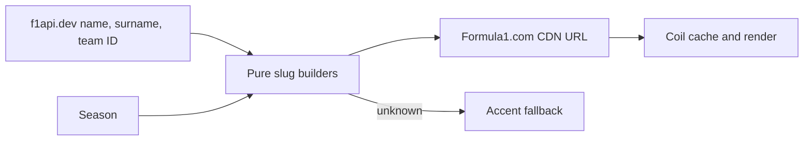

# Formula1.com imagery

F1app builds season-stable driver and car image URLs locally and loads them with
Coil. Formula1.com's CDN is the canonical image host; no runtime manifest,
OpenF1 join, or third-party image API is used.

## Car and team assets

- 2026+: Cloudinary
  `common/f1/{year}/{team}/{year}{team}car{left|right}.webp`.
- 2023–2025: legacy AEM PNGs with an explicit per-year slug map because
  rebrands use inconsistent casing and punctuation.
- Cloudinary team slugs use f1api.dev IDs through a small adapter map; notably
  `rb → racingbulls` and `red_bull → redbullracing`.
- Unknown team/year combinations return `null` and render the team accent.

## Driver portraits

The 2026+ path requires a derived `driverRef`:

```kotlin
fun driverRef(name: String, surname: String): String =
    (normalizeNfkd(name).take(3) +
        normalizeNfkd(surname.substringAfterLast(' ')).take(3) +
        "01").lowercase()
```

Normalization strips combining marks before truncation. Thus Pérez becomes
`serper01`; a multi-word surname uses its last token. The rule was verified for
all 22 drivers and 11 teams on the 2026 grid. Car number is not part of the ref.
Years before 2026 return `null` for driver portraits.



## Invariants and risks

- Keep the Cloudinary version segment as part of the URL; do not rotate it as a
  client cache buster.
- The `01` portrait suffix is a current-season assumption and must be rechecked
  for a new season.
- Do not derive legacy AEM slugs; use the verified map.
- Do not use Getty event photography; rights and URLs differ from stable team
  renders.

## Related

- [Team colors](../design-system/team-colors.md)
- [OpenF1 removal ADR](../decisions/0009-remove-openf1-runtime-dependency.md)
- [Imagery implementation issue](https://github.com/anpurnama11/my-f1-companion-app/issues/15)
