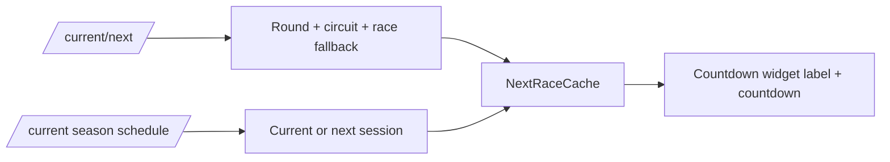

## Context

The Countdown widget originally counted only to the race session. That kept the cache
narrow, but it made the widget less useful during a race weekend: a user wants to see
whether the next F1 event is Free Practice, Qualifying, Sprint, or Race.

## Decision

The worker still fetches `/current/next` for the canonical round/deep-link data, then
uses the current season schedule to select the first session whose start has not passed
by more than the 3-hour live window. The cache stores `sessionName` plus that session's
`startMillis`; if season schedule lookup fails, it falls back to `Race` at the race start.

## Why

This trades one extra schedule dependency in the worker for a more truthful weekend
widget. The fallback preserves the old race-only behavior when the season endpoint is
missing or fails, so widget rendering and deep links remain robust.

## Reference

- `app/src/main/java/com/anpurnama/f1_app/widget/countdown/CountdownWorker.kt`
- `app/src/main/java/com/anpurnama/f1_app/widget/countdown/data/NextRaceCache.kt`
- `app/src/test/java/com/anpurnama/f1_app/widget/countdown/CountdownWorkerGateTest.kt`
