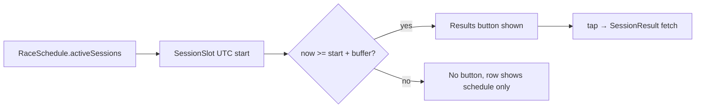

## Context

`roundMode(race, now)` decides whether RoundDetail shows `UpcomingWeekend`
or `PastResults` at **race-session** granularity. On Sunday morning of a race
weekend (e.g. Hungary GP), the race hasn't started, so the page is in
`Upcoming` mode — and `UpcomingWeekend` renders every session row with
`showAction = false`. That hides the **Results** button for FP1/FP2/FP3 (Friday)
and Qualifying (Saturday) even though those sessions already ran and f1api.dev
has their results.

The naive fix — `sessionStart <= now()` — is too eager: it shows Results the
instant a session starts, when results are not posted yet, regressing UX from
"no button" to "button that opens a blank page". Probing `/fp1`, `/qualy`,
etc. on page open to authoritatively check `results.isNotEmpty()` fires N
network calls per open — rejected.

## Decision

In `UpcomingWeekend`, show a session's **Results** button only when the
session's scheduled UTC start has passed by at least a per-session-type
buffer. The race row itself stays button-less until `roundMode` flips the
page to `Past` (unchanged). Tap reuses the existing `Route.SessionResult` →
`GetSessionResultUseCase` → `SessionResultViewModel` fetch, which already
owns empty/error handling.

Per-session buffers (within the agreed 6–12h window):

| Session | Buffer | Rationale |
|---|---|---|
| FP1 / FP2 / FP3 | 6h | Same-day sessions, results posted within ~1–2h; 6h clears any lag and any live-session window |
| SprintQuali | 6h | Sprint quali runs Friday/Saturday; short session, results land fast |
| Sprint | 6h | Sprint race is ~1h; posted within ~1–2h |
| Quali | 12h | Saturday quali → Sunday race; 12h guarantees Sunday-morning visibility without racing the API's overnight lag |

Race is **not** gated here — `roundMode` handles the race row.

The heuristic is a **pure domain helper** (`sessionResultMayBeAvailable(session, slot, now)`) living next to `roundMode`, unit-tested, not inlined in the Composable. Missing or unparseable slot (`toInstantOrNull()` null) ⇒ `false` (no button) — null-safe fallback, since `roundMode` only proves `schedule.race` is present, not that FP/quali slots are always populated.

## Why

- **Distinguishes "started" from "results likely available"** — the raw
  start-comparison conflated them; the buffer is the fix.
- **No extra fetch before tap** — schedule data is already on the page via
  `getSeason` in `RoundViewModel`. Authoritative availability is checked on
  tap by the existing fetch; the heuristic only controls affordance
  visibility.
- **6–12h is deliberately conservative** — a slightly late button (user
  waits until past the buffer) is a smaller regression than a button that
  opens a blank page before the API has posted. The asymmetry favors
  correctness over immediacy.
- **Per-session-type buffers** reflect that Qualifying → race has an
  overnight gap (12h) while same-day practices need only clear the same
  session day (6h).

## Considered options

- **Raw `start <= now`**: too eager, blank-page regression. Rejected.
- **On-open N-endpoint probe** (`/fp1`, `/qualy`, … checking non-empty):
  authoritative but too expensive and breaks the lazy-fetch pattern. Rejected.
- **Flat 2h buffer for all (advisor-suggested minimum)**: lower than the
  agreed 6–12h window; under-shoots API posting lag for quali-overnight. Not
  taken.
- **SessionResult screen is responsible for "not posted yet" copy regardless**
  — the heuristic does not replace good empty/error states on the result
  page; it only reduces how often a user hits them.

## Edge cases (accepted risks)

- **Delayed / postponed session**: start passes, session hasn't run → button
  may appear; tap shows empty result page. Accepted (matches existing fetch
  behavior; rare).
- **Cancelled session**: button may appear, API never posts → empty page.
  Accepted.
- **API posting lag beyond the buffer**: session complete, endpoint still
  empty → tap shows empty. Accepted; user can pull-to-refresh later.
- **Missing schedule slots** for the current round: null-safe ⇒ no button.
  Silent, but matches today's behavior.
- **Device clock skew**: inherits `roundMode`'s `Clock.System.now()` UTC
  comparison; no new skew surface.

## Open follow-up (not in scope here)

`roundMode` flips the page to `Past` at race **start**, not race
**completion** — so `PastResults` may expose the race Results button before
the race ends. Same over-eagerness class, different surface. Separate ticket
if pursued.

## Reference

- `app/src/main/java/com/anpurnama/f1_app/f1/model/Season.kt` — `roundMode`,
  `RaceSchedule.activeSessions`, `SessionSlot.toInstantOrNull`
- `app/src/main/java/com/anpurnama/f1_app/feature/round/RoundScreen.kt` —
  `UpcomingWeekend`, `WeekendSessionRow(showAction = …)`
- `app/src/main/java/com/anpurnama/f1_app/feature/sessionresult/SessionResultViewModel.kt`
  — existing fetch/empty/error owner