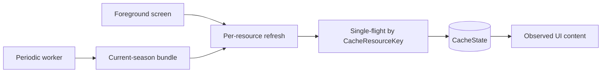

# 0017 — Offline refresh coordination uses foreground resources and background bundle

Status: accepted

## Context

The durable offline cache needs to keep visible content while refreshing from
network APIs. Screen opens should not pay for every current-season resource, but
background sync should warm the app broadly while the user is away. A single
whole-season refresh would spread failures too far; screen-only per-resource
refresh would leave too much cold until each screen opens.

## Decision

Foreground refresh is per-resource. Each screen observes the snapshot resources
it renders and refreshes only those keys when stale or pulled. Fixed periodic
background work runs a best-effort current-season bundle, but the bundle is only
orchestration: every payload still uses its own `CacheResourceKey`, metadata,
validation, single-flight gate, and failure boundary. The bundle covers
current-season structured data needed to open supported app surfaces warm
(schedule, next session, standings, catalogs, and recent/upcoming session
resources), not historical archives or remote images. `/current` schedule remains
the only atomic active-season promotion authority.

```kotlin
sealed interface RefreshReason {
    data object StaleOpen : RefreshReason
    data object PullToRefresh : RefreshReason
    data object Periodic : RefreshReason
}

interface SeasonCacheRepository {
    fun observe(key: CacheResourceKey): Flow<ResourceSnapshot?>
    suspend fun refresh(key: CacheResourceKey, reason: RefreshReason): RefreshResult
    suspend fun refreshCurrentSeasonBundle(): BundleRefreshResult
}
```



## Why

This split matches user experience and failure isolation. Opening Leaderboard
should not refresh every race result, while a background job should prepare more
than the currently visible screen. Keeping bundle writes resource-scoped prevents
one bad endpoint from blanking unrelated cached content. Sharing per-resource
single-flight gates avoids duplicate network calls when a worker and screen touch
the same key.

## Consequences

- Pull-to-refresh bypasses TTL and Ktor `HttpCache`, but still writes through the
  durable snapshot store and never clears existing content before success.
- Worker bundle results are partial: successful resource writes stand, failed
  resources update attempt metadata only.
- New-season rollover remains a special atomic transaction: validate `/current`,
  set `activeSeason`, write the schedule snapshot, and prune old season-scoped
  snapshots in one store update.

## References

- [../offline-data-cache/summary.md](../offline-data-cache/summary.md)
- [../wayfinder/offline-data-cache/tickets/03-repository-refresh-and-rollover.md](../wayfinder/offline-data-cache/tickets/03-repository-refresh-and-rollover.md)
