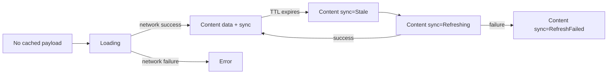

# 0018 — Cache status lives on SectionUiState.Content

Status: accepted

## Context

The offline cache makes a new UI distinction necessary: a screen may have no
payload yet, or it may have cached content while a refresh is stale, running, or
failed. The existing boundary from ADR 0002 still matters: `Outcome` is a
data-layer result and `SectionUiState` is the VM→UI transport. The choice was
whether to wrap every cached value in `CachedContent<T>(data, sync)` or add sync
metadata directly to `SectionUiState.Content`.

## Decision

Cache-aware sections use `SectionUiState.Content(data, sync)`. `Loading` and
`Error(message)` mean there is no cached payload to render. Once a payload
exists, the UI stays in `Content` and `ContentSyncStatus` carries whether that
payload is fresh, stale, refreshing, or failed to refresh.

```kotlin
sealed interface SectionUiState<out T> {
    data object Loading : SectionUiState<Nothing>
    data class Error(val message: String) : SectionUiState<Nothing>
    data class Content<T>(
        val data: T,
        val sync: ContentSyncStatus = ContentSyncStatus.Fresh,
    ) : SectionUiState<T>
}
```



## Why

This keeps screen code reading the real domain value directly (`content.data`)
instead of forcing every caller through a second `CachedContent<T>` wrapper. It
also preserves the existing shared renderer shape and allows old non-cache use
cases to migrate incrementally because `Content` defaults to `Fresh`. The cost is
that `SectionUiState` becomes cache-aware, and tests that asserted exact
`Content(data)` equality need to assert `data` and `sync` separately or include
the default `Fresh` value.

## Considered

- **Wrap data in `CachedContent<T>`.** Rejected because it pushes cache plumbing
  into every content consumer and makes simple screens unwrap `content.data.data`
  or destructure before rendering.
- **Keep cache status outside section state.** Rejected because pull-to-refresh,
  stale markers, and refresh-failed UI need to stay aligned with the exact
  payload being rendered.

