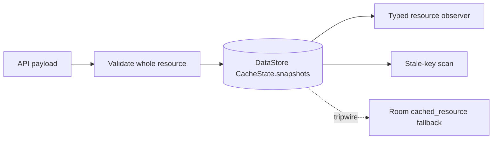

# 0019 — Offline cache uses DataStore snapshots

Status: accepted

The current-season offline structured-data cache uses a Proto DataStore-style
`CacheState.snapshots` map as its initial durable substrate, not Room. The cache
is bounded to current-season structured API resources, stores whole-resource
server-authored payloads, and does not need local joins, sorting, filtering, or
partial updates over fields inside those payloads. Room's single
`cached_resource` snapshot table remains a migration path only if measurements
show DataStore map scans/writes, blob size, write contention, debugging burden,
or future indexed local queries make the snapshot map the wrong substrate.
Fully normalized Room remains out of scope until screens need relational access
to payload internals.

```kotlin
data class CacheState(
    val schemaVersion: Int,
    val activeSeason: Int?,
    val snapshots: Map<String, ResourceSnapshot>,
)
```



Related: [offline cache summary](../offline-data-cache/summary.md), [storage substrate checkpoint](https://github.com/anpurnama11/my-f1-companion-app/issues/66).
