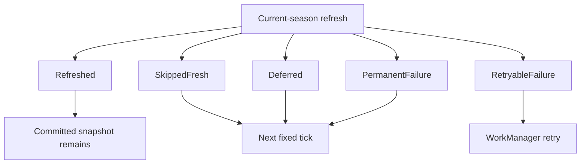

# 0020 — Current-season refreshes report truthful outcomes

Status: accepted

## Context

The cache previously returned `Success` both after persisting a network payload
and after skipping a fresh snapshot. WorkManager therefore could not distinguish
network evidence from a TTL decision, and a successful sibling write could hide
a retryable failure. The same ambiguity existed in non-season foreground
resources.

## Decision

All structured resources — current-season schedule, next-session, standings,
catalogs, session results, pitstops, circuit details, and Wikipedia summaries —
return five truthful outcomes. One classifier maps HTTP
408/429/5xx, timeout, connectivity, storage I/O, and malformed successful
payloads to `RetryableFailure`; other HTTP 4xx responses are
`PermanentFailure`. Unknown programmer failures and coroutine cancellation
propagate. Future or plausibly unpublished sessions return `Deferred` without
changing attempt metadata. The worker retries if any current-season entry is
retryable, while neutral and permanent entries do not request immediate retry.

```kotlin
sealed interface RefreshResult {
    data object Refreshed : RefreshResult
    data object SkippedFresh : RefreshResult
    data object Deferred : RefreshResult
    data class RetryableFailure(val message: String) : RefreshResult
    data class PermanentFailure(val message: String) : RefreshResult
}
```



## Why

This is the smallest contract that makes foreground and background
orchestration honest without parallel old/new bundle APIs. Keeping one
`requiresRetry` aggregate means a retryable failure remains visible beside
successful writes while fresh skips stay neutral.

## Consequences

- Existing compatible content stays in `SectionUiState.Content` with
  `RefreshFailed` after either failure class.
- Fresh skips and deferred work are neutral for worker retry; deferred work
  preserves cached content, while an uncached consumer may show unavailable.
- A retry can coexist with successful writes; TTL gates prevent rewriting those
  fresh siblings during backoff.
- Circuit Detail maps each non-season refresh through the same cache-aware
  section loader, so metadata and most-wins content fail independently without
  a direct-network fallback that could erase cached content.

Related: [../offline-data-cache/refresh-coordination.md](../offline-data-cache/refresh-coordination.md), [../offline-data-cache/summary.md](../offline-data-cache/summary.md), [../specs/cache-correctness-hardening.md](../specs/cache-correctness-hardening.md).
