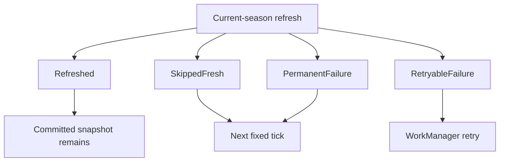

# 0020 — Current-season refreshes report truthful outcomes

Status: accepted

## Context

The cache previously returned `Success` both after persisting a network payload
and after skipping a fresh snapshot. WorkManager therefore could not distinguish
network evidence from a TTL decision, and a successful sibling write could hide
a retryable current-season failure. Session and non-season migration are owned
separately by GitHub issues #68 and #69.

## Decision

Current-season schedule, next-session, standings, and catalogs return five
truthful outcomes. One classifier maps HTTP 408/429/5xx, timeout, connectivity,
storage I/O, and malformed successful payloads to `RetryableFailure`; other HTTP
4xx responses are `PermanentFailure`. Unknown programmer failures and coroutine
cancellation propagate. The worker retries if any migrated current-season entry
is retryable, while neutral and permanent entries do not request immediate
retry.

```kotlin
sealed interface RefreshResult {
    data object Refreshed : RefreshResult
    data object SkippedFresh : RefreshResult
    data object Deferred : RefreshResult
    data class RetryableFailure(val message: String) : RefreshResult
    data class PermanentFailure(val message: String) : RefreshResult
    data object Success : RefreshResult // temporary: #68/#69
    data class Failure(val message: String) : RefreshResult // temporary: #68/#69
}
```



## Why

This is the smallest staged contract that makes current-season orchestration
honest without pre-implementing later tickets. Keeping one `requiresRetry`
aggregate avoids parallel old/new bundle APIs. Legacy `Success`/`Failure`
remain only because removing them would force the session-result/pitstop and
non-season migrations into this change. Issue #68 migrates session resources;
issue #69 migrates non-season resources and removes both legacy variants.

## Consequences

- Existing compatible content stays in `SectionUiState.Content` with
  `RefreshFailed` after either failure class.
- Fresh skips and deferred work are neutral, not user-visible errors.
- A retry can coexist with successful writes; TTL gates prevent rewriting those
  fresh siblings during backoff.
- Exhaustive legacy UI branches include compatibility fall-through only; their
  repositories and behavior remain binary until their owning tickets.

Related: [../offline-data-cache/refresh-coordination.md](../offline-data-cache/refresh-coordination.md), [../offline-data-cache/summary.md](../offline-data-cache/summary.md), [../specs/cache-correctness-hardening.md](../specs/cache-correctness-hardening.md).
