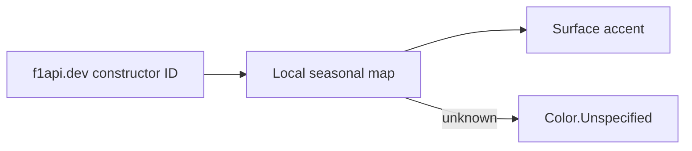

# Constructor accent colors

`TeamColors.forId(teamId)` is the year-round source for constructor accent
colors. Values are maintained locally because f1api.dev and Jolpica's standard
API expose no color, OpenF1 has a short live window, and Jolpica alpha is not a
stable production dependency.

```kotlin
object TeamColors {
    fun forId(teamId: String): Color = when (teamId) {
        "ferrari" -> Color(0xFFED1131)
        "mercedes" -> Color(0xFF00D7B6)
        "rb", "racing_bulls" -> Color(0xFF6C98FF)
        else -> Color.Unspecified
    }
}
```

API `#RRGGBB` values become opaque Compose ARGB by stripping `#` and prepending
`FF`. Unknown IDs return `Color.Unspecified`; no invented fallback color.
Accents belong on surface strips or image fallbacks, never text on the dark
theme.



## Maintenance and rationale

Update the small map when liveries or constructors change. Jolpica alpha
`primary_color` is a possible future source only after the API stabilizes; the
local map remains an offline fallback. A network fetch and cache would cost more
than maintaining the current seasonal values.

## Related

- [Theme](theme.md)
- [Formula1.com imagery](../data-sources/formula1-imagery.md)
- [Team-color decision issue](https://github.com/anpurnama11/my-f1-companion-app/issues/46)
