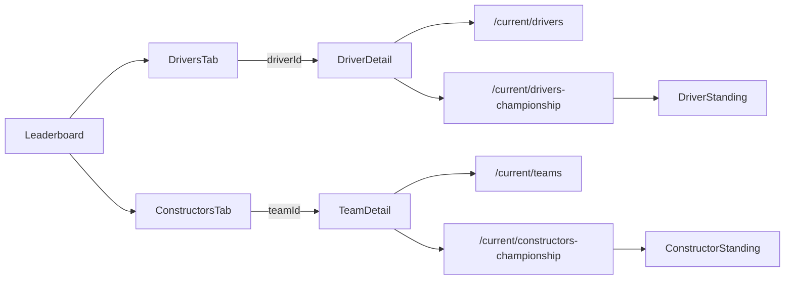
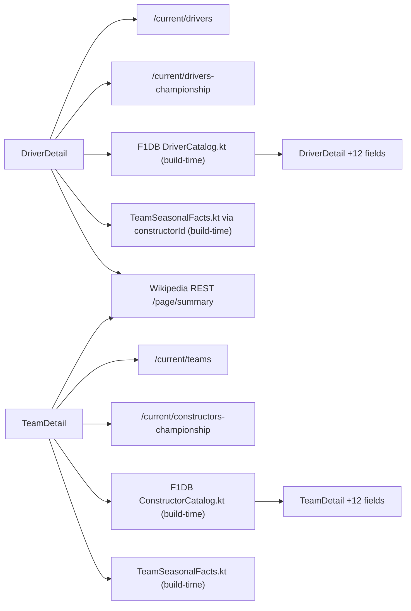

# Leaderboard and driver/team detail

The Leaderboard tab loads driver and constructor standings independently from
f1api.dev and presents them through a Material 3 `SecondaryTabRow` with
**Drivers** and **Constructors** tabs. Only the selected standings list is
visible, and `HorizontalPager` lets users swipe between the pages. Each row
displays position, wins, points, and a stable API ID; row clicks push
`Route.DriverDetail(driverId)` or `Route.TeamDetail(teamId)`. Tab taps animate
the same pager, while pull-to-refresh and retry re-fetch both independent
sections.

Driver detail joins `/current/drivers` with `/current/drivers-championship` by
`driverId`. Team detail joins `/current/teams` with
`/current/constructors-championship` by `teamId`. Missing IDs become an
`Outcome.Failure`, then the ViewModel exposes `SectionUiState.Error` through the
shared `OutcomeContent` renderer.

```kotlin
DriverScreen(driverId = key.driverId)
// ViewModel seam: suspend (String, Boolean) -> Outcome<DriverDetail>
```

Both detail surfaces render Cloudinary formula1.com imagery for the current
season: `DriverScreen` builds a `driverImageUrl()` headshot from the driver's
name + last surname token, and `TeamScreen` builds a `teamImageUrl()` car
render from `teamId`. If the URL cannot be derived, the hero falls back to the
existing `TeamColors.forId(teamId)` swatch treatment.



## Invariants and lessons

- Joins use `driverId`/`teamId`, never display-name matching.
- ViewModels are init-less: first collection starts the load; refresh is the
  only forced re-fetch path and sends `Cache-Control: no-cache`.
- Driver and constructor leaderboard sections fail independently.
- DTOs use the live underscored championship keys as their single canonical
  wire contract.
- `f1/` remains Android-free so this slice can move to future KMP shared code.

## Planned: GAP-F detail-page redesign (ticket 26, follow-ups 27/28/29)

The DriverDetail/TeamDetail screens are about to be rewritten to match 5
reference screenshots. The use case seam gains ~12 new fields per screen
(across two tabs — current-season + all-time), sourced from F1DB build-time
+ Wikipedia REST + the already-wired f1api.dev.



**Locked rules (per ADR 0012):**
- Bar chart, base city, team principal are **dropped** (no free JSON source).
- All-time "Grands Prix" = race-only (sprint rounds filtered).
- F1DB is **build-time** only — generated artifacts checked in, no runtime network.
- Wikipedia REST is the **only** "About" source (CC BY-SA 4.0 attribution
  required in UI). No LLM-generated biography.
- `User-Agent: F1app/1.0 (+contact URL)` per Wikipedia's API etiquette.
- F1DB catalog files carry the CC BY 4.0 attribution header in their KDoc.

When tickets 27 (F1DB import) + 28 (Wikipedia extension) + 29 (UI rewrite)
ship, this section becomes the description of the running code and the
upstream mermaid above is the source of truth.

**Status:** F1DB catalog (build 12) + Wikipedia REST extension (build 13)
are shipped as data-layer-only — the catalogs and the
`getWikipediaSummary` extension are reachable but not yet consumed by
the use cases. The use case join change + model field additions
(`DriverDetail` / `TeamDetail` gain the new fields) + the two-tab
UI rewrite land in
[build ticket 14](../plans/f1app-build/tickets/14-driver-team-detail-ui-rewrite.md)
(UI rewrite, wayfinder ticket 29). Compare card is driver-only and
shows "vs teammate" per [ADR 0013](../decisions/0013-compare-card-vs-teammate.md);
the four sub-decisions inside ticket 29 (Compare shape, tab
interaction, About placement, error states) are all locked. When
build 14 ships, this section becomes the description of the running
code and the upstream mermaid above is the source of truth.

Related: [`../decisions/0012-gap-f-detail-page-data-sources.md`](../decisions/0012-gap-f-detail-page-data-sources.md),
[`../wayfinder/f1app/driver-team-detail.md`](../wayfinder/f1app/driver-team-detail.md),
[`../wayfinder/f1app/tickets/26-research-gap-f-detail-redesign.md`](../wayfinder/f1app/tickets/26-research-gap-f-detail-redesign.md).

Related: [`core/navigation.md`](../core/navigation.md),
[`summary.md`](../summary.md), and
[`../decisions/0002-sectionuistate-is-vm-to-ui-transport.md`](../decisions/0002-sectionuistate-is-vm-to-ui-transport.md).
