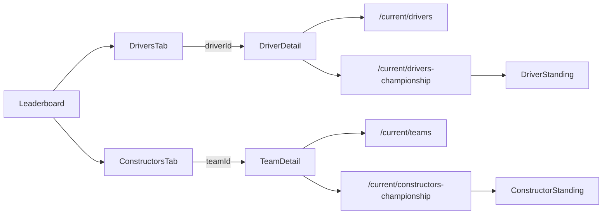

# Leaderboard and driver/team detail

The Leaderboard tab loads driver and constructor standings independently from
f1api.dev and presents them through a Material 3 `SecondaryTabRow` with
**Drivers** and **Constructors** tabs. Only the selected standings list is
visible, and `HorizontalPager` lets users swipe between the pages. Each row
displays position, wins, points, and a stable API ID; row clicks push
`Route.DriverDetail(driverId)` or `Route.TeamDetail(teamId)`. Tab taps animate
the same pager, while pull-to-refresh and retry re-fetch both independent
sections.

Driver detail joins `/current/drivers` with `/current/drivers-championship` by
`driverId`. Team detail joins `/current/teams` with
`/current/constructors-championship` by `teamId`. Missing IDs become an
`Outcome.Failure`, then the ViewModel exposes `SectionUiState.Error` through the
shared `OutcomeContent` renderer.

```kotlin
DriverScreen(driverId = key.driverId)
// ViewModel seam: suspend (String, Boolean) -> Outcome<DriverDetail>
```

Both detail surfaces use `TeamColors.forId(teamId)` as the temporary swatch:
the driver hero says “Headshot unavailable” and the team hero says “Car image
unavailable”. Imagery is intentionally deferred to
[`08-enrichments-headshots-and-team-imagery.md`](../plans/f1app-build/tickets/08-enrichments-headshots-and-team-imagery.md).



## Invariants and lessons

- Joins use `driverId`/`teamId`, never display-name matching.
- ViewModels are init-less: first collection starts the load; refresh is the
  only forced re-fetch path and sends `Cache-Control: no-cache`.
- Driver and constructor leaderboard sections fail independently.
- DTOs use the live underscored championship keys as their single canonical
  wire contract.
- `f1/` remains Android-free so this slice can move to future KMP shared code.

Related: [`core/navigation.md`](../core/navigation.md),
[`summary.md`](../summary.md), and
[`../decisions/0002-sectionuistate-is-vm-to-ui-transport.md`](../decisions/0002-sectionuistate-is-vm-to-ui-transport.md).
