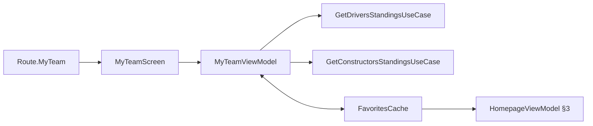

# My Team favorites management

> **Superseded 2026-07-25.** The My Team tab is removed in v1 polish.
> Favorites management moves to Homepage §3 per
> [ADR 0010](../decisions/0010-my-team-content-into-homepage-§3.md) +
> [GitHub issue #54](https://github.com/anpurnama11/my-f1-companion-app/issues/54) +
> [build ticket 11](https://github.com/anpurnama11/my-f1-companion-app/issues/18).
> This file is kept as the record of what the in-tab My Team management
> looked like before it was folded into §3. The `FavoritesCache` storage
> layer (`FavoritesCache.kt`) is unchanged; only the surface that exposes
> it is removed.

The `Route.MyTeam` tab is the management surface for the same three-slot
`FavoritesCache` read by Homepage §3. It renders Driver 1, Driver 2, and
Constructor cards from the cache, resolves their display data from current
standings, and opens a `ModalBottomSheet` when any slot is tapped.

## Runtime flow



`MyTeamViewModel` follows the init-less pattern ([practices.md](../practices.md) §SharingStarted policy). Favorites remain reactive for the ViewModel's lifetime; standings load independently and retry with `forceRefresh = true`.

```kotlin
MyTeamViewModel(
    favoritesFlow = favoritesCache.read(),
    setDriver1 = favoritesCache::setDriver1,
    setDriver2 = favoritesCache::setDriver2,
    setTeam = favoritesCache::setTeam,
    // standings use-case function references omitted
)
```

## Contracts and invariants

- The slots are two independent favorite drivers plus one favorite
  constructor. Driver choices do not follow the chosen constructor.
- Tapping a slot explicitly chooses which value will be replaced; there is no
  oldest-pin eviction and no separate picker route.
- A driver ID cannot occupy both driver slots. The sheet disables the driver
  used by the other slot, while `FavoritesCache` enforces the hard invariant
  inside the same atomic `DataStore.edit` that performs the write. This keeps
  rapid or non-UI writes race-safe.
- Constructor replacement writes only `FAV_TEAM`; driver replacement writes
  only the selected driver key.
- Homepage and My Team receive the same `FavoritesCache` instance from
  `Wiring`, so successful writes propagate to Homepage §3 through its Flow.
- First-launch defaults remain owned by `HomepageViewModel` and
  `seedIfEmpty`; the seed only fills empty slots and never overwrites a pick.
- Standings failures use the shared `SectionUiState` / `OutcomeContent` UX.

## Lessons learned

Checking uniqueness only against ViewModel state is insufficient: two rapid
cross-slot writes can both observe the old snapshot. Persistent invariants must
be checked inside the serialized `DataStore.edit` transaction.

Related: [terminology](../terminology.md), [project practices](../practices.md),
[favorites decision](https://github.com/anpurnama11/my-f1-companion-app/issues/42),
and [build ticket](https://github.com/anpurnama11/my-f1-companion-app/issues/12).
