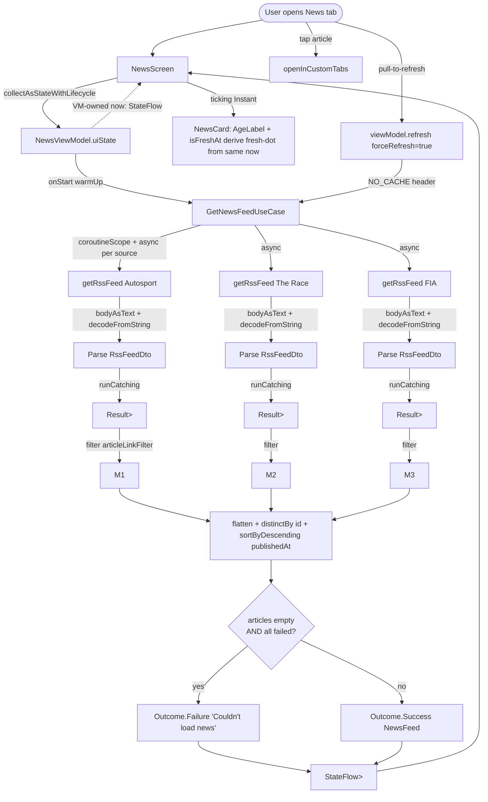

# News — RSS feed tab (parked to v2)

The News tab is the app's 4th top-level tab. It renders a merged, deduped list of F1 news articles from 3 RSS sources (Autosport, The Race, FIA), sorted by `publishedAt` desc. Tapping an article opens it in Chrome Custom Tabs. Status: `[PARKED]` — the design is locked but the build is deferred to v2 per wayfinder ticket 25.

When un-parked, the News tab **replaces the My Team tab** in the nav. My Team content moves to Homepage §3 per wayfinder ticket 24 / plans ticket 11. The tab shape stays at 4 (Homepage, Schedule, Leaderboard, News).

## File layout

```
f1/data/RssApi.kt              ← DTOs + HttpClient.getRssFeed() + DTO→domain mapper
f1/data/RssSources.kt          ← RssSource data class + SourceKey/SourceKind enums + 3-source list + BBC filter
f1/model/NewsArticle.kt        ← domain model (NO f1/data/ refs; sourceKey/sourceKind are String)
f1/model/NewsFeed.kt           ← articles + failedSourceCount + totalSourceCount
f1/GetNewsFeedUseCase.kt       ← fan-out N sources, merge + dedup + sort, honest failure semantics

feature/news/NewsScreen.kt     ← PullToRefreshBox + OutcomeContent + LazyColumn<NewsCard>
feature/news/NewsViewModel.kt  ← single SectionUiState<NewsFeed>, init-less + Lazily, VM-owned now tick
feature/news/NewsCard.kt       ← source pill + headline + snippet + AgeLabel + FreshDot
feature/news/EmptyNewsState.kt

core/ui/AgeLabel.kt            ← "2h" / "1d" relative time
core/network/CustomTabs.kt     ← launchUrl with scheme guard + ActivityNotFoundException fallback

core/navigation/Routes.kt      (edit: +Route.News, -Route.MyTeam, homepageTabs updates)
core/navigation/NavShell.kt    (edit: -MyTeam entry, +News entry, TopLevelDestination swap)
core/di/Wiring.kt              (edit: +5 lines for the use case)

gradle/libs.versions.toml      (edit: +2 aliases)
app/build.gradle.kts           (edit: +2 implementation lines)
app/src/main/res/drawable/ic_news_outline.xml  (new)
```

## Types (added / changed / deleted)

**Added:**
- `RssSource(key: SourceKey, kind: SourceKind, url: String, articleLinkFilter: (String) -> Boolean)` — `f1/data/RssSources.kt`
- `SourceKey` enum (`AUTOSPORT`, `THE_RACE`, `FIA`, `BBC`) — `f1/data/RssSources.kt`
- `SourceKind` enum (`NEWS`, `ANALYSIS`, `OFFICIAL`) — `f1/data/RssSources.kt`
- `RssFeedDto` / `RssChannelDto` / `RssItemDto` (with `@XmlSerialName("rss")` on the root) — `f1/data/RssApi.kt`
- `NewsArticle(id, sourceKey: String, sourceKind: String, headline, snippet, link, publishedAt: Instant)` — `f1/model/NewsArticle.kt`
- `NewsFeed(articles, failedSourceCount, totalSourceCount)` — `f1/model/NewsFeed.kt`
- `GetNewsFeedUseCase` (operator invoke) — `f1/GetNewsFeedUseCase.kt`
- `NewsViewModel` + `newsViewModelFactory` — `feature/news/NewsViewModel.kt`
- `NewsScreen` / `NewsCard` / `NewsList` / `EmptyNewsState` / `SourcePill` / `FreshDot` — `feature/news/`
- `AgeLabel` — `core/ui/AgeLabel.kt`
- `openInCustomTabs` — `core/network/CustomTabs.kt`
- `Route.News` (NavKey) — `core/navigation/Routes.kt`

**Changed (1–10 line edits):**
- `Routes.kt` — `Route.MyTeam` deleted; `Route.News` added; `homepageTabs` swap.
- `NavShell.kt` — `MyTeam` `entryProvider` deleted; `News` `entryProvider` added; `TopLevelDestination` enum swap.
- `Wiring.kt` — +1 import, +5 lines.
- `gradle/libs.versions.toml` — +2 library aliases.
- `app/build.gradle.kts` — +2 `implementation(...)` lines.

**Deleted:**
- `Route.MyTeam` (NavKey)
- `ic_myteam_outline.xml` (drawable, after `TopLevelDestination.MyTeam` is removed)
- `feature/myteam/MyTeamScreen.kt` + `MyTeamViewModel.kt` + tests (per plans ticket 11; the picker content moves to `feature/homepage/FavoritesPicker.kt`)

**Unchanged:**
- `HttpClientFactory.kt` — no Ktor XML plugin; the use case goes through `bodyAsText()` + top-level `XML { ignoreUnknownKeys = true }`.

## Domain-purity invariant

`f1/` files (`RssApi.kt`, `RssSources.kt`, `NewsArticle.kt`, `NewsFeed.kt`, `GetNewsFeedUseCase.kt`) have **zero** `android.*` imports. `MessageDigest`, `SimpleDateFormat`, `Locale` are `java.*`; `Instant` and `Clock` are `kotlinx.datetime`; `coroutineScope` / `async` / `awaitAll` are `kotlinx.coroutines`. The `Context` boundary stays at `Wiring` and at the `NewsCard` tap handler.

## Data flow



## Use case fan-out semantics

| Scenario | Returned | User sees |
|---|---|---|
| All 3 sources return 200 with items | `Success(NewsFeed(articles, failed=0))` | List of articles |
| 1 source 500, 2 return 200 | `Success(NewsFeed(articles, failed=1))` | List of articles, **no error banner** |
| 2 sources 500, 1 returns 200 | `Success(NewsFeed(articles, failed=2))` | List of articles, **no error banner** |
| All 3 sources 500 (or DNS fail) | `Failure("Couldn't load news (3/3 sources failed)")` | Error state with Retry |
| `sources = emptyList()` (defensive) | `Success(NewsFeed(articles=0, failed=0, total=0))` | Empty state placeholder |
| Cancellation | Propagated via `coroutineScope` — parent cancels | — |

## Test surface

5 JVM unit test files, no Compose UI tests:

- **`RssItemToArticleTest`** — pure mapping (no Ktor): `pubDate` parsing (multi-format: standard / no-seconds / GMT / ISO 8601), HTML entity decoding (`&amp;` / `&nbsp;` / `&apos;` / `&quot;`), link normalization (fragment + trailing slash + tracking params), dedup `id` determinism.
- **`RssApiParseTest`** — XML roundtrip: real Autosport XML body via `rssXmlFormat.decodeFromString<RssFeedDto>(body)`. Items with missing `<pubDate>` → mapper returns null. Items with `<rss version="2.0">` attribute parse cleanly under `ignoreUnknownKeys`.
- **`RssPodcastFilterTest`** — `isBbcNewsArticle`: `/sounds/play/` and `/iplayer/episode/` → false; `/sport/...` → true.
- **`GetNewsFeedUseCaseTest`** — fan-out via Ktor `MockEngine`: dedup by normalized link, sort by `publishedAt` desc, partial-fail (no Failure banner), all-fail (Failure), cancellation propagation, `forceRefresh = true` adds `Cache-Control: no-cache` header, empty-sources-list defensive case.
- **`NewsViewModelTest`** — init-less + Lazily: first emission = Loading, second = Content; `refresh()` re-fires with `forceRefresh = true`; all-fail maps to `SectionUiState.Error`; one-fail-many-succeed maps to `SectionUiState.Content(NewsFeed(articles, failed=N))`; resubscribe-after-timeout doesn't re-fire (Lazily contract).

## v2 enhancements (parking list)

Recorded in wayfinder ticket 25. The 11 items cover: per-source result list for debug, `<pubDate>` fallback, Atom feed support, `<guid>`-based dedup, recency-precedence dedup, kind-precedence dedup, typed `SourceKey`/`SourceKind` in the model, `Map<String, RssSource>` for `byKey` at scale, remote config for source list, app-level DataStore cache, "Showing X of Y sources" UI hint.

## Cross-references

- `../wayfinder/f1app/tickets/25-news-rss.md` — the parking ticket
- `../wayfinder/f1app/tickets/24-favorites-on-homepage.md` — My Team tab removal decision
- `../plans/f1app-build/tickets/11-favorites-on-homepage.md` — plans ticket for the My Team removal
- `../specs/f1app.md` §Out of Scope (line 622) — news + collaborator content screens are out of v1
- `../practices.md` — domain-purity invariant, init-less VM, `Lazily` convention
- `../architecture/architecture.md` — single `:app`, manual `Wiring` DI, use case pattern
