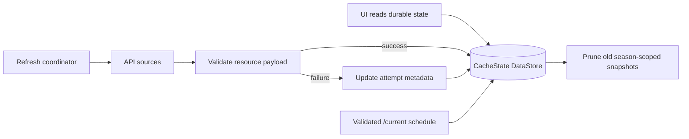
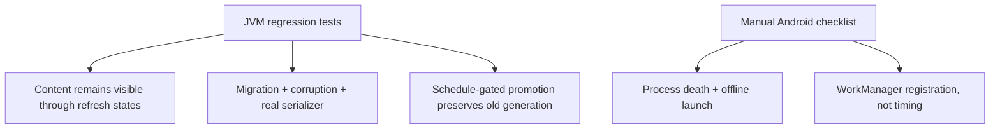

# Cache refresh coordination

Refresh coordination has two shapes over the same store. Foreground screen refresh is
per-resource: a screen observes and refreshes only the snapshots it renders. Fixed
periodic WorkManager refresh is a best-effort current-season bundle on one
12-hour `NetworkType.CONNECTED` unique periodic job (`CacheSyncWorker`,
`UNIQUE_PERIODIC_NAME = "current-season-cache-sync"`,
`ExistingPeriodicWorkPolicy.KEEP`, `BackoffPolicy.EXPONENTIAL` with 30s initial
delay). The schedule refresh runs first because `/current` is the only atomic
active-season promotion authority; the resource and session-result bundles
follow. Bundle selection considers current-season structured data needed to open
supported app surfaces warm (schedule as discovery and rollover guard, next
session, standings, catalogs, and session result/enrichment keys in the
`now - 48h` through `now + 48h` schedule window), but normal per-resource TTL
gates decide whether network calls run. **Both `StaleOpen` and `Periodic`
honor the per-resource TTL gate**; only `PullToRefresh` bypasses it. The
worker therefore does not redundantly network-refresh a foreground-loaded
resource that is still within its TTL window — the 12h tick only hits the
network for stale (or missing) snapshots, plus any force-refresh the user
initiates. The session bundle's eligibility filter
is a coarse ±48h discovery hint; the per-session plausibly-complete gate
(start + per-session buffer) is the authoritative filter, so a future session
inside the window is still excluded. Outcomes remain resource-scoped;
partial failures record attempt metadata and never roll back successful writes
or delete old payloads. Foreground and worker refreshes share per-resource
single-flight gates.

Worker result policy during the current-season expansion:
- **Empty bundle** (off-season, no active season, no cached schedule, no
  plausibly-complete sessions in window) → `Result.success()`. Nothing was
  attempted, so there is nothing to retry. The next 12h tick re-evaluates
  against fresh state. A "no active season" or "no schedule" entry is
  **not** recorded as a failure — that would loop WorkManager's backoff
  forever during the off-season and during the schedule-promotion gap.
- **Any migrated `RetryableFailure`** → `Result.retry()`, even beside
  `Refreshed` or `SkippedFresh`. Successful writes remain committed and skip
  on the retry while fresh.
- **Only `SkippedFresh`, `Deferred`, or `PermanentFailure`** →
  `Result.success()`. These outcomes are neutral for immediate retry.
- Legacy variants remain for non-season foreground resources until issue #69;
  they do not participate in the current-season worker aggregate.

```kotlin
// core/cache/CacheSyncWorker.kt — platform worker, NOT in f1/.
// f1/ stays free of android.* imports; the worker reaches f1/
// repositories through F1App.wiring, mirroring the
// widget/countdown/CountdownWorker.kt pattern.

class CacheSyncWorker(...) : CoroutineWorker(...) {
    override suspend fun doWork(): Result {
        val wiring = (applicationContext as F1App).wiring
        val schedule = BundleRefreshResult(listOf(
            BundleRefreshResult.Entry("season-schedule",
                runCatching {
                    wiring.seasonScheduleCacheRepository.refreshCurrentSeason(RefreshReason.Periodic)
                }.getOrElse(RefreshFailureClassifier::classify)),
        ))
        val now = Clock.System.now()
        val resources = runCatching {
            wiring.currentSeasonResourcesCacheRepository.refreshCurrentSeasonBundle()
        }.getOrElse { error ->
            BundleRefreshResult(listOf(BundleRefreshResult.Entry("current-season-resources-bundle", RefreshFailureClassifier.classify(error))))
        }
        val sessions = runCatching {
            wiring.sessionResultsCacheRepository.refreshCurrentSeasonBundle(now)
        }.getOrElse { error ->
            BundleRefreshResult(listOf(BundleRefreshResult.Entry("current-season-sessions-bundle",
                RefreshFailureClassifier.classify(error))))
        }
        return decideWorkerResult(schedule + resources + sessions)
    }
}

// Pure decision extracted for testability (no WorkManager harness needed).
internal fun decideWorkerResult(aggregate: BundleRefreshResult): ListenableWorker.Result = when {
    aggregate.isEmpty -> Result.success()
    aggregate.requiresRetry -> Result.retry()
    else -> Result.success()
}

fun CurrentSeasonResourcesCacheRepository.refreshCurrentSeasonBundle(): BundleRefreshResult {
    val season = activeSeason() ?: return BundleRefreshResult.Empty
    // Refreshes next race, driver + constructor standings, driver + team catalogs.
    // Per-resource failures are caught; the bundle records them and continues.
    // The per-resource TTL gate is respected: RefreshReason.Periodic
    // skips fresh foreground-loaded snapshots.
}

fun SessionResultsCacheRepository.refreshCurrentSeasonBundle(now: Instant): BundleRefreshResult {
    val activeSeason = store.state.first().activeSeason ?: return BundleRefreshResult.Empty
    val schedule = readCachedSchedule(activeSeason) ?: return BundleRefreshResult.Empty
    val candidates = eligibleBundleCandidates(now, schedule)  // ±48h AND plausibly-complete
    // Refreshes each session + Race pitstops. Per-resource failures are caught.
    // The per-resource TTL gate is respected: RefreshReason.Periodic
    // skips fresh foreground-loaded snapshots.
}

data class BundleRefreshResult(val entries: List<Entry>) {
    val requiresRetry: Boolean
        get() = entries.any { it.result is RefreshResult.RetryableFailure }
    data class Entry(val key: String, val result: RefreshResult)
    companion object { val Empty: BundleRefreshResult = BundleRefreshResult(emptyList()) }
}
```

```kotlin
data class CacheState(
    val schemaVersion: Int,
    val activeSeason: Int?,
    val snapshots: Map<String, ResourceSnapshot>,
)

data class ResourceSnapshot(
    val key: String,
    val season: Int?,
    val payloadKind: String,
    val payloadVersion: Int,
    val payloadJson: String,
    val fetchedAtEpochMs: Long,
    val staleAfterEpochMs: Long,
    val lastAttemptEpochMs: Long?,
    val lastAttemptStatus: RefreshAttemptStatus?,
)
```

Room's fallback shape stays snapshot-shaped rather than normalized:

```kotlin
@Entity(tableName = "cached_resource")
data class CachedResourceEntity(
    @PrimaryKey val key: String,
    val resourceType: String,
    val season: Int?,
    val round: Int?,
    val sessionType: String?,
    val staleAfterEpochMs: Long,
    val payloadKind: String,
    val payloadVersion: Int,
    val payloadJson: String,
)
```


Cache-aware UI state preserves content. The shared UI transport already exposes
`SectionUiState.Content(data, sync = ContentSyncStatus.Fresh)`, so existing
non-cache use cases keep fresh-content behavior while future cached resources
can mark the visible payload as `Stale`, `Refreshing`, or
`RefreshFailed(message)`. ViewModels map observed snapshots into
`SectionUiState`: `Loading` and `Error(message)` are only for the no-cached-data
phase, while `SectionUiState.Content(data, sync)` renders cached data with a
non-destructive `ContentSyncStatus` (`Fresh`, `Stale`, `Refreshing`, or
`RefreshFailed(message)`). Pull-to-refresh and stale-open indicators read the
sync status; they do not blank content.

Validation uses a hybrid gate. JVM tests carry the durable-state regression
load: snapshot state-machine transitions, cache-aware VM mapping, stale/open and
forced-refresh failure behavior, background bundle failure metadata,
single-flight coalescing between UI and worker refreshes, schema-version
migration, corrupt-store recovery, and season-promotion/pruning invariants. At
least one storage test uses the real serializer/store path with a temp file so
default values, corruption, and atomic writes are not proven only by in-memory
fakes. Unsupported future schemas and failed migrations fail safe as no usable
cache, preserving or quarantining old bytes where possible so a later network
refresh can recover. Manual Android checks cover the platform edges: seed online, kill or
force-stop the process, launch offline, and confirm cached current-season
content renders before any network success; WorkManager checks verify unique
registration, constraints, interval, and `KEEP` policy, not exact run timing.

Resource keys are persisted strings, not type names:

```kotlin
val schedule = CacheResourceKeys.currentSeasonSchedule(2026)
// schedule.value == "season:2026:schedule"

val race = CacheResourceKeys.sessionResults(2026, 4, SessionResultCacheKind.Race)
// race.value == "season:2026:round:4:session-results:race"

val wiki = CacheResourceKeys.wikipediaSummary("Scuderia Ferrari")
// wiki.value == "wikipedia:summary:scuderia-ferrari"
```

`SnapshotStore.recordAttempt(...)` preserves the last good payload:

```kotlin
store.writeSnapshot(lastGood)
store.recordAttempt(key, attemptedAtEpochMs = now, RefreshAttemptStatus.Failed("offline"))
// observeSnapshot(key) still emits lastGood.payloadJson, plus lastAttempt metadata.
```

```kotlin
sealed interface ContentSyncStatus {
    data object Fresh : ContentSyncStatus
    data object Stale : ContentSyncStatus
    data object Refreshing : ContentSyncStatus
    data class RefreshFailed(val message: String) : ContentSyncStatus
}
```





## Invariants

- `HttpCache` is not the offline source of truth; it only reduces network cost.

- Foreground refresh is per-resource; background periodic refresh is a best-effort current-season bundle.
- The periodic worker cadence is fixed at 12 hours; race-weekend intelligence belongs in resource selection, not dynamic WorkManager rescheduling.
- The periodic worker uses `NetworkType.CONNECTED`, WorkManager exponential backoff for total/transient bundle failure, and startup `enqueueUniquePeriodicWork(..., KEEP, ...)`; future interval/constraint changes need `UPDATE` or a versioned work name.
- The 12h worker respects the per-resource TTL gate (`RefreshReason.Periodic` does not bypass `staleAfterEpochMs`); only `PullToRefresh` bypasses it. A fresh foreground-loaded resource is not redundantly network-refreshed by the worker.
- The schedule refresh is included in the worker's aggregate so a failed schedule on a pre-promotion device (no active season yet) is not silently mis-classified as off-season; that scenario retries, it does not enter the empty-bundle success path.
- Bundle refresh is orchestration only: every payload keeps its own resource key, metadata, validation, and failure boundary.
- Bundle scope is current-season structured data for supported surfaces, not historical archives or remote images; session result endpoints are only refreshed once plausibly complete.
- Foreground and worker refreshes coalesce through a per-resource single-flight gate.
- Pull-to-refresh bypasses TTL and the Ktor transport cache but still writes through the snapshot store and preserves visible cached content.
- Cache-aware screens use `SectionUiState.Content(data, sync)` for every cached-payload state; stale, refreshing, and failed refreshes never become full-section errors.
- A failed refresh never deletes the last good payload; it updates attempt metadata.
- `staleAfterEpochMs` owns stale decisions; `fetchedAtEpochMs` is history, not policy.
- Promotion is atomic: set the active season, write the schedule snapshot, and prune snapshots whose `season != activeSeason`.
- Driver catalogs and team/constructor catalogs are season-scoped because drivers can change teams and constructors can enter, leave, or rename.
- Room is a fallback only if indexed local queries, relational joins, partial updates, payload volume, stale scans, debugging burden, or write contention prove DataStore snapshots are the wrong shape.
- Corrupt storage must never crash the app. It behaves like no usable cached
  payload, records best-effort diagnostics, and can be overwritten or
  quarantined by the next successful refresh.
- Unsupported future schemas and failed migrations fail safe: keep/quarantine
  old bytes where possible, expose no usable cache, and allow network recovery.

Related: [cache summary](summary.md), [network layer](../core/network.md), [practices](../practices.md), [terminology](../terminology.md).
