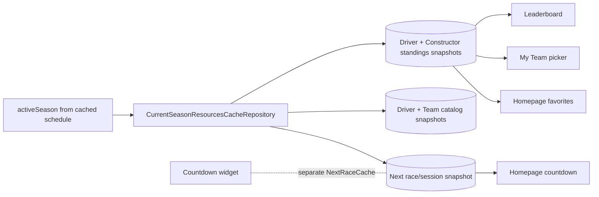
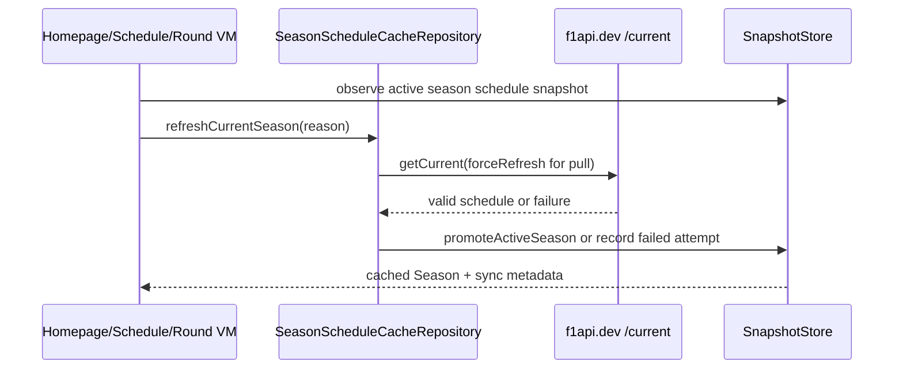

# Offline data cache

F1app's offline structured-data cache is a single-season, typed resource snapshot store backed by a Proto DataStore-style `CacheState.snapshots` map. The store foundation is built in `core/cache`: `CacheState`, `ResourceSnapshot`, `RefreshAttemptStatus`, `BundleRefreshResult`, `CacheStateSerializer`, and `SnapshotStore` provide durable JSON serialization, corruption-handler recovery, atomic snapshot writes, per-key observation with stable equality, failed-attempt metadata updates, a generic per-resource bundle aggregate (`BundleRefreshResult` with `isTotalFailure()` for worker retry decisions), and active-season promotion gated to the canonical `season:<year>:schedule` / `season.schedule` snapshot with season-scoped pruning. F1 resource contracts live in `f1/cache/CacheResourceKeys` as stable string keys for current-season schedule, next race/session, standings, catalogs, session results, pitstops, circuit metadata, circuit most-wins, and Wikipedia summaries. The UI reads durable structured API data from typed resource snapshots; Room `cached_resource` snapshot rows are a measured fallback only if payload volume, stale scans, write contention, or future indexed local queries prove the map substrate wrong. The cache is not a fully normalized F1 domain database unless screens need local joins, sorting, or filtering over fields inside payloads. Network refreshes validate payloads and write through the store, while Ktor `HttpCache` remains only a transport optimization. Season rollover is schedule-gated: only a valid f1api.dev `/current` schedule can promote a new active season. The store enforces the schedule resource contract (`season:<year>:schedule`, `season.schedule`) before that atomic promotion prunes old season-scoped standings, results, and catalogs immediately. Non-season resources such as circuit metadata, circuit most-wins, and Wikipedia summaries may remain because their keys are not tied to the active season.

The current-season schedule is cached end to end through
`SeasonScheduleCacheRepository`. Homepage and Schedule observe
`CachedResource<Season>` from the snapshot store and call
`refreshCurrentSeason(StaleOpen|PullToRefresh)` for network attempts. Round
detail observes the same cache only when the cached season matches the route
`year`; it gates from the observed snapshot value, not from mutable UI state, so
a delayed DataStore emission can still render cached content before network. It
also rereads the observed snapshot after a successful `/current` refresh; if
rollover promoted a different active season, the route falls back to
`getSeason(year)` instead of marking the old route-year content fresh.
Non-current `RoundDetail(year, round)` keeps using `getSeason(year)` so the
year-specific schedule contract remains intact. Refresh returns status only:
valid `/current` payloads serialize the `SeasonResponseDto`, map to `Season` for
validation, write the snapshot, and promote/prune in one store transaction;
failed or invalid refreshes preserve the last good season and record
`RefreshAttemptStatus.Failed`. ViewModels map cached snapshots through the shared
`CachedResource<T>.toSection(nowEpochMs)` helper so cached schedule content stays
visible as `Stale`, `Refreshing`, or `RefreshFailed` instead of becoming a
full-section error.

Standings, current driver/team catalogs, and Homepage next-race/session are
cached end to end through `CurrentSeasonResourcesCacheRepository`. The repository
derives its key season from `CacheState.activeSeason`; if no active season exists
on a first online open, it asks `SeasonScheduleCacheRepository` to refresh the
schedule and then writes the resource under the promoted season. It never
promotes rollover itself. Standings and catalogs use year-specific endpoints
(`/{activeSeason}/driverStandings.json`, `/{activeSeason}/constructorStandings.json`,
`/{activeSeason}/drivers`, `/{activeSeason}/teams`) so Jolpica or f1api.dev
`current` rollover skew cannot poison the old active-season key. Empty Jolpica
standings lists, empty f1api.dev catalogs, and `/current/next` responses with
`race: []` are valid payloads only when the response `season` still matches the
active season; a rollover-skewed `/current/next` response from a later season is
recorded as a failed attempt and is not written under the old key. Homepage,
Leaderboard, and My Team observe cached standings; Homepage also observes cached
next race/session. My Team warms driver and team catalogs as production
resources for picker/detail joins that need the season catalog generation. The
Countdown widget still reads its separate typed-key `NextRaceCache`.

```kotlin
currentResources.refreshDriverStandings(RefreshReason.StaleOpen)
currentResources.refreshNextRace(RefreshReason.PullToRefresh)
// Empty race array decodes to CachedResource<NextRace?>(data = null, snapshot)
```



```kotlin
val cached = seasonScheduleCacheRepository.observeCurrentSeason()
seasonScheduleCacheRepository.refreshCurrentSeason(RefreshReason.PullToRefresh)
// UI renders SectionUiState.Content(cached.data, ContentSyncStatus.RefreshFailed("offline"))
// when refresh fails after a usable snapshot exists.
```




Session results and race enrichments are cached through
`SessionResultsCacheRepository`. It observes and refreshes per-session results
(Race, Quali, Sprint, Sprint Quali, FP1/FP2/FP3) and per-round pitstops via raw
API DTOs (JolpicaRaceResultsResponseDto, JolpicaQualifyingResponseDto,
JolpicaAlphaResultsResponseDto, JolpicaPitStopsResponseDto), mapped to domain on
read. Alpha-sourced cached sessions (FP/Sprint/Sprint Quali) rebuild their
car-number translator from the cached current-driver catalog so driver/team ids
match the online path; if the catalog is absent or malformed, rows degrade to
the alpha opaque ids instead of failing. Session refreshes are gated by a
plausibly-complete check that reads the cached schedule snapshot: the network call is skipped when the session start +
per-session buffer (Race 4h, Quali 2h, Sprint 2h, SQuali 1.5h, FP 1.5h) is in
the future. If no cached result exists for a gated future session, the refresh
returns `RefreshResult.Failure("Session not yet complete")` so screens render a
non-loading unavailable/error row and do not bypass the gate through direct network
fallbacks. Missing or malformed schedule data always allows the fetch. Empty
pitstop payloads cache as null FastestPitstop (empty enrichment is valid).
Single-flight per-resource key includes (season, round, session).

Non-season detail resources (circuit metadata, circuit most-wins, Wikipedia
summaries) are cached through `NonSeasonResourcesCacheRepository`. Circuit
metadata stores CircuitDetailResponseDto and maps to CircuitDetail; circuit
most-wins stores CircuitWinnersResponseDto and aggregates to CircuitMostWins;
Wikipedia summaries store the @Serializable WikipediaSummary domain model
directly. All have `season = null` keys, surviving active-season promotion
without pruning. TTL is 24h (vs 12h for season-scoped resources).


Related: [refresh coordination](refresh-coordination.md), [network layer](../core/network.md), [practices](../practices.md), [terminology](../terminology.md).
