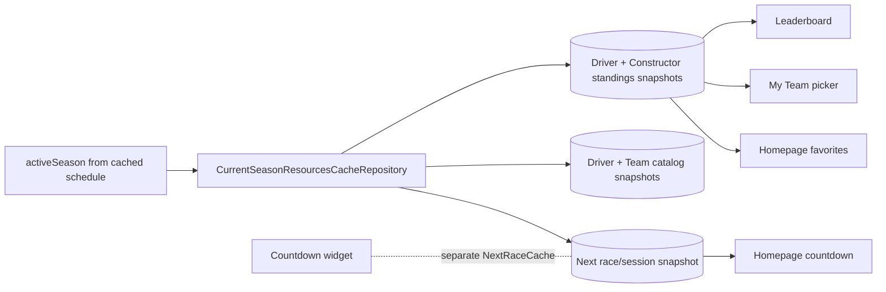
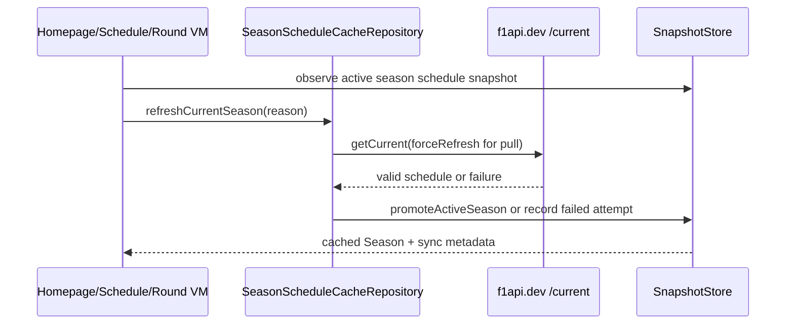
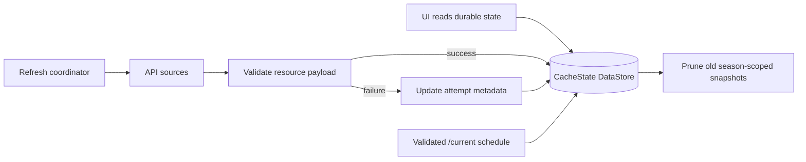
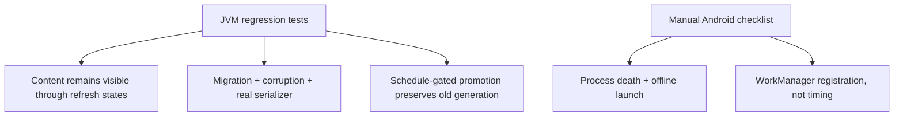

# Offline data cache

F1app's offline structured-data cache is a single-season, typed resource snapshot store backed by a Proto DataStore-style `CacheState.snapshots` map. The store foundation is built in `core/cache`: `CacheState`, `ResourceSnapshot`, `RefreshAttemptStatus`, `BundleRefreshResult`, `CacheStateSerializer`, and `SnapshotStore` provide durable JSON serialization, corruption-handler recovery, atomic snapshot writes, per-key observation with stable equality, failed-attempt metadata updates, a generic per-resource bundle aggregate (`BundleRefreshResult` with `isTotalFailure()` for worker retry decisions), and active-season promotion gated to the canonical `season:<year>:schedule` / `season.schedule` snapshot with season-scoped pruning. F1 resource contracts live in `f1/cache/CacheResourceKeys` as stable string keys for current-season schedule, next race/session, standings, catalogs, session results, pitstops, circuit metadata, circuit most-wins, and Wikipedia summaries. The UI reads durable structured API data from typed resource snapshots; Room `cached_resource` snapshot rows are a measured fallback only if payload volume, stale scans, write contention, or future indexed local queries prove the map substrate wrong. The cache is not a fully normalized F1 domain database unless screens need local joins, sorting, or filtering over fields inside payloads. Network refreshes validate payloads and write through the store, while Ktor `HttpCache` remains only a transport optimization. Season rollover is schedule-gated: only a valid f1api.dev `/current` schedule can promote a new active season. The store enforces the schedule resource contract (`season:<year>:schedule`, `season.schedule`) before that atomic promotion prunes old season-scoped standings, results, and catalogs immediately. Non-season resources such as circuit metadata, circuit most-wins, and Wikipedia summaries may remain because their keys are not tied to the active season.

The current-season schedule is cached end to end through
`SeasonScheduleCacheRepository`. Homepage and Schedule observe
`CachedResource<Season>` from the snapshot store and call
`refreshCurrentSeason(StaleOpen|PullToRefresh)` for network attempts. Round
detail observes the same cache only when the cached season matches the route
`year`; it gates from the observed snapshot value, not from mutable UI state, so
a delayed DataStore emission can still render cached content before network. It
also rereads the observed snapshot after a successful `/current` refresh; if
rollover promoted a different active season, the route falls back to
`getSeason(year)` instead of marking the old route-year content fresh.
Non-current `RoundDetail(year, round)` keeps using `getSeason(year)` so the
year-specific schedule contract remains intact. Refresh returns status only:
valid `/current` payloads serialize the `SeasonResponseDto`, map to `Season` for
validation, write the snapshot, and promote/prune in one store transaction;
failed or invalid refreshes preserve the last good season and record
`RefreshAttemptStatus.Failed`. ViewModels map cached snapshots through the shared
`CachedResource<T>.toSection(nowEpochMs)` helper so cached schedule content stays
visible as `Stale`, `Refreshing`, or `RefreshFailed` instead of becoming a
full-section error.

Standings, current driver/team catalogs, and Homepage next-race/session are
cached end to end through `CurrentSeasonResourcesCacheRepository`. The repository
derives its key season from `CacheState.activeSeason`; if no active season exists
on a first online open, it asks `SeasonScheduleCacheRepository` to refresh the
schedule and then writes the resource under the promoted season. It never
promotes rollover itself. Standings and catalogs use year-specific endpoints
(`/{activeSeason}/driverStandings.json`, `/{activeSeason}/constructorStandings.json`,
`/{activeSeason}/drivers`, `/{activeSeason}/teams`) so Jolpica or f1api.dev
`current` rollover skew cannot poison the old active-season key. Empty Jolpica
standings lists, empty f1api.dev catalogs, and `/current/next` responses with
`race: []` are valid payloads only when the response `season` still matches the
active season; a rollover-skewed `/current/next` response from a later season is
recorded as a failed attempt and is not written under the old key. Homepage,
Leaderboard, and My Team observe cached standings; Homepage also observes cached
next race/session. My Team warms driver and team catalogs as production
resources for picker/detail joins that need the season catalog generation. The
Countdown widget still reads its separate typed-key `NextRaceCache`.

```kotlin
currentResources.refreshDriverStandings(RefreshReason.StaleOpen)
currentResources.refreshNextRace(RefreshReason.PullToRefresh)
// Empty race array decodes to CachedResource<NextRace?>(data = null, snapshot)
```



```kotlin
val cached = seasonScheduleCacheRepository.observeCurrentSeason()
seasonScheduleCacheRepository.refreshCurrentSeason(RefreshReason.PullToRefresh)
// UI renders SectionUiState.Content(cached.data, ContentSyncStatus.RefreshFailed("offline"))
// when refresh fails after a usable snapshot exists.
```




Session results and race enrichments are cached through
`SessionResultsCacheRepository`. It observes and refreshes per-session results
(Race, Quali, Sprint, Sprint Quali, FP1/FP2/FP3) and per-round pitstops via raw
API DTOs (JolpicaRaceResultsResponseDto, JolpicaQualifyingResponseDto,
JolpicaAlphaResultsResponseDto, JolpicaPitStopsResponseDto), mapped to domain on
read. Alpha-sourced cached sessions (FP/Sprint/Sprint Quali) rebuild their
car-number translator from the cached current-driver catalog so driver/team ids
match the online path; if the catalog is absent or malformed, rows degrade to
the alpha opaque ids instead of failing. Session refreshes are gated by a
plausibly-complete check that reads the cached schedule snapshot: the network call is skipped when the session start +
per-session buffer (Race 4h, Quali 2h, Sprint 2h, SQuali 1.5h, FP 1.5h) is in
the future. If no cached result exists for a gated future session, the refresh
returns `RefreshResult.Failure("Session not yet complete")` so screens render a
non-loading unavailable/error row and do not bypass the gate through direct network
fallbacks. Missing or malformed schedule data always allows the fetch. Empty
pitstop payloads cache as null FastestPitstop (empty enrichment is valid).
Single-flight per-resource key includes (season, round, session).

Non-season detail resources (circuit metadata, circuit most-wins, Wikipedia
summaries) are cached through `NonSeasonResourcesCacheRepository`. Circuit
metadata stores CircuitDetailResponseDto and maps to CircuitDetail; circuit
most-wins stores CircuitWinnersResponseDto and aggregates to CircuitMostWins;
Wikipedia summaries store the @Serializable WikipediaSummary domain model
directly. All have `season = null` keys, surviving active-season promotion
without pruning. TTL is 24h (vs 12h for season-scoped resources).

Refresh coordination has two shapes over the same store. Foreground screen refresh is
per-resource: a screen observes and refreshes only the snapshots it renders. Fixed
periodic WorkManager refresh is a best-effort current-season bundle on one
12-hour `NetworkType.CONNECTED` unique periodic job (`CacheSyncWorker`,
`UNIQUE_PERIODIC_NAME = "current-season-cache-sync"`,
`ExistingPeriodicWorkPolicy.KEEP`, `BackoffPolicy.EXPONENTIAL` with 30s initial
delay). The schedule refresh runs first because `/current` is the only atomic
active-season promotion authority; the resource and session-result bundles
follow. Bundle selection considers current-season structured data needed to open
supported app surfaces warm (schedule as discovery and rollover guard, next
session, standings, catalogs, and session result/enrichment keys in the
`now - 48h` through `now + 48h` schedule window), but normal per-resource TTL
gates decide whether network calls run. **Both `StaleOpen` and `Periodic`
honor the per-resource TTL gate**; only `PullToRefresh` bypasses it. The
worker therefore does not redundantly network-refresh a foreground-loaded
resource that is still within its TTL window — the 12h tick only hits the
network for stale (or missing) snapshots, plus any force-refresh the user
initiates. The session bundle's eligibility filter
is a coarse ±48h discovery hint; the per-session plausibly-complete gate
(start + per-session buffer) is the authoritative filter, so a future session
inside the window is still excluded. Success and failure remain resource-scoped;
partial failures record attempt metadata and never roll back successful writes
or delete old payloads. Foreground and worker refreshes share per-resource
single-flight gates.

Worker result policy (the retry decision is a deliberate three-way split, not
a binary on failure):
- **Empty bundle** (off-season, no active season, no cached schedule, no
  plausibly-complete sessions in window) → `Result.success()`. Nothing was
  attempted, so there is nothing to retry. The next 12h tick re-evaluates
  against fresh state. A "no active season" or "no schedule" entry is
  **not** recorded as a failure — that would loop WorkManager's backoff
  forever during the off-season and during the schedule-promotion gap.
- **At least one resource succeeded** → `Result.success()`. Partial or
  full success; the next 12h tick advances.
- **At least one resource was attempted and all failed** →
  `Result.retry()`. Transient infrastructure failure; WorkManager's
  exponential backoff defers the next attempt.

```kotlin
// core/cache/CacheSyncWorker.kt — platform worker, NOT in f1/.
// f1/ stays free of android.* imports; the worker reaches f1/
// repositories through F1App.wiring, mirroring the
// widget/countdown/CountdownWorker.kt pattern.

class CacheSyncWorker(...) : CoroutineWorker(...) {
    override suspend fun doWork(): Result {
        val wiring = (applicationContext as F1App).wiring
        // 1. Atomic active-season promotion (schedule = rollover guard).
        //    The schedule entry is included in the aggregate so a
        //    failed schedule on a pre-promotion device is not
        //    mis-classified as off-season.
        val schedule = BundleRefreshResult(listOf(
            BundleRefreshResult.Entry("season-schedule",
                runCatching {
                    wiring.seasonScheduleCacheRepository.refreshCurrentSeason(RefreshReason.Periodic)
                }.getOrElse { RefreshResult.Failure(it.message ?: "Schedule refresh error") }),
        ))
        val now = Clock.System.now()
        // 2. Next race + standings + catalogs bundle.
        val resources = runCatching {
            wiring.currentSeasonResourcesCacheRepository.refreshCurrentSeasonBundle()
        }.getOrElse { /* wrap as BundleRefreshResult.Failure */ }
        // 3. Plausibly-complete session result + pitstop bundle.
        val sessions = runCatching {
            wiring.sessionResultsCacheRepository.refreshCurrentSeasonBundle(now)
        }.getOrElse { /* wrap as BundleRefreshResult.Failure */ }
        return decideWorkerResult(schedule + resources + sessions)
    }
}

// Pure decision extracted for testability (no WorkManager harness needed).
internal fun decideWorkerResult(aggregate: BundleRefreshResult): ListenableWorker.Result = when {
    aggregate.isEmpty -> Result.success()                  // off-season re-eval
    aggregate.isTotalFailure() -> Result.retry()           // transient infra failure
    else -> Result.success()                               // partial or full success
}

fun CurrentSeasonResourcesCacheRepository.refreshCurrentSeasonBundle(): BundleRefreshResult {
    val season = activeSeason() ?: return BundleRefreshResult.Empty
    // Refreshes next race, driver + constructor standings, driver + team catalogs.
    // Per-resource failures are caught; the bundle records them and continues.
    // The per-resource TTL gate is respected: RefreshReason.Periodic
    // skips fresh foreground-loaded snapshots.
}

fun SessionResultsCacheRepository.refreshCurrentSeasonBundle(now: Instant): BundleRefreshResult {
    val activeSeason = store.state.first().activeSeason ?: return BundleRefreshResult.Empty
    val schedule = readCachedSchedule(activeSeason) ?: return BundleRefreshResult.Empty
    val candidates = eligibleBundleCandidates(now, schedule)  // ±48h AND plausibly-complete
    // Refreshes each session + Race pitstops. Per-resource failures are caught.
    // The per-resource TTL gate is respected: RefreshReason.Periodic
    // skips fresh foreground-loaded snapshots.
}

data class BundleRefreshResult(val entries: List<Entry>) {
    val succeeded: Int get() = entries.count { it.result is RefreshResult.Success }
    val failed: Int get() = entries.count { it.result is RefreshResult.Failure }
    fun isTotalFailure(): Boolean = entries.isNotEmpty() && succeeded == 0
    data class Entry(val key: String, val result: RefreshResult)
    companion object { val Empty: BundleRefreshResult = BundleRefreshResult(emptyList()) }
}
```

```kotlin
data class CacheState(
    val schemaVersion: Int,
    val activeSeason: Int?,
    val snapshots: Map<String, ResourceSnapshot>,
)

data class ResourceSnapshot(
    val key: String,
    val season: Int?,
    val payloadKind: String,
    val payloadVersion: Int,
    val payloadJson: String,
    val fetchedAtEpochMs: Long,
    val staleAfterEpochMs: Long,
    val lastAttemptEpochMs: Long?,
    val lastAttemptStatus: RefreshAttemptStatus?,
)
```

Room's fallback shape stays snapshot-shaped rather than normalized:

```kotlin
@Entity(tableName = "cached_resource")
data class CachedResourceEntity(
    @PrimaryKey val key: String,
    val resourceType: String,
    val season: Int?,
    val round: Int?,
    val sessionType: String?,
    val staleAfterEpochMs: Long,
    val payloadKind: String,
    val payloadVersion: Int,
    val payloadJson: String,
)
```


Cache-aware UI state preserves content. The shared UI transport already exposes
`SectionUiState.Content(data, sync = ContentSyncStatus.Fresh)`, so existing
non-cache use cases keep fresh-content behavior while future cached resources
can mark the visible payload as `Stale`, `Refreshing`, or
`RefreshFailed(message)`. ViewModels map observed snapshots into
`SectionUiState`: `Loading` and `Error(message)` are only for the no-cached-data
phase, while `SectionUiState.Content(data, sync)` renders cached data with a
non-destructive `ContentSyncStatus` (`Fresh`, `Stale`, `Refreshing`, or
`RefreshFailed(message)`). Pull-to-refresh and stale-open indicators read the
sync status; they do not blank content.

Validation uses a hybrid gate. JVM tests carry the durable-state regression
load: snapshot state-machine transitions, cache-aware VM mapping, stale/open and
forced-refresh failure behavior, background bundle failure metadata,
single-flight coalescing between UI and worker refreshes, schema-version
migration, corrupt-store recovery, and season-promotion/pruning invariants. At
least one storage test uses the real serializer/store path with a temp file so
default values, corruption, and atomic writes are not proven only by in-memory
fakes. Unsupported future schemas and failed migrations fail safe as no usable
cache, preserving or quarantining old bytes where possible so a later network
refresh can recover. Manual Android checks cover the platform edges: seed online, kill or
force-stop the process, launch offline, and confirm cached current-season
content renders before any network success; WorkManager checks verify unique
registration, constraints, interval, and `KEEP` policy, not exact run timing.

Resource keys are persisted strings, not type names:

```kotlin
val schedule = CacheResourceKeys.currentSeasonSchedule(2026)
// schedule.value == "season:2026:schedule"

val race = CacheResourceKeys.sessionResults(2026, 4, SessionResultCacheKind.Race)
// race.value == "season:2026:round:4:session-results:race"

val wiki = CacheResourceKeys.wikipediaSummary("Scuderia Ferrari")
// wiki.value == "wikipedia:summary:scuderia-ferrari"
```

`SnapshotStore.recordAttempt(...)` preserves the last good payload:

```kotlin
store.writeSnapshot(lastGood)
store.recordAttempt(key, attemptedAtEpochMs = now, RefreshAttemptStatus.Failed("offline"))
// observeSnapshot(key) still emits lastGood.payloadJson, plus lastAttempt metadata.
```

```kotlin
sealed interface ContentSyncStatus {
    data object Fresh : ContentSyncStatus
    data object Stale : ContentSyncStatus
    data object Refreshing : ContentSyncStatus
    data class RefreshFailed(val message: String) : ContentSyncStatus
}
```





## Invariants

- `HttpCache` is not the offline source of truth; it only reduces network cost.

- Foreground refresh is per-resource; background periodic refresh is a best-effort current-season bundle.
- The periodic worker cadence is fixed at 12 hours; race-weekend intelligence belongs in resource selection, not dynamic WorkManager rescheduling.
- The periodic worker uses `NetworkType.CONNECTED`, WorkManager exponential backoff for total/transient bundle failure, and startup `enqueueUniquePeriodicWork(..., KEEP, ...)`; future interval/constraint changes need `UPDATE` or a versioned work name.
- The 12h worker respects the per-resource TTL gate (`RefreshReason.Periodic` does not bypass `staleAfterEpochMs`); only `PullToRefresh` bypasses it. A fresh foreground-loaded resource is not redundantly network-refreshed by the worker.
- The schedule refresh is included in the worker's aggregate so a failed schedule on a pre-promotion device (no active season yet) is not silently mis-classified as off-season; that scenario retries, it does not enter the empty-bundle success path.
- Bundle refresh is orchestration only: every payload keeps its own resource key, metadata, validation, and failure boundary.
- Bundle scope is current-season structured data for supported surfaces, not historical archives or remote images; session result endpoints are only refreshed once plausibly complete.
- Foreground and worker refreshes coalesce through a per-resource single-flight gate.
- Pull-to-refresh bypasses TTL and the Ktor transport cache but still writes through the snapshot store and preserves visible cached content.
- Cache-aware screens use `SectionUiState.Content(data, sync)` for every cached-payload state; stale, refreshing, and failed refreshes never become full-section errors.
- A failed refresh never deletes the last good payload; it updates attempt metadata.
- `staleAfterEpochMs` owns stale decisions; `fetchedAtEpochMs` is history, not policy.
- Promotion is atomic: set the active season, write the schedule snapshot, and prune snapshots whose `season != activeSeason`.
- Driver catalogs and team/constructor catalogs are season-scoped because drivers can change teams and constructors can enter, leave, or rename.
- Room is a fallback only if indexed local queries, relational joins, partial updates, payload volume, stale scans, debugging burden, or write contention prove DataStore snapshots are the wrong shape.
- Implementation starts with the Proto DataStore-style `CacheState.snapshots`
  map. Worker stale-key selection may scan the in-memory snapshot map; resource
  observation may map/filter the whole DataStore flow to requested keys, with
  stable equality and `distinctUntilChanged` at the resource seam to avoid
  unnecessary UI churn.
- Cache validation is hybrid: automated JVM tests are the release gate for logic
  invariants; manual/platform checks are retained for process death, offline
  launch, and WorkManager registration.
- Corrupt storage must never crash the app. It behaves like no usable cached
  payload, records best-effort diagnostics, and can be overwritten or
  quarantined by the next successful refresh.
- Unsupported future schemas and failed migrations fail safe: keep/quarantine
  old bytes where possible, expose no usable cache, and allow network recovery.
- WorkManager tests assert registration policy and constraints; they never
  assert that periodic work runs at an exact wall-clock time.

Related: [wayfinder map](../wayfinder/offline-data-cache/map.md), [network layer](../core/network.md), [practices](../practices.md), [terminology](../terminology.md).
