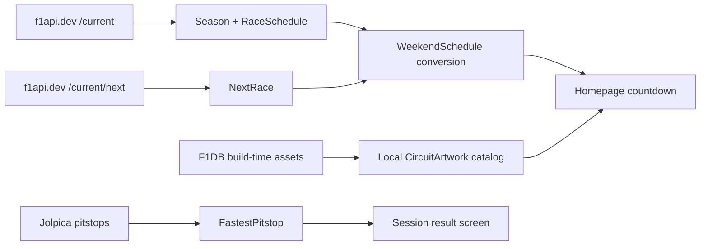

# Ticket 10 — Remove OpenF1 runtime dependency

Status: shipped

Implement [ADR 0009](../../../decisions/0009-remove-openf1-runtime-dependency.md)
and its source-ownership plan in
[openf1-removal.md](../../../wayfinder/f1app/openf1-removal.md). This is a
hard cut: remove OpenF1 runtime code rather than retaining adapters or fallback
paths. F1DB is used only for build-time circuit artwork in this slice; its
Driver of the Day and historical fastest-lap contracts remain future work.

## Target data flow



## Canonical schedule model

Keep `RaceSchedule` on `Race`. It is already populated from f1api.dev
`/current` and contains the seven nullable session slots. Keep
`WeekendSchedule` as the countdown model, but make `SessionTime` typed:

```kotlin
data class SessionTime(
    val type: SessionType,
    val start: Instant,
) {
    val label get() = type.label
    val shortLabel get() = type.shortLabel
}
```

Add a pure conversion beside the race-weekend models:

```kotlin
internal fun RaceSchedule.toWeekendSchedule(): WeekendSchedule? {
    val sessions = activeSessions()
        .mapNotNull { scheduled ->
            scheduled.slot.toInstantOrNull()?.let { instant ->
                SessionTime(scheduled.type, instant)
            }
        }
        .sortedBy { it.start }

    return WeekendSchedule(sessions).takeIf { it.sessions.isNotEmpty() }
}
```

Use `SessionType.Race` for race lookup. Do not identify sessions by comparing
string labels such as `"RACE"`.

The Homepage already loads both `Season` and `NextRace`. After those loads,
the ViewModel finds the matching season race and converts its schedule:

```kotlin
val schedule = season.races
    .firstOrNull { it.round == next.round }
    ?.schedule
    ?.toWeekendSchedule()
```

Missing or malformed slots are valid empty data, not a network failure.

## Homepage state and code path

Remove `topSpeed` and `circuitImage` from `HomepageViewModel.UiState.Sections`.
The remaining derived section is `weekendSchedule`:

```kotlin
data class Sections(
    val favorites: SectionUiState<Favorites>,
    val season: SectionUiState<Season>,
    val nextRace: SectionUiState<NextRace?>,
    val drivers: SectionUiState<List<DriverStanding>>,
    val constructors: SectionUiState<List<ConstructorStanding>>,
    val weekendSchedule: SectionUiState<WeekendSchedule?>,
)
```

The load sequence remains:

```text
loadSeason()
loadNextRace()
deriveWeekendScheduleFromSeasonAndNextRace()
loadDrivers()
loadConstructors()
```

Remove the Homepage dependencies and methods for `GetCircuitTopSpeedUseCase`
and `GetCircuitImageUseCase`. The countdown card receives the local artwork
lookup result instead of a URL state.

## Local F1DB artwork

F1DB artwork is imported before packaging and checked into Android resources.
Runtime code receives no F1DB JSON and performs no F1DB request.

```text
tools/f1db/
  revision.txt
  circuit-artwork-map.json
  import-circuit-artwork.py
app/src/main/res/drawable-nodpi/circuit_*.webp
app/src/main/java/.../ui/artwork/CircuitArtwork.kt
THIRD_PARTY_NOTICES.md
```

Keep Android resource IDs out of `f1/`. Use a UI-layer type:

```kotlin
data class CircuitArtworkAsset(
    @DrawableRes val resourceId: Int,
    val tintable: Boolean,
)

object CircuitArtwork {
    fun forId(circuitId: String): CircuitArtworkAsset =
        assets[circuitId] ?: placeholder
}
```

The map is keyed by the f1api.dev `circuitId`, never country or round.
Unknown circuits return a neutral placeholder. Replace Coil `AsyncImage` with
Compose `Image` plus `painterResource`; remove Coil if it has no other caller.

## Remove top speed

Top speed has no supported runtime replacement in f1api.dev or Jolpica. Delete
`GetCircuitTopSpeedUseCase` and `TopSpeed`. Remove top-speed state, dependency,
loading, and UI from:

- `HomepageViewModel` and `HomepageScreen`
- `RoundViewModel` and `RoundScreen`
- `Wiring`

Do not relabel fastest lap or lap record as top speed.

## Jolpica pit-stop path

Replace the current OpenF1 session-key join:

```text
GetRoundResults → country/date → OpenF1 sessions → OpenF1 pit
```

with one Jolpica request:

```text
GetFastestPitstopUseCase
    → GET {JOLPICA_BASE}/{year}/{round}/pitstops/
    → minimum positive duration
```

Add `getJolpicaPitStops(year, round, forceRefresh)` and DTOs for the
`MRData.RaceTable.Races[].PitStops[]` envelope. Keep wire `duration` as a
nullable string and parse it at the use-case boundary.

Change the domain type from car number to driver ID:

```kotlin
data class FastestPitstop(
    val driverId: String,
    val durationSeconds: Double,
)
```

The session-result UI joins the optional pit-stop card to `RoundResult` by
`driverId`. No pit-stop records produce `Outcome.Success(null)` and hide the
optional card. The duration is labelled as pit-stop duration, not stationary
time.

## Network and DI deletion

Delete from `F1Api.kt`:

```text
OPENF1_BASE
getOpenF1Sessions
getOpenF1Laps
getOpenF1PitStops
getOpenF1Meetings
F1API_TO_OPENF1_COUNTRY
```

Delete the four OpenF1 DTOs from `Dtos.kt`. Delete these use cases:

```text
GetRaceWeekendScheduleUseCase
GetCircuitImageUseCase
GetCircuitTopSpeedUseCase
```

Remove the corresponding properties from `Wiring`. Keep the existing f1api.dev
and Jolpica result/alpha paths unchanged.

`NextRace.qualyDate` only existed for the OpenF1 top-speed join. Delete it and
remove the nested wire field if no other caller remains. Keep race date/time
needed by the Homepage and widget paths.

## Tests
Delete OpenF1-specific tests and add or update tests for:

- non-sprint and sprint `RaceSchedule.toWeekendSchedule()` conversion
- UTC ordering and malformed-slot dropping
- empty schedule behavior
- Jolpica pit-stop DTO decoding
- fastest positive duration selection
- malformed duration and no-data behavior
- `driverId` join in the session-result presentation
- known and unknown `CircuitArtwork` IDs
- Homepage state containing no top-speed or image atoms
- Round state containing no top-speed atom

Run a final source scan:

```text
rg -n -i "openf1|st_speed|OPENF1_BASE" app/src/main/java app/src/test/java
```

Production code must have no OpenF1 imports, URLs, DTOs, use cases, country
maps, session-key joins, or remote image URLs.

## Invariants

- `f1/` remains free of `android.*` imports.
- Countdown identity comes from f1api.dev `RaceSchedule`, not country joins.
- Circuit artwork is local, deterministic, and available offline.
- Optional pit-stop absence never blanks race results.
- Top speed is absent from v1 rather than replaced by an unsupported metric.
- F1DB Driver of the Day and historical fastest-lap types are not added until
  those features are explicitly approved.

## Related Lode files
- [ADR 0009](../../../decisions/0009-remove-openf1-runtime-dependency.md)
- [OpenF1 removal plan](../../../wayfinder/f1app/openf1-removal.md)
- [F1DB data coverage](../../../wayfinder/f1app/f1db-data.md)
- [Network layer](../../../core/network.md)
- [Homepage](../../../wayfinder/f1app/homepage.md)
- [Testing scope](../../../testing/scope.md)
