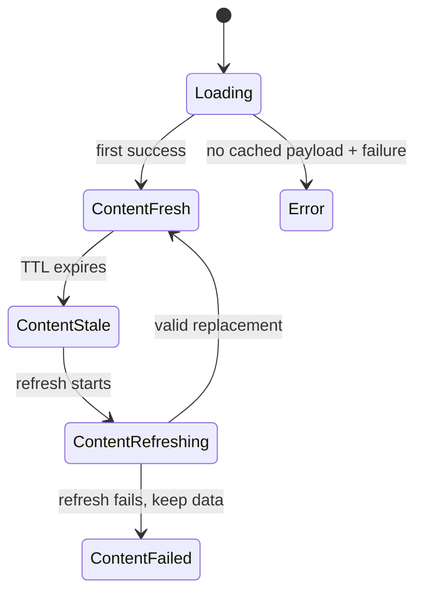

# 01 — Expand cache-aware section state

**What to build:** Make F1app's section UI transport able to keep content visible while a cached resource is fresh, stale, refreshing, or failed to refresh, without changing the behavior of existing non-cache screens.

**Blocked by:** None — can start immediately.

**Status:** shipped

```kotlin
sealed interface ContentSyncStatus {
    data object Fresh : ContentSyncStatus
    data object Stale : ContentSyncStatus
    data object Refreshing : ContentSyncStatus
    data class RefreshFailed(val message: String) : ContentSyncStatus
}
```



- [x] `SectionUiState.Content` carries a sync status with `Fresh` as the default.
- [x] Existing `Outcome` mapping still produces fresh content for non-cache use cases.
- [x] Existing screen behavior and tests remain equivalent unless they asserted the old exact `Content(data)` shape.
- [x] Tests assert `data` and `sync` separately where cache status matters.

Related: [spec](../../../specs/offline-data-cache.md), [terminology](../../../terminology.md), [ADR 0018](../../../decisions/0018-cache-status-on-section-content.md).
