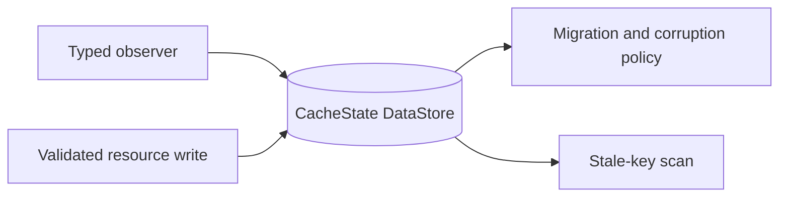

# 02 — Add snapshot store and resource contracts

**What to build:** Add the durable typed snapshot store foundation that can persist, observe, update, migrate, and recover current-season structured resources without committing to Room.

**Blocked by:** None — can start immediately.

**Status:** ready-for-agent

```kotlin
data class CacheState(
    val schemaVersion: Int,
    val activeSeason: Int?,
    val snapshots: Map<String, ResourceSnapshot>,
)
```



- [ ] Resource keys cover current-season schedule, next race/session, standings, catalogs, session results, pitstops, circuit metadata, circuit most-wins, and Wikipedia summaries.
- [ ] Snapshots record payload kind/version, fetch/stale timestamps, season metadata, and last-attempt metadata.
- [ ] Store observation emits stable per-key values and avoids unnecessary churn at the resource seam.
- [ ] Temp-file tests prove default state, atomic writes, migration behavior, and corruption recovery.
- [ ] Room remains absent from implementation unless measured fallback tripwires appear.

Related: [spec](../../../specs/offline-data-cache.md), [offline cache summary](../../../offline-data-cache/summary.md), [ADR 0019](../../../decisions/0019-offline-cache-uses-datastore-snapshots.md).
