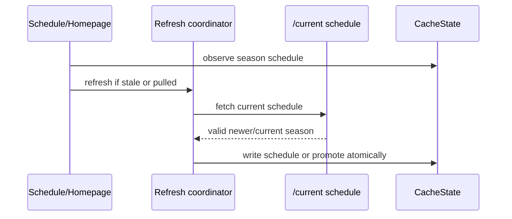

# 03 — Cache current-season schedule end to end

**What to build:** Make the current-season schedule a cached resource that Homepage, Schedule, and Round detail can read offline, with `/current` as the only active-season promotion authority.

**Blocked by:** 01 — Expand cache-aware section state; 02 — Add snapshot store and resource contracts.

**Status:** shipped

```kotlin
sealed interface CacheResourceKey {
    data class SeasonSchedule(val season: Int) : CacheResourceKey
}
```



- [x] Cached schedule renders before network success when valid data exists.
- [x] No cached schedule plus failed refresh renders the existing full-section error path.
- [x] Stale or forced refresh preserves visible schedule content and updates sync status.
- [x] Valid newer `/current` schedule promotes active season and prunes old season-scoped snapshots atomically.
- [x] Invalid or failed candidate schedule leaves the existing active season readable.

Related: [spec](../../../specs/offline-data-cache.md), [ADR 0017](../../../decisions/0017-offline-refresh-coordination.md), [wayfinder ticket 01](../../../wayfinder/offline-data-cache/tickets/01-cache-contract-and-inventory.md).
