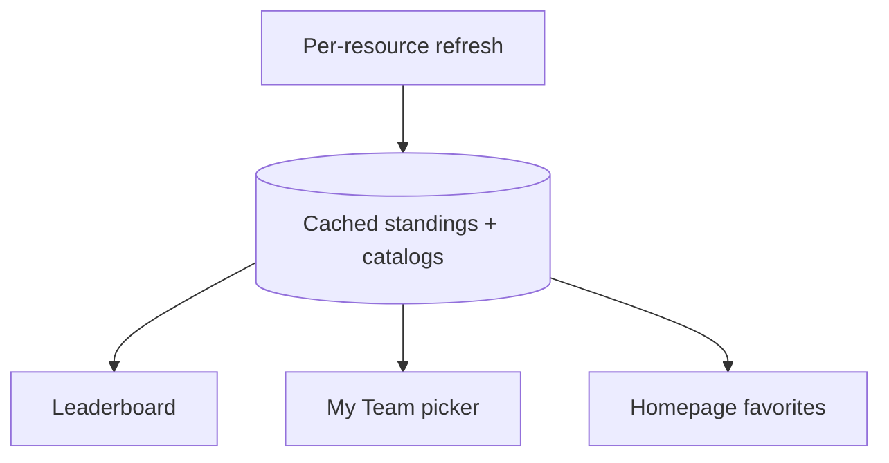

# 04 — Cache standings and catalogs end to end

**What to build:** Make Driver standings, Constructor standings, driver catalogs, and team catalogs cached current-season resources so Leaderboard, My Team, and favorites-backed Homepage content survive offline.

**Blocked by:** 03 — Cache current-season schedule end to end.

**Status:** shipped

```kotlin
sealed interface CacheResourceKey {
    data class DriverStandings(val season: Int) : CacheResourceKey
    data class ConstructorStandings(val season: Int) : CacheResourceKey
    data class DriverCatalog(val season: Int) : CacheResourceKey
    data class TeamCatalog(val season: Int) : CacheResourceKey
}
```



- [x] Leaderboard can render cached Driver and Constructor standings offline.
- [x] My Team picker and favorites-backed Homepage sections can render from cached standings/catalogs when available.
- [x] Empty-but-valid early-season standings/catalog payloads cache without being treated as corruption.
- [x] Refresh failure preserves last good standings/catalog payloads and records attempt metadata.
- [x] Rollover prunes old season-scoped standings and catalogs immediately after schedule promotion.

Related: [spec](../../../specs/offline-data-cache.md), [terminology](../../../terminology.md), [ADR 0017](../../../decisions/0017-offline-refresh-coordination.md).
