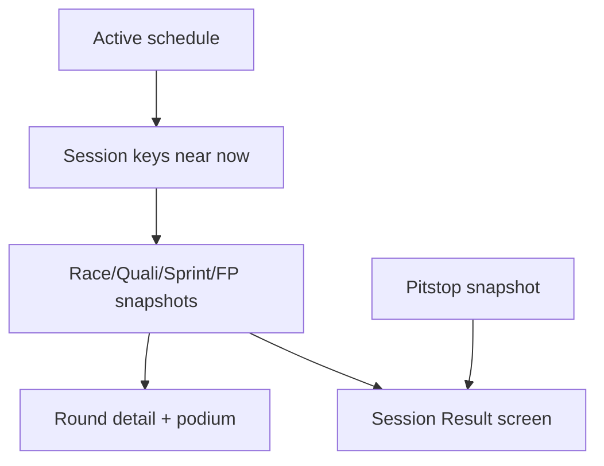

# 06 — Cache session results and race enrichments

**What to build:** Make selected current-season session results, past-list podium snippets, and race enrichments durable so Round and Session Result surfaces remain useful offline.

**Blocked by:** 03 — Cache current-season schedule end to end; 04 — Cache standings and catalogs end to end.

**Status:** ready-for-agent

```kotlin
sealed interface CacheResourceKey {
    data class SessionResult(val season: Int, val round: Int, val session: SessionType) : CacheResourceKey
    data class Pitstops(val season: Int, val round: Int) : CacheResourceKey
}
```



- [ ] Session Result pages render cached Race, Quali, Sprint, Sprint Quali, and Practice results when available.
- [ ] Past-list podium content can be derived from cached race results without a separate durable truth.
- [ ] Pit-stop enrichment preserves cached content and treats empty enrichment as valid when upstream has no data.
- [ ] Result refreshes only run when a session is plausibly complete according to schedule-derived rules.
- [ ] Refresh failure for one session/enrichment never blanks other session resources.

Related: [spec](../../../specs/offline-data-cache.md), [session result source ADR](../../../decisions/0005-session-results-use-two-apis.md), [ADR 0017](../../../decisions/0017-offline-refresh-coordination.md).
