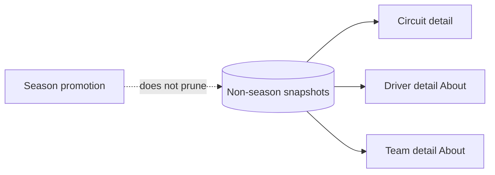

# 07 — Cache non-season detail resources

**What to build:** Make circuit metadata, circuit most-wins, and Wikipedia summaries durable non-season resources so detail pages remain readable offline and survive season rollover.

**Blocked by:** 02 — Add snapshot store and resource contracts; 04 — Cache standings and catalogs end to end.

**Status:** built

```kotlin
sealed interface CacheResourceKey {
    data class CircuitMetadata(val circuitId: String) : CacheResourceKey
    data class CircuitMostWins(val circuitId: String) : CacheResourceKey
    data class WikipediaSummary(val title: String) : CacheResourceKey
}
```



- [x] Circuit metadata and circuit most-wins render from cached snapshots offline.
- [x] Wikipedia summaries render from cached snapshots offline where detail pages use them.
- [x] Non-season resources are not pruned by active-season promotion.
- [x] Unknown/new circuit most-wins responses can cache valid nullable leaders instead of being treated as corruption.
- [x] Refresh failure preserves existing non-season content and updates sync status.

Related: [spec](../../../specs/offline-data-cache.md), [circuit detail](../../../wayfinder/f1app/circuit-most-wins.md), [driver/team detail](../../../wayfinder/f1app/driver-team-detail.md).
