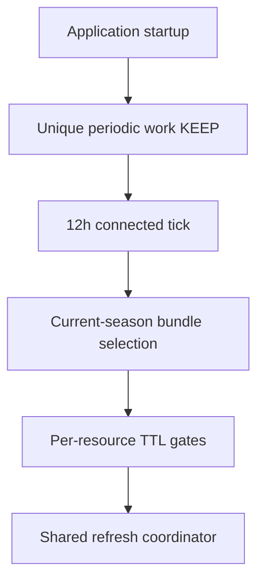

# 08 — Wire fixed periodic cache sync

**What to build:** Register and run one fixed 12-hour WorkManager job that warms bounded current-season structured data through the same refresh coordinator as foreground screens.

**Blocked by:** 03 — Cache current-season schedule end to end; 04 — Cache standings and catalogs end to end; 05 — Cache next race and session end to end; 06 — Cache session results and race enrichments; 07 — Cache non-season detail resources.

**Status:** ready-for-agent

```kotlin
WorkManager.enqueueUniquePeriodicWork(
    "current-season-cache-sync",
    ExistingPeriodicWorkPolicy.KEEP,
    periodicRequest,
)
```



- [ ] Startup registers one unique periodic work request with a 12-hour interval and `NetworkType.CONNECTED` constraint.
- [ ] The worker uses exponential backoff for transient bundle-level infrastructure failure.
- [ ] Bundle selection includes schedule, next race/session, standings, catalogs, and bounded recent/upcoming session resources.
- [ ] Per-resource TTL gates still decide whether network calls run during a tick.
- [ ] Per-resource failures record attempt metadata and normally do not fail the whole worker.
- [ ] Tests assert registration policy and constraints, not exact run timing.

Related: [spec](../../../specs/offline-data-cache.md), [wayfinder ticket 05](../../../wayfinder/offline-data-cache/tickets/05-fixed-periodic-sync.md), [ADR 0017](../../../decisions/0017-offline-refresh-coordination.md).
