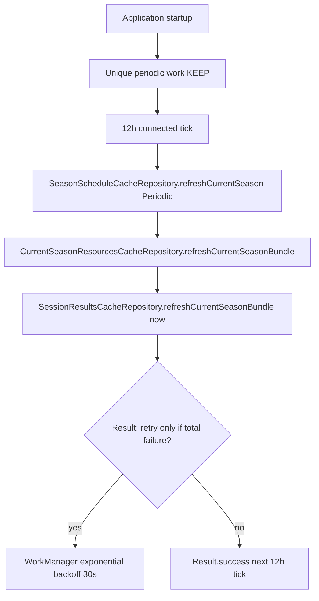

# 08 — Wire fixed periodic cache sync

**What to build:** Register and run one fixed 12-hour WorkManager job that warms bounded current-season structured data through the same refresh coordinator as foreground screens.

**Blocked by:** 03 — Cache current-season schedule end to end; 04 — Cache standings and catalogs end to end; 05 — Cache next race and session end to end; 06 — Cache session results and race enrichments; 07 — Cache non-season detail resources.

**Status:** built

```kotlin
WorkManager.enqueueUniquePeriodicWork(
    "current-season-cache-sync",
    ExistingPeriodicWorkPolicy.KEEP,
    periodicRequest,
)
```



- [x] Startup registers one unique periodic work request with a 12-hour interval and `NetworkType.CONNECTED` constraint. — `F1App.onCreate` calls `CacheSyncWorker.enqueuePeriodic(this)`. The pure `buildPeriodicRequest()` builds a 12h `PeriodicWorkRequest` with `NetworkType.CONNECTED`; `enqueueUniquePeriodicWork(UNIQUE_PERIODIC_NAME, KEEP, …)` is the production seam.
- [x] The worker uses exponential backoff for transient bundle-level infrastructure failure. — `BackoffPolicy.EXPONENTIAL` with 30s initial delay; the worker returns `Result.retry()` only when `BundleRefreshResult.isTotalFailure()` is true (i.e. at least one resource was attempted and none succeeded). The worker does **not** treat a no-active-season / no-schedule / no-eligible-sessions state as a failure — those are legitimate "nothing to attempt this tick" outcomes and return `Result.success()` so the next 12h tick re-evaluates without WorkManager backoff amplifying an off-season loop. The schedule refresh is included in the aggregate so a failed schedule on a pre-promotion device (no active season yet) retries, it is not silently mis-classified as off-season.
- [x] Per-resource TTL gates still decide whether network calls run during a tick. — `RefreshReason.Periodic` does **not** bypass the TTL gate; the gate is now `reason !is RefreshReason.PullToRefresh && !isStale(now)`, so both `StaleOpen` and `Periodic` honor the cache's `staleAfterEpochMs` decision. Only `PullToRefresh` bypasses. Applied in `SeasonScheduleCacheRepository.refreshCurrentSeason`, `CurrentSeasonResourcesCacheRepository.refreshActiveSeason`, `SessionResultsCacheRepository.refreshSessionResult` and `refreshPitstops`, and all three `NonSeasonResourcesCacheRepository.refresh*` methods.
- [x] Bundle selection includes schedule, next race/session, standings, catalogs, and bounded recent/upcoming session resources. — `CacheSyncWorker.doWork()` orchestrates three calls: schedule (`refreshCurrentSeason(Periodic)` — atomic promotion), `currentSeasonResourcesCacheRepository.refreshCurrentSeasonBundle()` (next race + driver/constructor standings + driver/team catalogs), and `sessionResultsCacheRepository.refreshCurrentSeasonBundle(now)` (sessions within ±48h of `now` that are plausibly complete per the per-session buffer gate, plus race pitstops).
- [x] Per-resource TTL gates still decide whether network calls run during a tick. — The bundle calls the same per-resource `refresh*` methods the foreground uses; the existing TTL/StaleOpen fast-path and the session plausibly-complete gate are unchanged.
- [x] Per-resource failures record attempt metadata and normally do not fail the whole worker. — Each bundle wraps the per-resource call in `runCatching`; the per-resource repository's `fail(...)` updates `lastAttempt*` metadata; the worker returns `Result.success()` for any partial success (or empty bundle — off-season re-evaluation), and `Result.retry()` only for total infrastructure failure.
- [x] Tests assert registration policy and constraints, not exact run timing. — `CacheSyncWorkerTest` (now in `core/cache/`, 15 tests) asserts the pure builder's interval (12h), constraint (CONNECTED), backoff (EXPONENTIAL, 30s), the `UNIQUE_PERIODIC_NAME`/`INTERVAL_HOURS`/`BACKOFF_DELAY_SECONDS` constants, the `BundleRefreshResult` retry policy, and the three-way worker result decision (empty → success, partial → success, total failure → retry; schedule-only failure retries; schedule-failed-but-bundles-succeeded succeeds). Bundle behavior is covered in `CurrentSeasonResourcesCacheRepositoryTest` (7 new tests: bundle writes all keys, partial failure preserves good writes, total failure leaves schedule intact, no-active-season returns empty, Periodic on fresh snapshot skips network, Periodic on stale snapshot hits network, PullToRefresh bypasses TTL) and `SessionResultsCacheRepositoryTest` (5 new tests: only plausibly-complete sessions in window are attempted, future sessions inside window are excluded, empty bundle when no sessions eligible, no-active-season returns empty, no-schedule returns empty). 27 new tests, 0 timing assertions.

Related: [spec](../../../specs/offline-data-cache.md), [wayfinder ticket 05](../../../wayfinder/offline-data-cache/tickets/05-fixed-periodic-sync.md), [ADR 0017](../../../decisions/0017-offline-refresh-coordination.md).

**Worker placement:** `CacheSyncWorker` lives in `core/cache/`, not `f1/`, because the `f1/` package is the domain layer (zero `android.*` imports per the `practices.md` domain-purity invariant). The worker reaches the F1 repositories through `F1App.wiring`, mirroring the `widget/countdown/CountdownWorker.kt` pattern.
