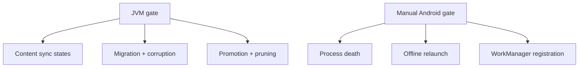

# 09 — Offline cache validation and rollout hardening

**What to build:** Prove the offline cache is safe to ship by closing automated edge-case coverage and documenting the manual Android checks for process death, offline launch, WorkManager registration, migration, and corruption recovery.

**Blocked by:** 08 — Wire fixed periodic cache sync.

**Status:** ready-for-agent

```kotlin
@Test
fun forcedRefreshFailure_keepsCachedContentVisible() = runTest {
    // seed cache, fail refresh, assert content data remains with RefreshFailed status
}
```



- [ ] JVM tests cover stale-open, forced-refresh failure, background partial failure, single-flight coalescing, promotion, pruning, migration, and corruption recovery.
- [ ] At least one test uses the real serializer/store path with a temp file.
- [ ] Unsupported future schemas and failed migrations fail safe as no usable cache with network recovery possible.
- [ ] Manual checklist covers seed online, kill/force-stop, disable network, relaunch, and confirm cached current-season content renders before network success.
- [ ] Manual checklist verifies WorkManager unique registration, constraint, interval, and `KEEP` policy without relying on exact timing.
- [ ] Lode docs are updated if implementation changes any load-bearing cache contract.

Related: [spec](../../../specs/offline-data-cache.md), [wayfinder ticket 06](../../../wayfinder/offline-data-cache/tickets/06-offline-cache-validation.md), [offline cache summary](../../../offline-data-cache/summary.md).
