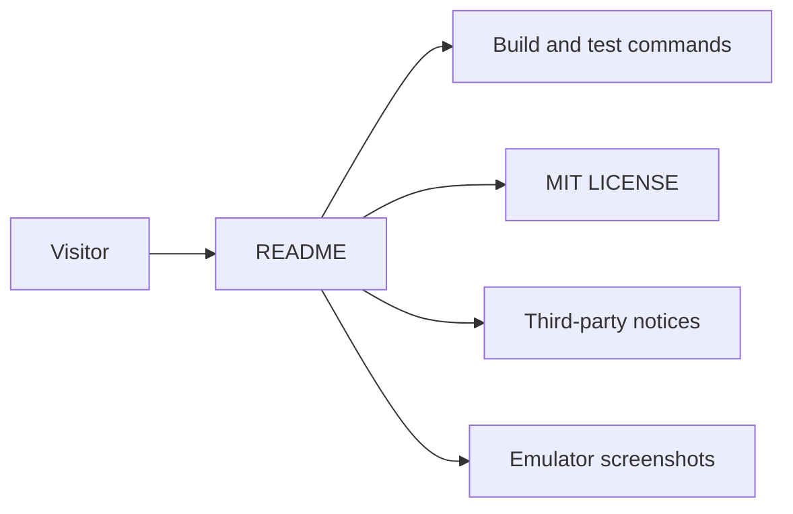

# Public repository surface

F1app is presented publicly as a personal open-source Android project under
active development. The root [README](../../README.md) documents only shipped
behavior, while [THIRD_PARTY_NOTICES](../../THIRD_PARTY_NOTICES.md) owns data
and media attribution and the root [LICENSE](../../LICENSE) applies MIT terms
to project source code.

## Public entry points

```text
README.md                  # product, screenshots, setup, privacy, disclaimer
LICENSE                    # MIT license for F1app source
THIRD_PARTY_NOTICES.md     # external data, artwork, and media notices
docs/images/*.png          # emulator screenshots used by README
```



## Contracts

- README feature claims must match shipped code, not queued plans.
- The clone URL is `https://github.com/anpurnama/F1app.git`, matching the
  public identifier already sent in the Wikipedia REST User-Agent.
- Screenshots come from an emulator and contain no personal device data.
- `keystore.properties`, `local.properties`, and signing material stay ignored.
- MIT covers project source only; third-party data, media, and trademarks are
  not relicensed.

## Rationale and lessons

The public surface separates source licensing from third-party attribution so
the MIT grant cannot be mistaken for ownership of Formula 1 marks or external
media. Re-capture screenshots when the top-level product shape materially
changes.

Related: [project summary](../summary.md), [release signing](../release/build-and-signing.md).
