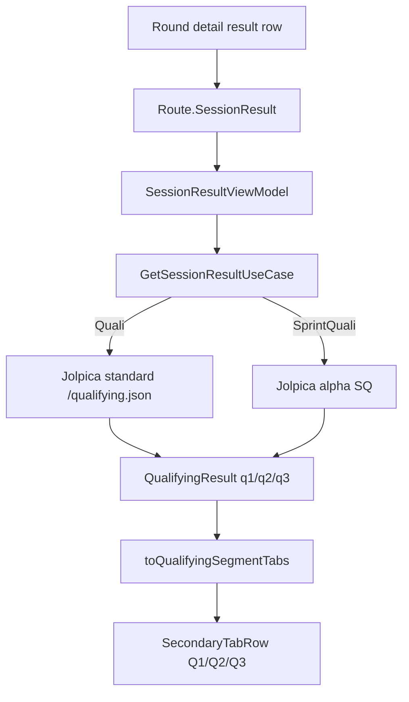

# Qualifying segment tabs

Qualifying and Sprint Qualifying are fetched as one session result, then rendered as
three segment tabs. The app does **not** create route-level Q1/Q2/Q3 session types:
`Route.SessionResult(year, round, SessionType.Quali)` and
`Route.SessionResult(year, round, SessionType.SprintQuali)` remain the only navigation
keys for these result pages.

Related: [../architecture/id-namespaces.md](../architecture/id-namespaces.md),
[../decisions/0005-session-results-use-two-apis.md](../decisions/0005-session-results-use-two-apis.md),
[../summary.md](../summary.md).

## Data flow



## Types and contracts

`QualifyingResult` remains the source row:

```kotlin
data class QualifyingResult(
    val gridPosition: Int,
    val q1: String?,
    val q2: String?,
    val q3: String?,
    val driverId: String,
    val teamId: String,
)
```

Segment rendering is derived by `f1/model/QualifyingSegments.kt`:

```kotlin
enum class QualifyingSegment { Q1, Q2, Q3 }

data class QualifyingSegmentTab(
    val segment: QualifyingSegment,
    val rows: List<QualifyingSegmentResult>,
    val advancedCount: Int,
    val eliminatedCount: Int,
)
```

## Derivation rules

- Q1 rows are drivers whose `q1 != null`; `eliminated = q2 == null`.
- Q2 rows are drivers whose `q2 != null`; `eliminated = q3 == null`.
- Q3 rows are drivers whose `q3 != null`; `eliminated = false`.
- Empty strings count as present segment participation. Display them as **No time**.
- Segment positions are recomputed inside each tab after sorting by segment lap time.
- Counts are derived from the data, not hard-coded to 20/15/10 or 20/16/10.

## Sorting invariant

Lap-time strings are display strings from the source APIs. The segment mapper parses
common forms before sorting:

```kotlin
parseQualifyingLapTimeMillis("1:30.031") == 90_031L
parseQualifyingLapTimeMillis("1:30:031") == 90_031L
parseQualifyingLapTimeMillis("59.999") == 59_999L
```

Unparsed values sort after parsed lap times and keep their original API relative
order. The original string is always preserved for display.

## UI contract

`SessionResultScreen` renders Qualifying and Sprint Qualifying with a
`SecondaryTabRow` containing Q1, Q2, and Q3. Each selected tab lists only that
segment's rows, shows the segment lap time, and includes the overall qualifying classification position as
secondary context. Q3 rows say **Final segment**, not **Advanced**.
