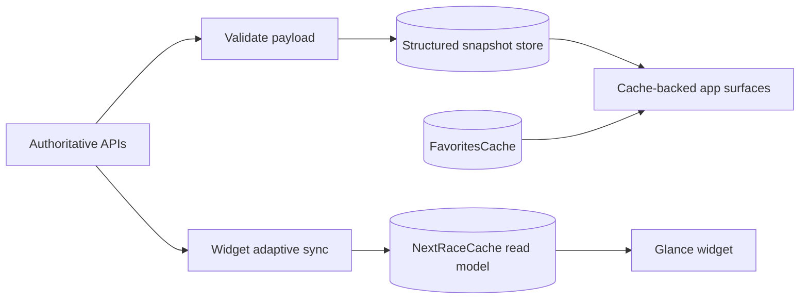
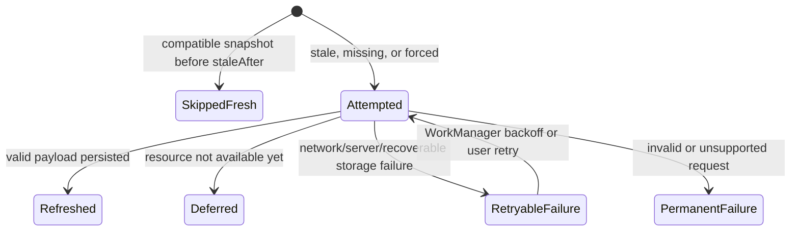

# Offline cache correctness and ownership hardening

## Problem Statement

F1app's durable structured-data cache preserves validated current-season data
and supports several offline surfaces, but some cache signals do not describe
what actually happened. A resource skipped because its snapshot is fresh is
reported as a successful refresh, payload versions are written but not checked
when read, and a first-launch pull-to-refresh can lose its force-refresh intent
while discovering the active season. These gaps can suppress background retry
or expose an incompatible payload after an app upgrade.

Coverage is also inconsistent with the offline cache contract. Session Result
and Circuit Detail use durable snapshots, while Round Detail result summaries,
Driver Detail, Constructor Detail, and Wikipedia-backed summaries remain wholly or
partly network-only. Finally, the structured cache recovers from corrupt bytes,
but the FavoritesCache and widget's NextRaceCache do not have equivalent
recovery at their DataStore construction seams.

## Solution

F1app will retain the bounded DataStore snapshot architecture and make its
contracts truthful. Refresh outcomes will distinguish a network write, a fresh
TTL skip, a time-deferred resource, retryable failure, and terminal resource failure. WorkManager will
base retry only on attempted retryable failures; fresh skips are neutral.
Snapshot readers will reject unsupported payload versions as cache misses.
Force-refresh intent will propagate through active-season discovery.

The remaining current-scope offline surfaces will consume the existing cache
repositories or a narrow cache-backed detail coordinator. Cached content will
remain visible during refresh and after retryable failure. Preference DataStore
instances will recover to safe defaults after corruption. The widget cache will
remain a separate, narrow launcher read model because its rendering and update
cadence are independent, but it will not be described as the structured-data
source of truth.

```kotlin
sealed interface RefreshResult {
    data object Refreshed : RefreshResult
    data object SkippedFresh : RefreshResult
    data object Deferred : RefreshResult
    data class RetryableFailure(val message: String) : RefreshResult
    data class PermanentFailure(val message: String) : RefreshResult
}
```



## User Stories

1. As an F1app user, I want previously loaded content to remain visible when a refresh fails, so that weak connectivity does not blank useful data.
2. As an F1app user, I want stale content identified honestly, so that I know when displayed information may be old.
3. As an F1app user, I want pull-to-refresh to force an upstream request, so that reconnecting to the network can replace stale data immediately.
4. As a first-launch user, I want pull-to-refresh to preserve its force intent while discovering the active season, so that an intermediary transport cache cannot defeat my request.
5. As an offline user, I want Homepage season, next-session, standings, and favorites sections to render their last validated payloads, so that the primary screen remains useful.
6. As an offline user, I want Schedule to render the cached current-season schedule, so that I can browse rounds without connectivity.
7. As an offline user, I want cached past-round podiums to remain visible, so that a failed result refresh does not erase them.
8. As an offline user, I want Round Detail to render cached Race and Qualifying summaries when available, so that the round overview is consistent with Session Result pages.
9. As an offline user, I want Session Result pages to render cached Race, Qualifying, Sprint, Sprint Qualifying, and Practice results, so that previously opened sessions remain readable.
10. As an offline user, I want cached fastest-pitstop enrichment to remain visible, so that optional detail survives an upstream failure.
11. As an offline user, I want Circuit Detail metadata and most-wins sections to render independently from cache, so that one failure does not blank the other.
12. As an offline user, I want Driver Detail to render its last validated current-season joined data, so that a profile does not regress to a full-screen network error.
13. As an offline user, I want Constructor Detail to render its last validated current-season joined data, so that a constructor profile remains readable.
14. As an offline user, I want a previously loaded Wikipedia summary to remain readable, so that About content survives connectivity loss.
15. As a user opening data that has never been cached, I want a clear loading then error state, so that F1app does not pretend content exists.
16. As a user opening a future session, I want F1app to avoid premature result requests, so that empty upstream responses are not cached as completed results.
17. As a user, I want an app upgrade to ignore incompatible cached payloads safely, so that schema evolution cannot display malformed data or crash a screen.
18. As a user, I want corrupt structured cache bytes to recover as no cached data, so that the app can refresh rather than crash.
19. As a user, I want corrupt favorites bytes to recover to empty favorites, so that the app remains usable and can seed or accept new picks.
20. As a widget user, I want corrupt countdown bytes to recover to the no-data state, so that the launcher does not repeatedly fail to render the widget.
21. As a widget user, I want the countdown's narrow snapshot and adaptive cadence preserved, so that launcher updates do not depend on a screen being opened.
22. As a widget user, I want widget refresh failure to preserve the last good snapshot, so that a temporary outage does not erase the countdown.
23. As a user, I want a new season promoted only from a valid current schedule, so that standings and results cannot move the cache to a partially published season.
24. As a user, I want old season-scoped snapshots pruned atomically after promotion, so that current-season screens never mix generations.
25. As a user, I want stable non-season circuit and Wikipedia snapshots retained across season promotion, so that useful reference content is not discarded.
26. As a user, I want successful resource refreshes retained when another endpoint fails, so that one upstream outage cannot roll back unrelated data.
27. As a user, I want failed background requests retried with backoff even when another resource was fresh or refreshed, so that partial outages recover without waiting twelve hours.
28. As a user, I want permanent resource failures excluded from retry loops, so that invalid requests do not waste battery and network indefinitely.
29. As a developer, I want fresh TTL skips represented separately from network success, so that orchestration decisions are based on real work.
30. As a developer, I want payload compatibility checked at one cache-read contract, so that every resource follows the same upgrade rule.
31. As a developer, I want foreground and background refreshes to keep one per-resource single-flight owner, so that overlapping work does not duplicate requests.
32. As a developer, I want a pull-to-refresh joining weaker in-flight work to have a documented result, so that user intent is not silently ambiguous.
33. As a developer, I want cache-backed screens to share the same stale/refreshing/failure state mapping, so that UI behavior does not drift by feature.
34. As a developer, I want unused cache APIs either connected to a current surface or removed, so that the cache's claimed coverage matches production behavior.
35. As a developer, I want storage size and write latency measured before adopting Room, so that substrate changes respond to evidence rather than architecture preference.

## Implementation Decisions

- Keep the Proto DataStore-style whole-resource snapshot map as the structured
  cache substrate. Do not introduce Room without a measured size, write
  latency, contention, partial-update, or indexed-query tripwire.
- Replace the binary refresh result with five outcomes: refreshed,
  skipped-fresh, deferred, retryable failure, and permanent failure.
- Treat skipped-fresh as neutral in bundle aggregation. It proves cache
  freshness, not network availability.
- Treat a future or plausibly incomplete session as deferred. Deferred is
  neutral for the current worker run and is reconsidered on a later scheduled
  run; it is neither success nor failure.
- Make the periodic worker retry when at least one attempted resource has a
  retryable failure. Successful writes remain committed; on retry they are
  skipped by their TTL gates.
- Classify timeouts, connectivity failures, HTTP 408, HTTP 429, HTTP 5xx, and
  transient storage I/O failures as retryable. Other HTTP 4xx responses and
  unsupported resource requests are permanent for that invocation. A malformed
  HTTP-success payload or serializer failure is retryable because the upstream
  response may recover; an incompatible stored payload is a cache miss, not a
  refresh failure.
- Preserve the fixed twelve-hour periodic schedule, connected-network
  constraint, unique work identity, and exponential backoff.
- Propagate the initiating refresh reason through active-season discovery.
  Pull-to-refresh bypasses both resource TTL and Ktor HttpCache at every
  network step required by that request.
- Enforce key, payload kind, season where applicable, and payload version from
  envelope metadata before decoding the payload body. An unsupported version behaves as no usable
  payload and is replaceable by the next valid refresh.
- Keep failed refreshes from deleting the last compatible payload. Attempt
  metadata remains attached to existing snapshots.
- Keep schedule-gated active-season promotion and atomic pruning unchanged.
- Preserve one single-flight gate per resource key. If callers with different
  refresh strengths overlap, the implementation must either elevate to the
  strongest reason before network dispatch or run one forced follow-up after
  weaker work completes. A joined pull-to-refresh completes only after its
  forced attempt or follow-up and returns that attempt's actual outcome.
- Extend cache-backed production coverage to the current-scope Round Detail,
  Driver Detail, Constructor Detail, and Wikipedia-backed summary surfaces.
  Reuse existing current-season catalogs, standings, session results, and
  non-season snapshots before adding new payload shapes.
- Remove cache contracts that remain unreachable after current product scope
  is applied. Do not retain speculative cache APIs solely for future screens.
- Keep `SectionUiState.Content(data, sync)` as the only cache-aware VM-to-UI
  transport. Stale, refreshing, and refresh-failed data remains Content.
- Add safe-default corruption recovery when constructing FavoritesCache and
  NextRaceCache DataStores. Serializer-detected corruption recovers Favorites
  to empty and widget state to no race data until the next successful worker
  run; arbitrary file I/O failures remain failures rather than being erased.
- Retain NextRaceCache as a widget-specific read model and retain its adaptive
  worker cadence. It is not an alternative structured cache and does not own
  app-screen state.
- Avoid a general caching framework. Shared code may be extracted only for the
  proven cross-resource contracts: outcome aggregation, compatibility checks,
  and cache-aware section loading.



## Testing Decisions

- Use repository refresh plus bundle aggregation as the primary seam. Assert
  persisted snapshots and returned outcomes, not internal call choreography.
- Test the worker's pure result reducer with all meaningful mixtures:
  refreshed, skipped-fresh, deferred, retryable failure, and permanent failure.
- Prove that a fresh schedule plus failed stale resources produces retry, not
  success, and that permanent-only failures do not produce retry.
- Test payload versions at every resource family through representative
  snapshots: supported versions decode; unsupported versions act as misses;
  a subsequent valid refresh replaces them.
- Test first-launch pull-to-refresh through active-season discovery and assert
  that every required HTTP request bypasses transport cache.
- Test mixed-strength single-flight behavior, especially stale-open followed
  by pull-to-refresh, using request capture rather than mock interaction APIs.
- Test that failed refreshes preserve the previous compatible payload and
  expose RefreshFailed through `SectionUiState.Content`.
- Add ViewModel tests only for newly cache-backed user-visible surfaces. Reuse
  hand-written flows and suspend lambdas used by existing Homepage, Schedule,
  Circuit, and Session Result tests.
- Test Preferences DataStore corruption recovery with temporary files for both
  FavoritesCache and NextRaceCache.
- Keep one real serializer/DataStore temporary-file test for atomic promotion,
  pruning, and compatibility behavior.
- Manually validate process-death offline relaunch for each newly cache-backed
  screen and launcher widget recovery after corrupt/no-data state.
- Benchmark a realistic full current-season snapshot set. Record serialized
  file size and representative single-resource write latency; use the existing
  Room tripwires rather than an arbitrary threshold invented by this spec.

## Out of Scope

- A normalized Room F1 database.
- Historical archive retention beyond the active season.
- Indexed local joins, sorting, or filtering inside cached payloads.
- Remote-image cache changes; Coil remains responsible.
- Dynamic rescheduling of the twelve-hour structured-cache worker.
- Replacing Glance or removing the widget's narrow read model.
- Authenticated synchronization, user-editable remote F1 data, or conflict
  resolution.
- Exact background execution timing guarantees; WorkManager remains
  opportunistic.

## Further Notes

The existing debug JVM suite covers fresh-skip aggregation and mixed-strength
single-flight behavior for non-season resources. Unsupported payload versions
and preference corruption remain outside this focused hardening coverage.
Passing tests therefore describe the current implementation, not completion
of every item in this spec.

This work hardens the existing architecture rather than introducing a new one.
If measurements eventually trip the Room fallback, that substrate change is a
separate load-bearing decision and requires a new ADR.

Related: [offline cache spec](offline-data-cache.md), [cache summary](../offline-data-cache/summary.md), [refresh coordination](../offline-data-cache/refresh-coordination.md), and [project practices](../practices.md).
