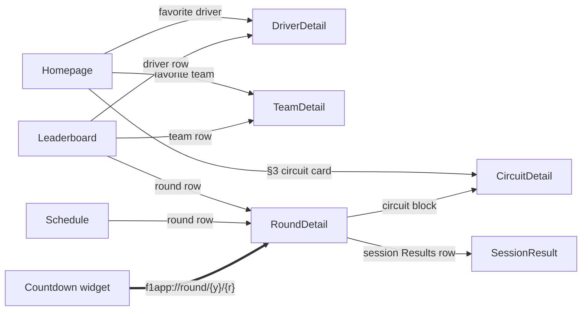

# F1app data layer spec

Architecture, data sources, API client, caching, navigation, and schedule contract.

## Implementation Decisions

### Module & architecture

- Single `:app` module. No multi-module split; a future KMP `:shared` port is
  a `git mv` of `f1/`, not a refactor — guarded by the domain-purity invariant
  below, not by premature module extraction.
- **Manual `Wiring(context)` service locator** held by a custom `Application`
  subclass (`app.wiring`). The widget shares the same instance — one manual
  service locator across entry points.
- **MVVM:** `ViewModel` + sealed `UiState` + `StateFlow`. State derived via
  `combine` of small `MutableStateFlow` atoms + `stateIn(SharingStarted.Lazily)`.
- **Init-less loading:** first load fires from `Flow.onStart { load() }`, not
  an `init {}` block. The lazy upstream stays alive for the ViewModel lifetime;
  explicit `refresh()` is the re-fire path.
- **Result type:** sealed `Outcome<T>` (`Success` / `Failure` / `Loading`) at
  `core/Outcome.kt`.
- **Domain seam:** UseCase classes; ViewModels take them as function
  references (`useCase::invoke`). No direct repository access from
  ViewModels.
- **Navigation 3:** `NavKey` + `@Serializable` route objects + custom
  `Navigator` / `NavigationState` in `core/navigation/`; flat graph, no
  nested subgraphs.

### Domain-purity invariant (hard)

`f1/` — domain models, DTOs, Ktor API extensions, and use cases — must
contain zero `android.*` imports. Platform concerns (`Context`,
`android.util.Log`, dispatchers) are injected as interfaces from `core/`.
This is the hedge that makes a future KMP port a move instead of a rewrite.

### Data sources & API client

- One `HttpClient` in `Wiring`, with **no default base URL**; full URLs are
  built per request. Three base URL constants live in `f1/data/F1Api.kt`:

  ```kotlin
  const val F1API_BASE   = "https://f1api.dev/api"
  const val JOLPICA_BASE  = "https://api.jolpi.ca/ergast/f1"
  ```

  No `jolpica/` package — second source is `suspend fun
  HttpClient.*` extensions in the same file. The API definition itself is
  pure Kotlin and satisfies the domain-purity invariant.

- **Ktor CIO engine** (KMP-safe) + `ContentNegotiation` with
  `kotlinx.serialization` JSON
  (`{ ignoreUnknownKeys = true; coerceInputValues = true }`). Replaces
  Retrofit+OkHttp deliberately — Retrofit `@GET` interfaces are JVM-tied.

- f1api.dev endpoints wired (all zero auth):
  - `GET /current` — full-season schedule + sessions (Homepage §2 aggregates;
    Schedule both tabs; `RaceSchedule` DTO also carries `sprintQualy` and
    `sprintRace` fields, null when the GP has no sprint)
  - `GET /current/next` — next race (Homepage §1+§3, Countdown worker)
  - `GET /current/drivers`, `GET /current/teams` — Driver / Team detail
  - `GET /current/drivers-championship`, `GET /current/constructors-championship`
    — Leaderboard, Homepage fav-driver / fav-team, detail pages
  - `GET /{year}/drivers` — season-matched driver catalog; the car-number
    bridge for the Jolpica alpha translator (FP/SQ/SR rows → Ergast canonical
    ids). HttpCache-shared.
  - f1api.dev carries **no** race / qualifying / free-practice result
    endpoints after the Jolpica migration (ADR 0005); those moved to Jolpica
    (standard for race+quali, alpha for FP/SQ/SR).
  - Jolpica alpha `GET /f1/alpha/results/{round_id}/{SR|SQ|FP1|FP2|FP3}/` —
    `SessionResult` route for Sprint, Sprint Qualifying, and Free Practice
    (f1api.dev has no such endpoints). Rows translated to Ergast ids at the
    data seam via the car-number bridge; see architecture/id-namespaces.md.
  - `GET /circuits/{circuitId}` — Circuit metadata (cheap; inlined elsewhere
    but called directly for `CircuitDetail`)

- jolpica extensions:
  - `GET /{year}/{round}/results.json` and `GET /{year}/{round}/qualifying.json`
    — single source for `GetRoundResultsUseCase` (full Ergast race richness:
    circuit block, per-row `Constructor`, authoritative `status`, numeric
    `grid`, `fastestLap`, time/gap, points) and `GetRoundQualifyingUseCase`
    (per-segment Q1/Q2/Q3, per-row `Constructor` on every row including Q1
    knockouts). No f1api.dev merge (ADR 0005 supersedes 0006).
  - `GET /{year}/{round}/pitstops.json` — fastest pit-stop standout card
    (duration); aligned with the Jolpica-standard race ids.
  - `getCircuitWinners(f1apiCircuitId)` —
    `GET /circuits/{id}/results/1.json`; client-aggregates the top driver +
    top team. `driverId` / `constructorId` match f1api.dev's namespace; only
    `circuitId` needs a translation (5-entry map below).

- **ID translation maps** (private vals in `F1Api.kt`):

  ```kotlin
  private val F1API_TO_JOLPICA_CIRCUIT = mapOf(
      "austin" to "americas",
      "gilles_villeneuve" to "villeneuve",
      "hermanos_rodriguez" to "rodriguez",
      "lusail" to "losail",
      "montmelo" to "catalunya",
  )
  ```

### Use cases (18 in the full design — screen-driven, no use case without a caller)

The shipped Homepage currently has seven use-case seams: season, next race,
race-weekend schedule, driver standings, constructor standings, circuit top
speed, and circuit image. The remaining rows below are the full design
contract; unimplemented rows remain follow-up work rather than shipped
behavior.

| Use case | Source(s) | Callers |
|---|---|---|
| `GetNextRaceUseCase` | f1api.dev `/current/next` | Homepage §1+§3, Countdown worker |
| `GetSeasonUseCase` | f1api.dev `/current` | Homepage §2, Schedule, Schedule-upcoming |
| `GetDriversStandingsUseCase` | f1api.dev `/current/drivers-championship` | Leaderboard, Homepage fav-driver, Driver detail |
| `GetConstructorsStandingsUseCase` | f1api.dev `/current/constructors-championship` | Leaderboard, Homepage fav-team, Team detail, first-launch seed |
| `GetDriverDetailUseCase(id)` | f1api.dev `/current/drivers` + `/drivers-championship` | Driver detail |
| `GetTeamDetailUseCase(id)` | f1api.dev `/current/teams` + `/constructors-championship` | Team detail |
| `GetRoundResultsUseCase(year, round)` | Jolpica standard `/ergast/f1/{y}/{r}/results.json` | Race `SessionResult`, RoundDetail past-mode podium chips, Past-list podium |
| `GetRoundQualifyingUseCase(year, round)` | Jolpica standard `/ergast/f1/{y}/{r}/qualifying.json` | Qualifying `SessionResult` |
| `GetPracticeResultUseCase(year, round, session)` | Jolpica alpha `/f1/alpha/results/{round_id}/{FP1|FP2|FP3}/` (ids via car-number bridge) | FP1/FP2/FP3 `SessionResult` |
| `GetSprintResultUseCase(year, round)` | Jolpica alpha `/f1/alpha/results/{round_id}/SR/` (ids via car-number bridge) | Sprint `SessionResult` |
| `GetSprintQualifyingResultUseCase(year, round)` | Jolpica alpha `/f1/alpha/results/{round_id}/SQ/` (ids via car-number bridge) | Sprint Qualifying `SessionResult` |
| `GetSessionResultUseCase(year, round, sessionType)` | branches to the five use cases above | `SessionResult` screen |
| `GetRoundPodiumUseCase(year, round)` | reuses `getRoundResults`, slices `[0..2]` | Schedule > Past list |
| `GetCircuitMostWinsUseCase(f1apiCircuitId)` | jolpica `/circuits/{id}/results/1.json` | Round detail, Circuit detail |

Homepage ViewModel combines seven use-case seams (including the weekend
schedule and circuit image); each section fails independently — no composite
use case. `GetSeasonUseCase` pre-computes season aggregates
(`completedGp`, `totalKm`, `totalLaps`, `progressPercent`) on the `Season`
model so ViewModels don't recompute.

### Caching

- **HttpCache** plugin, ~10MB file cache. Probed live:
  - f1api.dev — `max-age=600` (10-min) — respected.
  - jolpica — `max-age=3600` (1-hour) — respected.
- **Pull-to-refresh** = `CacheControl.NO_CACHE` per request, on the same
  `HttpClient`. Two cache policies by request flag.
- **Offline cold launch:** `max-stale` tolerance for f1api.dev + jolpica;
- DataStore + HttpCache; WorkManager reserved for widget refresh only.
  Multi-source is additive endpoints on the same client; the caching strategy is unchanged.

### Persistence (DataStore)

Two `DataStore<Preferences>` wrappers in `Wiring`, both using one atomic
`edit` block with typed keys — no serialized JSON blob:

- **`NextRaceCache`** (`widget/countdown/data/`) —
  `NEXT_RACE_START_MILLIS: Long`, `NEXT_RACE_NAME: String`,
  `NEXT_RACE_CIRCUIT: String`, `NEXT_RACE_ROUND: Int`, `NEXT_RACE_SEASON: Int`,
  plus the full session schedule (FP1/FP2/FP3/qualy/race timestamps — used for
  the worker's race window). Worker writes; widget reads; same instance.
- **`FavoritesCache`** —
  `FAV_DRIVER_1: String`, `FAV_DRIVER_2: String`, `FAV_TEAM: String`. No
  timestamp keys (explicit replace makes them unnecessary). Written from My
  Team's picker, read by HomepageViewModel (§3) + MyTeamViewModel.

### Navigation routes (9 in the contract; 8 currently wired)

`@Serializable` `NavKey` route objects in `core/navigation/`:

- `data object Homepage : NavKey` — start destination
- `data object Schedule : NavKey`
- `data object Leaderboard : NavKey`
- (No 4th `MyTeam` `data object` — the My Team tab is being removed per
  wayfinder ticket 24 / plans ticket 11. The 3 tabs above are the v1
  destination. When the news feature un-parks per wayfinder ticket 25,
  `Route.News` takes the freed slot.)
- `data class DriverDetail(val driverId: String) : NavKey` — wired from
  Leaderboard driver rows and DriverDetail team links.
- `data class TeamDetail(val teamId: String) : NavKey` — wired from
  Leaderboard constructor rows and DriverDetail team links.
- `data class RoundDetail(val year: Int, val round: Int) : NavKey` — wired;
  the screen derives upcoming/past mode, renders circuit stats and weekend
  sessions, and links each past session to its result page.
- `data class SessionResult(val year: Int, val round: Int, val session: SessionType) : NavKey` —
  wired to the normalized race, qualifying, practice, sprint, and standout UI.
- `data class CircuitDetail(val circuitId: String) : NavKey` — wired as the
  Homepage §3 navigation edge; the destination page remains a placeholder.

Entry points:



### Schedule surface shape (locked — revision 1 of ticket 03)
