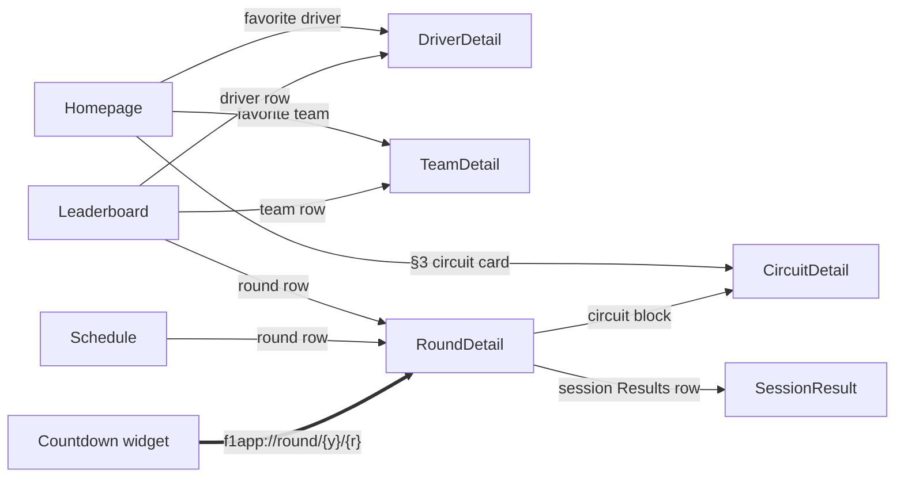
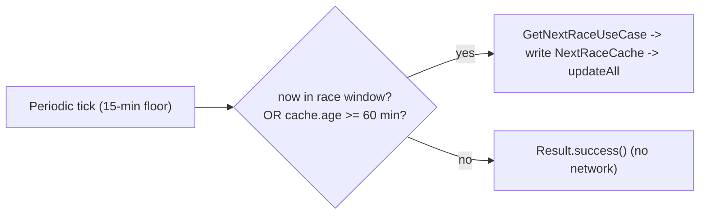

## Problem Statement

An F1 fan wants live and historical F1 data on their personal Android phone:
the next race countdown, the current season's schedule with full podiums,
driver and constructor standings, circuit stats, and quick access to their
favourite drivers and team — surfaced through a dark-first, glanceable
interface *and* a home-screen Countdown widget. No free offering bundles these
into one lean native app; the fan currently jumps between web sources to get
the same picture.

## Solution

A single-module Jetpack Compose Android app (`com.anpurnama.f1_app`) with three
top-level tabs — Homepage, Schedule, Leaderboard — plus Driver / Team
/ Round / Circuit detail pages, and one Jetpack Glance home-screen Countdown
widget. All F1 data comes from free, zero-auth APIs
(f1api.dev for schedule + driver/team/circuit catalogs; Jolpica standard for
Race + Qualifying results and pit-stops; Jolpica alpha for Sprint, Sprint
Qualifying, and Free Practice results, translated to Ergast ids at the data
seam; OpenF1 for top speed; jolpica for all-time most-wins at a circuit),
fetched over one Ktor `HttpClient`, cached via HttpCache +
DataStore for offline-first reads. Favorites (2 drivers + 1 team) persist
locally and drive the Homepage §3 combined favorites card and My Team
management view. The
widget periodically refreshes a cached next-race snapshot and renders a
render-time countdown + LIVE / COMPLETE / off-season / no-cache states, with
a custom-scheme deep link into the round detail.

## User Stories

1. As an F1 fan, I want a dark-first app so that staring at race data in the
   evening doesn't blast me with white.
2. As a fan, I want four clear top-level tabs so I can move between
   overview, schedule, standings, and my favorites without hunting.
3. As a fan, I want the next race countdown on a home-screen widget so I
   never have to open the app to know how long until lights out.
4. As a fan, I want the widget to show "LIVE NOW" in a circuit brand colour
   when a race session is in its window so I notice and open the app.
5. As a fan, I want the widget to show the GP date and time in my local
   timezone so I know exactly when to tune in.
6. As a fan, I want to tap the widget and land on that race's Round detail
   so I can read the result without navigating.
7. As a fan, I want the widget to keep showing the last good countdown when
   the network fails so it never blanks mid-season.
8. As a fan, I want to see "Season over" on the widget during the off-season
   rather than a stale or missing countdown.
9. As a fan, I want the Homepage to surface, in one scroll: the next-session
   countdown (§1), season progress aggregates (§2), and my favourite drivers
   and constructor plus the nearest GP's circuit stats including top speed
   (§3), so I get the whole weekend picture at a glance.
10. As a fan, I want the Schedule tab to show upcoming rounds with session
    times and past rounds with full podiums (P1/P2/P3), so I can see what's
    next and what just happened.
11. As a fan, I want the Leaderboard tab to show current driver and
    constructor standings with wins and points, with rows that drill into
    driver or team detail.
12. As a fan, I want my two favourite drivers and one favourite
    constructor to be pinnable from Homepage §3, with an easy replace
    interaction, so the Homepage reflects who I care about.
13. As a fan, I want the favorite-driving picks to be decoupled from my
    favorite constructor (drivers need not be from that team), so I can
    follow whoever I actually root for.
14. As a fan, I want first launch to seed sensible defaults (the current
    championship-leading constructor plus its two drivers) so §3 on the
    Homepage is not empty before I pick anything.
15. As a fan, I want a Round detail page showing the race-weekend schedule
    (upcoming) or per-session result rows (past), plus a circuit block that
    links to Circuit detail, and a per-session result page, so I can dig into
    a specific weekend.
16. As a fan, I want a Circuit detail page showing the top speed recorded
    there and the all-time most-winning driver and team at that circuit, so
    a track has identity beyond one race.
17. As a fan, I want Driver detail to show a headshot, team, number, and
    standings snapshot; Team detail to show a car render, wordmark, and
    standings snapshot, so a driver or team I follow has a rich surface.
18. As a fan, I want the app to keep working offline (last good cached data)
    rather than throwing connection errors when I'm on a patchy network.
19. As a fan, I want pull-to-refresh on list screens to force-fetch fresh
    data ignoring the cache, so I'm never looking at a stale table right
    after a session.
20. As a fan, I want per-section failure independence on the Homepage so a
    single source failing doesn't blank the whole screen.
21. As a fan, I want a release-signed APK I can sideload on my personal
    Android device, without needing the Play Store.

## Implementation Decisions

### Module & architecture

- Single `:app` module. No multi-module split; a future KMP `:shared` port is
  a `git mv` of `f1/`, not a refactor — guarded by the domain-purity invariant
  below, not by premature module extraction.
- **Manual `Wiring(context)` service locator** held by a custom `Application`
  subclass (`app.wiring`). The widget shares the same instance — one manual
  service locator across entry points.
- **MVVM:** `ViewModel` + sealed `UiState` + `StateFlow`. State derived via
  `combine` of small `MutableStateFlow` atoms + `stateIn(SharingStarted.Lazily)`.
- **Init-less loading:** first load fires from `Flow.onStart { load() }`, not
  an `init {}` block. The lazy upstream stays alive for the ViewModel lifetime;
  explicit `refresh()` is the re-fire path.
- **Result type:** sealed `Outcome<T>` (`Success` / `Failure` / `Loading`) at
  `core/Outcome.kt`.
- **Domain seam:** UseCase classes; ViewModels take them as function
  references (`useCase::invoke`). No direct repository access from
  ViewModels.
- **Navigation 3:** `NavKey` + `@Serializable` route objects + custom
  `Navigator` / `NavigationState` in `core/navigation/`; flat graph, no
  nested subgraphs.

### Domain-purity invariant (hard)

`f1/` — domain models, DTOs, Ktor API extensions, and use cases — must
contain zero `android.*` imports. Platform concerns (`Context`,
`android.util.Log`, dispatchers) are injected as interfaces from `core/`.
This is the hedge that makes a future KMP port a move instead of a rewrite.

### Data sources & API client

- One `HttpClient` in `Wiring`, with **no default base URL**; full URLs are
  built per request. Three base URL constants live in `f1/data/F1Api.kt`:

  ```kotlin
  const val F1API_BASE   = "https://f1api.dev/api"
  const val JOLPICA_BASE  = "https://api.jolpi.ca/ergast/f1"
  const val OPENF1_BASE   = "https://api.openf1.org/v1"
  ```

  No `openf1/` or `jolpica/` package — second/third sources are `suspend fun
  HttpClient.*` extensions in the same file. The API definition itself is
  pure Kotlin and satisfies the domain-purity invariant.

- **Ktor CIO engine** (KMP-safe) + `ContentNegotiation` with
  `kotlinx.serialization` JSON
  (`{ ignoreUnknownKeys = true; coerceInputValues = true }`). Replaces
  Retrofit+OkHttp deliberately — Retrofit `@GET` interfaces are JVM-tied.

- f1api.dev endpoints wired (all zero auth):
  - `GET /current` — full-season schedule + sessions (Homepage §2 aggregates;
    Schedule both tabs; `RaceSchedule` DTO also carries `sprintQualy` and
    `sprintRace` fields, null when the GP has no sprint)
  - `GET /current/next` — next race (Homepage §1+§3, Countdown worker)
  - `GET /current/drivers`, `GET /current/teams` — Driver / Team detail
  - `GET /current/drivers-championship`, `GET /current/constructors-championship`
    — Leaderboard, Homepage fav-driver / fav-team, detail pages
  - `GET /{year}/drivers` — season-matched driver catalog; the car-number
    bridge for the Jolpica alpha translator (FP/SQ/SR rows → Ergast canonical
    ids). HttpCache-shared.
  - f1api.dev carries **no** race / qualifying / free-practice result
    endpoints after the Jolpica migration (ADR 0005); those moved to Jolpica
    (standard for race+quali, alpha for FP/SQ/SR).
  - Jolpica alpha `GET /f1/alpha/results/{round_id}/{SR|SQ|FP1|FP2|FP3}/` —
    `SessionResult` route for Sprint, Sprint Qualifying, and Free Practice
    (f1api.dev has no such endpoints). Rows translated to Ergast ids at the
    data seam via the car-number bridge; see architecture/id-namespaces.md.
  - `GET /circuits/{circuitId}` — Circuit metadata (cheap; inlined elsewhere
    but called directly for `CircuitDetail`)

- OpenF1 extensions (for top speed and fastest pitstop in v1):
  - `getOpenF1Sessions(year, countryName, sessionName)` —
    `GET /v1/sessions`
  - `getOpenF1Laps(sessionKey)` — `GET /v1/laps?session_key=...` (the
    `st_speed` field is natively kph; never pass `speed_unit`, it 404s)
  - `getOpenF1PitStops(sessionKey)` — `GET /v1/pit?session_key=...`
    (`stop_duration` is stationary pit time; available from 2024 US GP onwards)

- jolpica extensions:
  - `GET /{year}/{round}/results.json` and `GET /{year}/{round}/qualifying.json`
    — single source for `GetRoundResultsUseCase` (full Ergast race richness:
    circuit block, per-row `Constructor`, authoritative `status`, numeric
    `grid`, `fastestLap`, time/gap, points) and `GetRoundQualifyingUseCase`
    (per-segment Q1/Q2/Q3, per-row `Constructor` on every row including Q1
    knockouts). No f1api.dev merge (ADR 0005 supersedes 0006).
  - `GET /{year}/{round}/pitstops.json` — fastest pit-stop standout card
    (duration); aligned with the Jolpica-standard race ids.
  - `getCircuitWinners(f1apiCircuitId)` —
    `GET /circuits/{id}/results/1.json`; client-aggregates the top driver +
    top team. `driverId` / `constructorId` match f1api.dev's namespace; only
    `circuitId` needs a translation (5-entry map below).

- **ID translation maps** (private vals in `F1Api.kt`):

  ```kotlin
  private val F1API_TO_JOLPICA_CIRCUIT = mapOf(
      "austin" to "americas",
      "gilles_villeneuve" to "villeneuve",
      "hermanos_rodriguez" to "rodriguez",
      "lusail" to "losail",
      "montmelo" to "catalunya",
  )
  // Used when joining OpenF1 by country_name+year+race-date
  private val F1API_TO_OPENF1_COUNTRY = mapOf(
      "Great Britain" to "United Kingdom",
  )
  ```

### Use cases (18 in the full design — screen-driven, no use case without a caller)

The shipped Homepage currently has seven use-case seams: season, next race,
race-weekend schedule, driver standings, constructor standings, circuit top
speed, and circuit image. The remaining rows below are the full design
contract; unimplemented rows remain follow-up work rather than shipped
behavior.

| Use case | Source(s) | Callers |
|---|---|---|
| `GetNextRaceUseCase` | f1api.dev `/current/next` | Homepage §1+§3, Countdown worker |
| `GetSeasonUseCase` | f1api.dev `/current` | Homepage §2, Schedule, Schedule-upcoming |
| `GetDriversStandingsUseCase` | f1api.dev `/current/drivers-championship` | Leaderboard, Homepage fav-driver, Driver detail |
| `GetConstructorsStandingsUseCase` | f1api.dev `/current/constructors-championship` | Leaderboard, Homepage fav-team, Team detail, first-launch seed |
| `GetDriverDetailUseCase(id)` | f1api.dev `/current/drivers` + `/drivers-championship` | Driver detail |
| `GetTeamDetailUseCase(id)` | f1api.dev `/current/teams` + `/constructors-championship` | Team detail |
| `GetRoundResultsUseCase(year, round)` | Jolpica standard `/ergast/f1/{y}/{r}/results.json` | Race `SessionResult`, RoundDetail past-mode podium chips, Past-list podium |
| `GetRoundQualifyingUseCase(year, round)` | Jolpica standard `/ergast/f1/{y}/{r}/qualifying.json` | Qualifying `SessionResult` |
| `GetPracticeResultUseCase(year, round, session)` | Jolpica alpha `/f1/alpha/results/{round_id}/{FP1|FP2|FP3}/` (ids via car-number bridge) | FP1/FP2/FP3 `SessionResult` |
| `GetSprintResultUseCase(year, round)` | Jolpica alpha `/f1/alpha/results/{round_id}/SR/` (ids via car-number bridge) | Sprint `SessionResult` |
| `GetSprintQualifyingResultUseCase(year, round)` | Jolpica alpha `/f1/alpha/results/{round_id}/SQ/` (ids via car-number bridge) | Sprint Qualifying `SessionResult` |
| `GetSessionResultUseCase(year, round, sessionType)` | branches to the five use cases above | `SessionResult` screen |
| `GetFastestPitstopUseCase(year, round)` | OpenF1 `/v1/sessions` + `/v1/pit` | Race `SessionResult` standout card |
| `GetRoundPodiumUseCase(year, round)` | reuses `getRoundResults`, slices `[0..2]` | Schedule > Past list |
| `GetCircuitTopSpeedUseCase(circuitId, year?)` | OpenF1 `/v1/sessions` + `/v1/laps` (`max(st_speed)`) | Homepage §3, Round detail |
| `GetCircuitMostWinsUseCase(f1apiCircuitId)` | jolpica `/circuits/{id}/results/1.json` | Round detail, Circuit detail |
| `GetRaceWeekendScheduleUseCase(year, country)` | OpenF1 `/v1/sessions` | Homepage §1 countdown |
| `GetCircuitImageUseCase(year, country)` | OpenF1 track-layout image | Homepage §1 countdown, Schedule rows |

Homepage ViewModel combines seven use-case seams (including the weekend
schedule and circuit image); each section fails independently — no composite
use case. `GetSeasonUseCase` pre-computes season aggregates
(`completedGp`, `totalKm`, `totalLaps`, `progressPercent`) on the `Season`
model so ViewModels don't recompute.

### OpenF1 top-speed specifics (locked by research)

- **Join** = `country_name + year + race-date match` (one `/v1/sessions`
  call). `country_name` alone is insufficient for US (3 circuits), Spain (2
  circuits 2026+), Italy (2 circuits 2023–2025); the race date is the unique
  disambiguator. The 1-entry `F1API_TO_OPENF1_COUNTRY` fallback is applied
  only when the literal country returns 0.
- **Session filter** = `session_name = Qualifying` (low-fuel push laps produce
  the weekend's actual peak).
- **Label** = "Top speed" (not "record"). Latest Qualifying peak.
- **Pre-2023 rounds:** empty cell — no placeholder, no fake dash.
- **`is_cancelled` filter not applied** — even cancelled weekends recorded
  qualifying laps; date match handles disambiguation.
- **All-time OpenF1 speed scan:** parked, not shipped.

### Caching

- **HttpCache** plugin, ~10MB file cache. Probed live:
  - f1api.dev — `max-age=600` (10-min) — respected.
  - jolpica — `max-age=3600` (1-hour) — respected.
  - OpenF1 — **no cache headers** (nginx, no CDN) — HttpCache skips it;
    accepted uncached (~0.3s/call, 2 calls per Homepage §3 cold open ≈ 0.6s).
    `ponytail:` add a default TTL / in-memory layer only if latency becomes a
    measured complaint.
- **Pull-to-refresh** = `CacheControl.NO_CACHE` per request, on the same
  `HttpClient`. Two cache policies by request flag.
- **Offline cold launch:** `max-stale` tolerance for f1api.dev + jolpica;
  OpenF1 has no stale layer (fails to network error offline).
- DataStore + HttpCache; WorkManager reserved for widget refresh only.
  Multi-source is additive endpoints on the same client; the caching strategy is unchanged.

### Persistence (DataStore)

Two `DataStore<Preferences>` wrappers in `Wiring`, both using one atomic
`edit` block with typed keys — no serialized JSON blob:

- **`NextRaceCache`** (`widget/countdown/data/`) —
  `NEXT_RACE_START_MILLIS: Long`, `NEXT_RACE_NAME: String`,
  `NEXT_RACE_CIRCUIT: String`, `NEXT_RACE_ROUND: Int`, `NEXT_RACE_SEASON: Int`,
  plus the full session schedule (FP1/FP2/FP3/qualy/race timestamps — used for
  the worker's race window). Worker writes; widget reads; same instance.
- **`FavoritesCache`** —
  `FAV_DRIVER_1: String`, `FAV_DRIVER_2: String`, `FAV_TEAM: String`. No
  timestamp keys (explicit replace makes them unnecessary). Written from My
  Team's picker, read by HomepageViewModel (§3) + MyTeamViewModel.

### Navigation routes (9 in the contract; 8 currently wired)

`@Serializable` `NavKey` route objects in `core/navigation/`:

- `data object Homepage : NavKey` — start destination
- `data object Schedule : NavKey`
- `data object Leaderboard : NavKey`
- (No 4th `MyTeam` `data object` — the My Team tab is being removed per
  wayfinder ticket 24 / plans ticket 11. The 3 tabs above are the v1
  destination. When the news feature un-parks per wayfinder ticket 25,
  `Route.News` takes the freed slot.)
- `data class DriverDetail(val driverId: String) : NavKey` — wired from
  Leaderboard driver rows and DriverDetail team links.
- `data class TeamDetail(val teamId: String) : NavKey` — wired from
  Leaderboard constructor rows and DriverDetail team links.
- `data class RoundDetail(val year: Int, val round: Int) : NavKey` — wired;
  the screen derives upcoming/past mode, renders circuit stats and weekend
  sessions, and links each past session to its result page.
- `data class SessionResult(val year: Int, val round: Int, val session: SessionType) : NavKey` —
  wired to the normalized race, qualifying, practice, sprint, and standout UI.
- `data class CircuitDetail(val circuitId: String) : NavKey` — wired as the
  Homepage §3 navigation edge; the destination page remains a placeholder.

Entry points:



### Schedule surface shape (locked — revision 1 of ticket 03)

The `Route.Schedule` tab is a **tab switcher at the top of the screen** (Material 3 `TabRow` or a `SegmentedButton` row), not a single scroll with two section headers. Two tabs: **Upcoming** and **Past**. The active tab is the only one whose list is visible; the inactive tab's state stays alive in `ScheduleViewModel` so a tab switch is instant (no re-fetch).

- **Upcoming row** — closest in shape to the Homepage §3 circuit card. Fields: round number, GP name, race date, city, **circuit image** (decorative; per-circuit brand accent or OpenF1 track-layout). No podium cell (no winner yet). Lazy per-row `LaunchedEffect` does not fire (no extra fetch needed for upcoming rows; the season response already carries everything).
- **Past row** — same fields as Upcoming (round / GP name / date / city / circuit image) plus a **podium winner** cell replacing any countdown block. Past rows have no countdown by definition. The lazy per-row `LaunchedEffect(race.round) { onLoadPodium() }` fires here, same as the v1 single-list shape; `GetRoundPodiumUseCase` is unchanged. Per-row failure degrades to a retry row inside the Past tab, never blanks the schedule.
- **No countdown anywhere on Schedule.** Countdown is a Homepage §1 / widget surface; the Schedule tab is a reference (what's coming / what happened), not a live timer.
- **Pull-to-refresh** on either tab re-fetches the season + every past podium with `forceRefresh = true` (NO_CACHE). Tab state is preserved across the refresh.

Cross-ref: `lode/plans/f1app-build/tickets/03-schedule-tab-and-round-detail.md` (the build record + revision 1 block).

### Deep link (custom scheme, widget → RoundDetail)

- Form: `f1app://round/{year}/{round}`.
- The widget builds an `Intent.ACTION_VIEW` `PendingIntent` (via Glance
  `clickable(actionStartActivity(intent))`) with args read from
  `NextRaceCache` (`NEXT_RACE_SEASON` / `NEXT_RACE_ROUND`).
- `MainActivity` parses `intent.data` — if the host is `round`, it pushes a
  `RoundDetail` nav key onto Homepage as the backstack root (`[Homepage,
  RoundDetail]`; back from `RoundDetail` lands on Homepage, not exit). No
  config activity.
- Single-app custom scheme (no public web domain for App Links verification).
- **Suppressed** in off-season (`NEXT_RACE_START_MILLIS == 0L`) and no-cache
  states — no valid round to open.

### Round detail + Session result

Ticket 03 is shipped. `RoundDetail` is two-mode and `SessionResult` is wired;
the implementation below is the current behavior contract.

`Route.RoundDetail(year, round)` is one screen with two modes driven by the
Race session start time:

- **Upcoming mode** — circuit stats card (length, laps, turns, top speed) +
  the full five-session race-weekend schedule (FP1 → FP2/FP3 or
  Sprint Quali → Sprint → Qualifying → Race). Tapping the circuit card or the
  "Circuit Stats" button opens `Route.CircuitDetail(circuitId)`.
- **Past mode** — circuit stats card + a **Results** tab with per-session rows
  (Race, Qualifying, Sprint, Sprint Quali, FP1). Each row has a **Results**
  button that pushes `Route.SessionResult(year, round, session)`. The **Highlights**
  tab and Driver of the Day are out of scope for v1.

Top speed in the circuit stats card uses the same source as Homepage §3
(OpenF1 all-time max `stSpeed` per circuit). Elevation is not available in a
free API and is dropped from v1.

`Route.SessionResult(year, round, session)` renders a full result list for the
selected session:

- **Race** — podium chip header (P1/P2/P3 driver abbreviations), Fastest Lap
  standout card (derived from the Jolpica standard `fastestLap` block, the race
  result source after the migration; ADR 0005), Fastest Pitstop standout
  card (OpenF1 `stop_duration`; hidden when unavailable), and a full grid table
  showing position, driver, team, grid-change arrow (hidden for pit-lane starts),
  time/status, and points. `Retired` rows show **"DNF"**; `Did not start` rows show
  **"DNS"**; pit-lane starts (`grid: "0"`) display **"PL"**.
- **Sprint** — same table shape as Race.
- **Qualifying / Sprint Quali** — position, driver, team, Q1/Q2/Q3 times.
- **FP1 / FP2 / FP3** — time-ordered list with implicit position, driver, team,
  fastest-lap time.

The session list is built from the f1api.dev schedule, which includes
`sprintQualy` and `sprintRace` fields (null when the GP has no sprint). Race +
Qualifying results come from Jolpica standard; Sprint, Sprint Qualifying, and
Free Practice results come from Jolpica alpha (translated to Ergast ids via
the car-number bridge), because f1api.dev provides none of these. See ADR
`0005-session-results-use-two-apis.md` and architecture/id-namespaces.md.

### Favorites (Homepage §3)

- Top-level nav is **3 tabs**: Homepage, Schedule, Leaderboard. The
  previous 4th tab (My Team) is being folded into Homepage §3 per
  wayfinder ticket 24 / plans ticket 11; the 3-tab shape is the v1
  destination.
- Homepage §3 is the favorites management surface (variant A per ticket
  24): one combined three-row card for Driver 1, Driver 2, and
  Constructor, plus the nearest-GP circuit card. It is not a pager or
  carousel. Each row is tappable and opens the picker (a
  `ModalBottomSheet` listing current standings with the "Already
  selected" disabled state) for that slot. The "Change" label on each
  row is the affordance; no mode toggle to teach.
- **First-launch default:** seed `FavoritesCache` with the #1 constructor in
  `GetConstructorsStandings` plus that team's two drivers (top two driver
  rows whose `teamId == favorited team`).
- **Driver ↔ team decoupled:** the two favorited drivers need not be from the
  favorited constructor.
- **Picker UX:** tapping a filled slot opens a `ModalBottomSheet` to choose
  or replace (variant A — chosen over a full-screen page and an inline
  expand). No separate onboarding route, no star/pin on Driver/Team detail.
- **3rd-pin behavior:** explicit user replace. A driver `id` occupies at
  most one of the two driver slots; a team `id` is unique in the team slot.

### Countdown widget (Glance)



- **Tech:** Jetpack Glance (`androidx.glance:appwidget`); a `GlanceAppWidget`
  subclass whose `provideGlance` reads `NextRaceCache` and renders
  `@Composable` content (compiles to `RemoteViews`). RemoteViews interop is
  an escape hatch only.
- **Refresh:** one `PeriodicWorkRequest` (`CountdownWorker`, 15-min WorkManager
  floor, `NETWORK_TYPE_CONNECTED` constraint, exponential backoff). A gate in
  `doWork` decides whether to fetch:
  - **Race window** = `[cached FP1_start, cached race_start + 3h]`. Inside
    the window, fetch every tick; outside, fetch only when cache age ≥ 60 min
    (effectively hourly between weekends).
  - **No live chronometer.** The displayed countdown is recomputed from
    `NEXT_RACE_START_MILLIS` at each worker-driven render; precision is days
    / hours / minutes; minute drift between renders is accepted. No exact
    AlarmManager near green flag for v1.
  - **On fetch failure:** leave the cached value; don't clear. After a
    successful write, call `CountdownWidget().updateAll(context)`.
- **Render-time state** (computed in `provideGlance` from `now` vs cached
  race window, assumed race duration 3h):

  | Condition | Display | Deep link |
  |---|---|---|
  | `now < start` | countdown (`Nd Nh Nm`) + GP date/time | on |
  | `start <= now < start + 3h` | "LIVE NOW" (circuit-accent colour) + GP date/time | on |
  | `now >= start + 3h` | "RACE COMPLETE" transient (until next worker fetch flips the cache) + GP date/time | on |
  | Off-season (`NEXT_RACE_START_MILLIS == 0L`) | "Season over" in `OnSurfaceVariant` | suppressed |
  | No cache + sync failure (first cold launch, no network) | "No race data — tap to retry" (taps enqueue one-shot expedited `OneTimeWork`) | suppressed |
  | Cache set + sync failure | stale cached countdown/date (never blanks) | on |

- **Visual contract:** dark-only `Surface` body (#0d0d0d, `Spacing.normal`
  padding) + full-bleed ~6dp `Circuits.forId(circuitId)` accent strip
  (backgrounds only, never body text on dark). Race name (bold), circuit +
  country, large countdown (state-replaced in LIVE/COMPLETE), GP date/time
  formatted device-local (e.g. `Sun 23 Mar · 15:00`) in countdown/LIVE/COMPLETE
  states; hidden in off-season/no-cache. No icon / launcher-art asset for v1
  (text-only).
- **Sizing** (AppWidgetProviderInfo): `minWidth 115dp`, `minHeight 256dp`,
  `maxResizeWidth 130dp`, `maxResizeHeight 624dp`, `minResizeWidth 56dp`,
  `minResizeHeight 120dp`, `resizeMode horizontal|vertical`, no `configure`,
  `updatePeriodMillis 0` (Glance re-render driven by worker `updateAll`, not
  system poller), Glance preview composables for `previewLayout`.

### Enrichments (Tier 1 only in v1)

- **Driver headshots** — on `DriverDetail`, Homepage §3 favorite-driver
  cards, My Team favorite-driver cards. Source: OpenF1
  `/v1/drivers?driver_number=<n>&session_key=<latest>` `headshot_url`.
  Cached in-memory (`Map<driverId, String>`); Coil for image load. Fallback
  chain: OpenF1 `headshot_url` → Cloudinary
  `common/f1/{year}/{team}/{driverRef}/` portrait → `team_colour` swatch.
- **Team / car imagery** — on `TeamDetail` (hero car render), Homepage §3
  favorite-team card, My Team favorite-team card. Source: formula1.com
  Cloudinary `media.formula1.com/.../common/f1/{year}/{team}/...webp`
  (2026+ only — legacy AEM path dropped for v1). The slug → URL is a
  compile-time constant (`teamImageUrl()` lives in `f1/data/` next to the
  other maps; no API call needed). Fallback: `team_colour` swatch.
- **Weather + race-control flags** — out of scope for v1 (both live-window
  only; graduate as a fresh ticket when a live-session feature is scoped).

### Design system (already built — ticket 02)

- **`F1appTheme`** — single dark-only `@Composable`, one `content` param.
  No light scheme, no dynamic color, no `isSystemInDarkTheme`.
- `darkColorScheme()` built from named `Color` vals. `F1Shapes`
  (`small 2 / medium 8 / large 14 / extraLarge 16` dp) + 8-rung `Spacing`
  (4–32dp: xs/sm/md/normal/semiLg/lg/xl/xxl). M3 default typography.
- `Circuits` `object` — 23 per-circuit brand colours (backgrounds only on
  dark, never text). `Tyres` `object` — six Pirelli compounds as
  text+background pairs (always pair the two halves).

### Schema noise locked into DTOs (no decisions, recorded for implementation)

- `position` is a `String` (`"1"` or `"NC"`) — model as String throughout.
- Race result `time` is messy (`"1:21:06.758"`, `"+1 lap"`, `"DNF (1)"`) —
  store as String, don't parse.
- `birthday` is dirty (ISO `2006-08-25` *and* `15/02/1998` mixed across
  drivers) — store as String, don't parse.
- `circuitLength: "7004km"` in `/current*` vs `7004` `Int` in
  `/circuits/{id}` — the `"<N>km"` form is **meters**, not km (Bahrain
  `"5412km"` = 5.412 km). Strip non-digits and **divide by 1000** to
  get real km; `Season.totalKm` is `Double` for precision.
- Envelope shape differs by endpoint: `/current/next` → `race: [...]` array;
  `/current` → `races: [...]` array; Jolpica standard
  `/{y}/{r}/results.json`|`/qualifying.json` → `MRData.RaceTable.Races[]`
  (Ergast envelope). Different envelope DTOs per source.
- `/current` `RaceSchedule` now includes `sprintQualy` and `sprintRace` fields
  (nullable) in addition to `fp1`/`fp2`/`fp3`/`qualy`/`race`; the model and UI
  must pick the five active sessions for the weekend.
- Jolpica alpha FP/SQ/SR results use opaque `round_id` + opaque driver/team
  ids, distinct from Ergast canonical; `loadAlpha` builds a `CarNumberTranslator`
  from the season-matched `getDrivers(year)` catalog and translates `car_number`
  → `(driverId, teamId)` at the data seam, with opaque-id fallback when the
  catalog misses. See architecture/id-namespaces.md (ADR 0005).
- Jolpica alpha FP results expose per-driver `best lap time` (string); position
  is implicit from ordering and the mapper assigns it.
- Three spellings of "firstAppearance" across endpoints
  (`firstAppareance`, `firstAppearance`, `firstParticipationYear`) —
  `@SerialName` per DTO.
- Jolpica standard race results expose `status` (`Finished`, `Lapped`,
  `Retired`, `Did not start`) and a numeric `grid`; `grid: "0"` means a
  pit-lane start.
- OpenF1 returns lowercase-no-underscore fields
  (`sessionkey`, `countryname`, `circuitshortname`) — OpenF1 DTOs get their
  own `@SerialName` mapping, distinct from f1api.dev's snake_case.

### Package layout

```
com.anpurnama.f1_app/
  F1App.kt                       # Application — holds `wiring: Wiring`
  MainActivity.kt
  core/
    di/Wiring.kt
    navigation/{Routes,Navigator,NavigationState,EntryProviders}.kt
    network/HttpClientFactory.kt
    Outcome.kt
    exception/ExceptionExtension.kt
  f1/                             # DOMAIN — pure Kotlin, zero android.*
    data/{F1Api, Dtos, ...}.kt
    model/                        # NextRace, Season (+aggregates), Race, Circuit,
                                  # Driver, Team, DriverStanding,
                                  # ConstructorStanding, RaceResult,
                                  # QualifyingResult, SessionType,
                                  # SessionResult, FastestPitstop
    {GetNextRaceUseCase, GetSeasonUseCase,
     GetDriversStandingsUseCase, GetConstructorsStandingsUseCase,
     GetDriverDetailUseCase, GetTeamDetailUseCase,
     GetRoundResultsUseCase, GetRoundQualifyingUseCase,
     GetPracticeResultUseCase,
     GetSprintResultUseCase, GetSprintQualifyingResultUseCase,
     GetSessionResultUseCase, GetFastestPitstopUseCase,
     GetCircuitTopSpeedUseCase, GetCircuitMostWinsUseCase,
     GetRoundPodiumUseCase}.kt
  ui/theme/{Color,Theme,Type}.kt   # [BUILT] dark-only M3 theme
  feature/
    homepage/{HomepageScreen,HomepageViewModel,HomepageViewModelFactory}.kt
    schedule/{ScheduleScreen,ScheduleViewModel,...}.kt
    leaderboard/{LeaderboardScreen,LeaderboardViewModel,...}.kt
    driver/...
    team/...
    round/{RoundScreen,RoundViewModel,...}.kt
    sessionresult/{SessionResultScreen,SessionResultViewModel,...}.kt
    circuit/...
  widget/countdown/
    CountdownWidget.kt
    CountdownWorker.kt
    data/NextRaceCache.kt
```

### Release, signing & R8 (`[BUILT]` — ticket 15)

- **Output:** release buildType produces a sideload-able APK. No AAB / Play
  Console.
- **Signing:** `signingConfigs.register("release")` reads credentials from a
  git-ignored `keystore.properties` at the repo root; keystore at
  `~/.android/f1app-release.jks` (PKCS12, RSA-2048).
- **R8:** `optimization { enable = true }` (AGP 9.x DSL — one flag = R8 code
  shrinking + optimized resource shrinking + bundled default keep rules) +
  `android.r8.gradual.support=true` in `gradle.properties`. No app-level
  keep rules (no reflection; Compose + kotlinx.serialization ship consumer
  rules). Add `src/<variant>/keepRules/*.keep` only if a release build strips
  something.
- **Versioning:** `versionCode 1` / `versionName "1.0.0"`, manual per-release
  bumps.

### Build floor (`[BUILT]`)

- `compileSdk = release(37)`, `targetSdk = 37` (bumped for AndroidX deps pulled
  by the Compose BOM 2026.06.01 / Kotlin 2.4.10). `minSdk = 24`.
- Don't re-declare `androidTestImplementation(platform(compose-bom))` — the
  `implementation(platform(...))` constraint propagates to androidTest via AGP
  inheritance.

## Testing Decisions

One guiding principle: test external behavior, not implementation details.
Reuse existing seams; the fewer, the better. Three seams in the initial
cut, two deferred until the UI stabilizes.

**Initial cut (JVM unit, `:app` `src/test/`):**

1. **Pure-mapping logic** — highest leverage, lowest cost. `Season` aggregates
   (`completedGp` / `totalKm` / `totalLaps` / `progressPercent`) on fixture
   DTOs, including the `circuitLength` digit-strip edge case. DTO→model
   mappers in the use cases. `Outcome<T>` sealed-type transitions.
2. **ViewModels** — init-less `Flow.onStart { load() } +
   stateIn(SharingStarted.Lazily)` loading → success/failure transitions;
   section-level independence on Homepage; Ktor `MockEngine` stubs on the
   `F1Api.kt` extensions for 200 / 4xx / 5xx / empty-body.
3. **Widget state reducer** — the `CountdownWidget` render-time state
   computation (countdown / LIVE NOW / RACE COMPLETE / off-season / no-cache)
   as a pure function. Test the reducer, not Glance rendering.

**Deferred until Homepage + theme stabilize** — `src/androidTest/` is
reserved for them:

4. Compose UI screen smokes (`Homepage`, `Schedule`, `Leaderboard`, `My
   Team`, `DriverDetail`, `TeamDetail`, `RoundDetail`, `CircuitDetail`) via
   `androidx.compose.ui:ui-test-junit4`.
5. Theme token screenshot tests (`Circuits.forId`, `Tyres.Soft` +
   `Tyres.SoftBg` pairing).

**Libraries:** `kotlin.test` + JUnit4 (Android default, no new catalog entry)
+ `ktor-client-mock` (transitively present via CIO). No Mockito/MockK — the
`Wiring` + function-reference use case seam makes hand-written fakes cheaper.

**Module & invariants:** Tests live in `:app` — no `:testing` module (no
second module to share with yet). Tests for `f1/` are JVM-only — the
domain-purity invariant applies to tests too (no `android.*` imports), so
they port to a future KMP `:shared`.

## Out of Scope

- **Feeders (F2 / F3 / F1 Academy)** — no free API.
- **News + collaborator content screens** (BoxBoxClub, F1StatsGuru,
  FormulaAddict, FormulaAerodynamics, FormulaDataAnalysis, FormulaNeon,
  FormulaPlanet, TrackLimits) — served via Firebase Remote Config, no free
  API. **RSS news** (free, public feeds) is parked to v2 per wayfinder
  ticket 25; the news tab replaces the My Team tab when un-parked.
- **Firebase Remote Config** as a data source — only the dropped screens /
  feeders used it.
- **7 secondary widget types** (Schedule, Drivers Standings, Team Standings,
  Champion, Season Progress, Favourite Driver, Favourite Team) — user chose
  Countdown widget only.
- **Driver Comparison screen** — dropped.
- **Driver Timeline Graph widget** — dropped (most call-heavy; per-round
  result fan-out).
- **Telemetry (RPM / speed / DRS), per-lap times, full pit-stop history** —
  OpenF1 / jolpica-only data not needed by any in-scope screen or widget.
  (Only the single fastest pitstop is surfaced on Race `SessionResult`.)
- **Weather + race-control flags** enrichments — out of scope for v1
  (live-window only; graduate as a fresh ticket).
- **App Links / `autoVerify`** — no public web domain; custom scheme only.
- **AAB / Play Console upload / store listing** — sideload APK only.
- **CI/CD pipeline** — separate from the first local signed build.
- **Cloud sync of favorites** — local DataStore only.
- **Star / pin on Driver / Team detail** — rejected; My Team is the pick
  surface.
- **End-to-end tests hitting live APIs** — manual smoke only; no free-API
  rate budget for CI.
- **Historical weather / past race-control** — live window only on first cut.
- **All-time OpenF1 top-speed scan** — parked; "Top speed" label ships as
  latest Qualifying peak only.
- **OpenF1 cache layer** — accepted uncached; revisit only if latency
  becomes a measured complaint.

## Further Notes

### One open question (fog, deliberately not fake-locked)

These are in-scope decisions that the wayfinder map flagged as **not yet
specifiable** — sharpening either prematurely into the spec would manufacture
a decision that has no basis yet. Both affect build sequencing.

1. **v1 / MVP slice.** This spec describes the full app, but there's no
   decision yet on what lands in a first release candidate vs. what stays a
   follow-up. It interacts with the favorites picker (now closed — favorites
   are in v1) and the release pipeline (closed — signed APK is the output).
   The build implementer should treat this as the first cut-line question
   when picking what to build first; a follow-up wayfinder ticket is the right
   place to lock it once concrete screens exist to slice against.
### Resolved cross-cutting choice

The error / empty / loading UX pattern is resolved: `SectionUiState` is the
VM-to-UI transport and the shared `OutcomeContent` family renders loading,
error, content, and optional retry states. Homepage and Schedule use it with
independent section/row failures; later screens must reuse the same family
instead of introducing ad-hoc loading/error renderers. See ADR 0002.

### Design reference

boxbox-club (dark-first F1 design tokens) is the design reference, not a
parity target — the app leans on it for tokens and shape, not a faithful
re-skin of every surface. The full design tokens, per-screen data mapping,
and widget dimensioning live outside the repo in the developer's Downloads,
but their conclusions have been folded into this spec and the referenced
Lode entries; the spec does not depend on the Downloads copies persisting.

### Ponytail / BSSN standing preference

Simplest system that works, no speculative abstraction. Look before writing
— reuse a sibling helper before reimplementing. Items marked `ponytail:`
throughout this spec are deliberate simplifications with a named ceiling and
upgrade path; revisit only when the ceiling materializes.

### Standing "free API or not built" rule

"If not covered by a free API, it's not built." This is the user's rule about
*features* (feeders, news, collaborator screens — all out). Enrichments
(headshots, weather) are a separate question, decided above: headshots + team
imagery in; weather + flags out for v1.

### Current build status and sequence signal

Foundation + Homepage §2 (ticket 01), Homepage §1 countdown + §3 favorites /
nearest-GP polish (ticket 02), Schedule with per-row podium retry, Leaderboard
with Driver/Team detail navigation, and ticket 03's full Round/SessionResult
slice are shipped. Circuit detail is still a placeholder; enrichments and the
widget remain planned. My Team is built with
three cache-backed slots and standings-backed bottom-sheet pickers.

Build proceeds down the dependency chain: Architecture → Data layer → API
client → Navigation → Homepage slices → Schedule / Round detail →
Leaderboard / Driver-Team detail → widget →
research-backed stats → Favorites picker → Enrichments → Testing. Local
verification for the shipped slices passes JVM unit tests, debug android-test
Kotlin compilation and instrumentation on the Pixel AVD, debug/release
assembly, and `git diff --check`.
