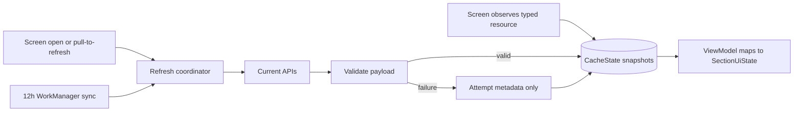
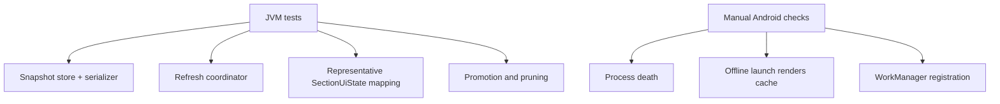

# Current-season offline data cache spec

## Problem Statement

F1app currently depends on live API calls, with Ktor `HttpCache` only reducing transport cost. A user who opens the app with weak or no connectivity can see full-section loading or error states even when the app has previously rendered the same current-season structured data. The app needs durable, app-owned offline structured data for current-season surfaces so users can keep reading schedules, standings, favorites-backed sections, round/session results, circuit metadata, and detail summaries when the network is unavailable. Refresh attempts must improve cached content without blanking the last good payload.

## Solution

F1app will add a single-season durable structured-data cache backed by a Proto DataStore-style `CacheState.snapshots` map. Screens observe typed cached resources as their source of truth, while foreground refreshes and the periodic worker write validated network payloads through a shared refresh coordinator. Cached content stays visible through stale, refreshing, and failed-refresh states via `SectionUiState.Content(data, sync)`. Only a valid f1api.dev `/current` schedule response can promote a new active season; promotion is atomic and prunes old season-scoped snapshots.

```kotlin
data class CacheState(
    val schemaVersion: Int,
    val activeSeason: Int?,
    val snapshots: Map<String, ResourceSnapshot>,
)

data class ResourceSnapshot(
    val key: String,
    val season: Int?,
    val payloadKind: String,
    val payloadVersion: Int,
    val payloadJson: String,
    val fetchedAtEpochMs: Long,
    val staleAfterEpochMs: Long,
    val lastAttemptEpochMs: Long?,
    val lastAttemptStatus: RefreshAttemptStatus?,
)
```



## User Stories

1. As an F1app user, I want the Homepage to show the last cached current-season summary offline, so that I can still understand the season state without connectivity.
2. As an F1app user, I want the next race or next session card to show cached data offline, so that I can still see what is coming up.
3. As an F1app user, I want the Schedule tab to open from cached current-season data, so that I can browse upcoming and past rounds while offline.
4. As an F1app user, I want past-list podium snippets to remain visible after they have been cached, so that one failed refresh does not erase useful race context.
5. As an F1app user, I want Round detail to show cached weekend/session information offline, so that I can read a Grand Prix page without a fresh network response.
6. As an F1app user, I want Session Result pages to show cached Race, Quali, Sprint, Sprint Quali, or Practice results offline, so that recent results remain readable.
7. As an F1app user, I want fastest pit-stop enrichment to remain visible when cached, so that optional race detail is not lost when the network fails.
8. As an F1app user, I want the Leaderboard to show cached Driver and Constructor standings offline, so that championship tables remain useful.
9. As an F1app user, I want Driver detail and Team detail to keep showing cached joined data, so that profile pages are not blank offline.
10. As an F1app user, I want Circuit detail metadata and most-wins information to remain readable offline, so that circuit pages still have useful context.
11. As an F1app user, I want Wikipedia-backed summaries to remain available after they are cached, so that detail pages keep their About copy offline.
12. As an F1app user, I want cached content to stay on screen during refresh, so that pull-to-refresh does not replace useful data with a spinner.
13. As an F1app user, I want a failed refresh to show a small stale/error status without clearing content, so that I know the data may be old but can still use it.
14. As an F1app user, I want first-time offline opens with no cached data to show a clear error, so that the app does not pretend data exists.
15. As an F1app user, I want pull-to-refresh to force a real network attempt, so that I can ask for fresh data when I know connectivity has returned.
16. As an F1app user, I want screen open to refresh stale resources automatically, so that cached data improves without extra taps.
17. As an F1app user, I want fresh cached data to avoid unnecessary network work, so that app opens feel fast.
18. As an F1app user, I want periodic background sync to warm likely current-season data, so that offline opens are more likely to succeed.
19. As an F1app user, I want background sync to be best-effort, so that partial upstream failures do not damage already-cached resources.
20. As an F1app user, I want the app to handle the off-season safely, so that a partially published new season does not erase the last complete current-season cache.
21. As an F1app user, I want a new season to appear only after a valid schedule exists, so that the app does not promote an empty or corrupt season.
22. As an F1app user, I want old season-scoped standings and results pruned after promotion, so that new-season screens do not mix old championship data.
23. As an F1app user, I want non-season resources such as circuit metadata to remain after rollover, so that stable reference data is not needlessly deleted.
24. As an F1app user, I want the app to recover from corrupt cache files, so that bad local bytes do not crash future launches.
25. As an F1app user, I want remote images to keep using Coil behavior, so that structured-data offline work does not overreach into image caching.
26. As a widget user, I want the existing Countdown widget cache to remain separate from the structured-data cache, so that widget behavior is not destabilized.
27. As a developer, I want one refresh coordinator seam, so that foreground screens and WorkManager share correctness rules.
28. As a developer, I want resource keys and payload versions to be explicit, so that migrations are local and testable.
29. As a developer, I want `Outcome` to remain data-layer-only, so that composables continue to render `SectionUiState` rather than network operation results.
30. As a developer, I want Room deferred until measured tripwires appear, so that the app avoids unnecessary schema and DAO complexity.

## Implementation Decisions

- Add a typed resource snapshot store with `CacheState`, `ResourceSnapshot`, schema version, active season, stable resource keys, payload kind, payload version, payload JSON, fetch/stale timestamps, and last-attempt metadata.
- Use Proto DataStore-style storage for the initial implementation. Room remains a fallback only for measured scale, query, contention, partial-update, or debugging tripwires. A normalized Room F1 database is out of scope.
- Treat Ktor `HttpCache` as a transport optimization only. It may reduce network cost, but the UI never treats it as durable offline app state.
- Keep remote-image caching out of this feature. Coil remains responsible for image cache behavior.
- Make the snapshot store the UI source of truth. Refresh calls return status and write through the store; screens render observed snapshots rather than transient network responses.
- Add a refresh coordinator with a per-resource foreground refresh path and a current-season bundle path for WorkManager.
- Coalesce overlapping foreground and worker refreshes through per-resource single-flight gates.
- Use server-wins semantics for valid API payloads. A valid refresh replaces the resource snapshot; a failed or invalid refresh preserves the last good payload and updates attempt metadata.
- Model foreground reasons as stale-open and pull-to-refresh. Pull-to-refresh bypasses TTL and the Ktor transport cache, but still preserves cached content until a valid replacement is written.
- Run one fixed 12-hour WorkManager sync with network-connected constraints, exponential backoff, unique periodic work, and startup `KEEP` policy.
- Limit background bundle scope to current-season structured data needed for supported app surfaces: schedule, next session/race, standings, catalogs, and bounded recent/upcoming session results/enrichment.
- Select session result/enrichment keys only around a bounded race-weekend window and only when plausibly complete, avoiding historical archive sweeps and pre-session noisy calls.
- Promote season rollover only from a validated f1api.dev `/current` schedule. Standings, catalogs, results, and enrichment never promote a season.
- Make promotion atomic: set active season, write the candidate schedule snapshot, and prune old season-scoped snapshots in one store update.
- Keep non-season resources after promotion when their keys are independent of active season.
- Extend `SectionUiState.Content` to carry sync status while preserving the existing no-data `Loading` and `Error` states.
- Map old non-cache `Outcome` use cases to `SectionUiState.Content(data, Fresh)` so adoption can be incremental.
- Preserve the domain-purity invariant: cache domain models and resource contracts stay free of `android.*`; DataStore, WorkManager, and `Context` wiring stay in platform/core layers.

```kotlin
sealed interface ContentSyncStatus {
    data object Fresh : ContentSyncStatus
    data object Stale : ContentSyncStatus
    data object Refreshing : ContentSyncStatus
    data class RefreshFailed(val message: String) : ContentSyncStatus
}
```

## Testing Decisions

- Test external behavior at the refresh coordinator and ViewModel state seams, not internal method choreography.
- Prefer one primary repository/refresh-coordinator seam for store observation, per-resource refresh, current-season bundle refresh, single-flight coalescing, and rollover behavior.
- Add a representative ViewModel mapping seam where needed to prove cached content becomes `SectionUiState.Content(data, sync)` rather than `Loading` or `Error` during stale, refreshing, and failed-refresh states.
- Use JVM tests as the release gate for snapshot state transitions, resource-key selection, TTL decisions, failed-refresh preservation, bundle partial failure metadata, single-flight behavior, migration, corruption recovery, and schedule-gated promotion/pruning.
- Include at least one temp-file test over the real serializer/store path so default values, corruption handling, and atomic writes are not proven only by in-memory fakes.
- Keep tests fake-driven. Avoid Mockito/MockK interaction tests unless a platform boundary leaves no smaller seam.
- Assert state emissions and persisted snapshots, not implementation call counts, except where single-flight coalescing requires proving duplicate network work was avoided.
- Add WorkManager tests only for registration policy, unique name, interval, constraints, and backoff. Do not assert exact periodic execution timing.
- Use manual Android validation for process death, force-stop, offline relaunch, and visible cached content before any network success.
- Reuse existing prior art: `FavoritesCacheTest` for real DataStore temp-file style, ViewModel tests with suspend-lambda fakes, `SectionUiState` assertions, and WorkManager/widget reducer-style tests that avoid platform timing assertions.



## Out of Scope

- Fully normalized Room domain schema.
- Room snapshot table implementation unless measured tripwires prove DataStore unsuitable.
- Historical archive retention beyond the active current-season generation.
- Remote-image caching changes.
- Race-aware dynamic WorkManager cadence.
- Results notifications.
- New user-editable F1 data or conflict resolution; API-backed F1 data is read-only and server-authored.
- Replacing the existing Countdown widget cache.
- Adding authenticated APIs or changing logging/privacy posture beyond what offline cache needs.

## Further Notes

The cache should land incrementally. First add shared `ContentSyncStatus` and snapshot-store primitives, then prove repository behavior with JVM tests, then migrate one high-value screen path before expanding across surfaces. The final implementation should update the Lode snapshot and ADRs if measured evidence trips the Room fallback or changes the season-promotion contract.
