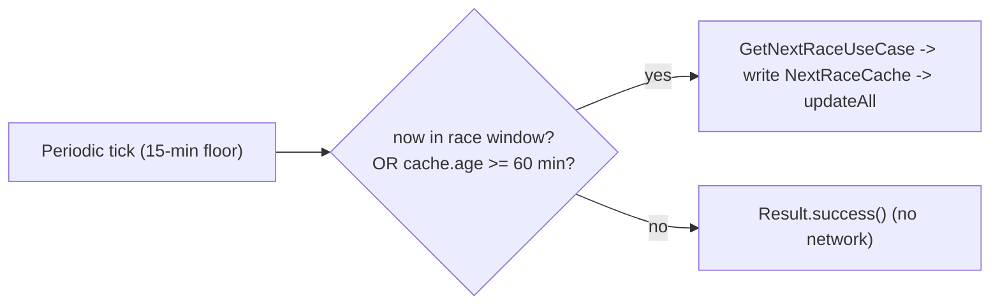

# F1app screens spec

Screen contracts: deep links, round detail, favorites, countdown widget, and enrichments.

The `Route.Schedule` tab is a **tab switcher at the top of the screen** (Material 3 `TabRow` or a `SegmentedButton` row), not a single scroll with two section headers. Two tabs: **Upcoming** and **Past**. The active tab is the only one whose list is visible; the inactive tab's state stays alive in `ScheduleViewModel` so a tab switch is instant (no re-fetch).

- **Upcoming row** — closest in shape to the Homepage §3 circuit card. Fields: round number, GP name, race date, city, **circuit image** (decorative; per-circuit brand accent). No podium cell (no winner yet). Lazy per-row `LaunchedEffect` does not fire (no extra fetch needed for upcoming rows; the season response already carries everything).
- **Past row** — same fields as Upcoming (round / GP name / date / city / circuit image) plus a **podium winner** cell replacing any countdown block. Past rows have no countdown by definition. The lazy per-row `LaunchedEffect(race.round) { onLoadPodium() }` fires here, same as the v1 single-list shape; `GetRoundPodiumUseCase` is unchanged. Per-row failure degrades to a retry row inside the Past tab, never blanks the schedule.
- **No countdown anywhere on Schedule.** Countdown is a Homepage §1 / widget surface; the Schedule tab is a reference (what's coming / what happened), not a live timer.
- **Pull-to-refresh** on either tab re-fetches the season + every past podium with `forceRefresh = true` (NO_CACHE). Tab state is preserved across the refresh.

Cross-ref: `https://github.com/anpurnama11/my-f1-companion-app/issues/10` (the build record + revision 1 block).

### Deep link (custom scheme, widget → RoundDetail)

- Form: `f1app://round/{year}/{round}`.
- The widget builds an `Intent.ACTION_VIEW` `PendingIntent` (via Glance
  `clickable(actionStartActivity(intent))`) with args read from
  `NextRaceCache` (`NEXT_RACE_SEASON` / `NEXT_RACE_ROUND`).
- `MainActivity` parses `intent.data` — if the host is `round`, it pushes a
  `RoundDetail` nav key onto Homepage as the backstack root (`[Homepage,
  RoundDetail]`; back from `RoundDetail` lands on Homepage, not exit). No
  config activity.
- Single-app custom scheme (no public web domain for App Links verification).
- **Suppressed** in off-season (`NEXT_RACE_START_MILLIS == 0L`) and no-cache
  states — no valid round to open.

### Round detail + Session result

Ticket 03 is shipped. `RoundDetail` is two-mode and `SessionResult` is wired;
the implementation below is the current behavior contract.

`Route.RoundDetail(year, round)` is one screen with two modes driven by the
Race session start time:

- **Upcoming mode** — circuit stats card (length, laps, turns, top speed) +
  the full five-session race-weekend schedule (FP1 → FP2/FP3 or
  Sprint Quali → Sprint → Qualifying → Race). Tapping the circuit card or the
  "Circuit Stats" button opens `Route.CircuitDetail(circuitId)`.
- **Past mode** — circuit stats card + a **Results** tab with per-session rows
  (Race, Qualifying, Sprint, Sprint Quali, FP1). Each row has a **Results**
  button that pushes `Route.SessionResult(year, round, session)`. The **Highlights**
  tab and Driver of the Day are out of scope for v1.

Top speed in the circuit stats card uses the same source as Homepage §3
(absent from v1 per ADR 0009). Elevation is not available in a
free API and is dropped from v1.

`Route.SessionResult(year, round, session)` renders a full result list for the
selected session:

- **Race** — podium chip header (P1/P2/P3 driver abbreviations), Fastest Lap
  standout card (derived from the Jolpica standard `fastestLap` block, the race
  result source after the migration; ADR 0005), Fastest Pitstop standout
  card (OpenF1 `stop_duration`; hidden when unavailable), and a full grid table
  showing position, driver, team, grid-change arrow (hidden for pit-lane starts),
  time/status, and points. `Retired` rows show **"DNF"**; `Did not start` rows show
  **"DNS"**; pit-lane starts (`grid: "0"`) display **"PL"**.
- **Sprint** — same table shape as Race.
- **Qualifying / Sprint Quali** — position, driver, team, Q1/Q2/Q3 times.
- **FP1 / FP2 / FP3** — time-ordered list with implicit position, driver, team,
  fastest-lap time.

The session list is built from the f1api.dev schedule, which includes
`sprintQualy` and `sprintRace` fields (null when the GP has no sprint). Race +
Qualifying results come from Jolpica standard; Sprint, Sprint Qualifying, and
Free Practice results come from Jolpica alpha (translated to Ergast ids via
the car-number bridge), because f1api.dev provides none of these. See ADR
`0005-session-results-use-two-apis.md` and architecture/id-namespaces.md.

### Favorites (Homepage §3)

- Top-level nav is **3 tabs**: Homepage, Schedule, Leaderboard. The
  previous 4th tab (My Team) is being folded into Homepage §3 per
  GitHub issues #54 and #18; the 3-tab shape is the v1
  destination.
- Homepage §3 is the favorites management surface (variant A per ticket
  24): one combined three-row card for Driver 1, Driver 2, and
  Constructor, plus the nearest-GP circuit card. It is not a pager or
  carousel. Each row is tappable and opens the picker (a
  `ModalBottomSheet` listing current standings with the "Already
  selected" disabled state) for that slot. The "Change" label on each
  row is the affordance; no mode toggle to teach.
- **First-launch default:** seed `FavoritesCache` with the #1 constructor in
  `GetConstructorsStandings` plus that team's two drivers (top two driver
  rows whose `teamId == favorited team`).
- **Driver ↔ team decoupled:** the two favorited drivers need not be from the
  favorited constructor.
- **Picker UX:** tapping a filled slot opens a `ModalBottomSheet` to choose
  or replace (variant A — chosen over a full-screen page and an inline
  expand). No separate onboarding route, no star/pin on Driver/Team detail.
- **3rd-pin behavior:** explicit user replace. A driver `id` occupies at
  most one of the two driver slots; a team `id` is unique in the team slot.

### Countdown widget (Glance)

- **Tech:** Jetpack Glance (`androidx.glance:appwidget`); a `GlanceAppWidget`
  subclass whose `provideGlance` reads `NextRaceCache` and renders
  `@Composable` content (compiles to `RemoteViews`). RemoteViews interop is
  an escape hatch only.
- **Refresh:** one `PeriodicWorkRequest` (`CountdownWorker`, 15-min WorkManager
  floor, `NETWORK_TYPE_CONNECTED` constraint, exponential backoff). A gate in
  `doWork` decides whether to fetch:
  - **Race window** = `[cached FP1_start, cached race_start + 3h]`. Inside
    the window, fetch every tick; outside, fetch only when cache age ≥ 60 min
    (effectively hourly between weekends).
  - **No live chronometer.** The displayed countdown is recomputed from
    `NEXT_RACE_START_MILLIS` at each worker-driven render; precision is days
    / hours / minutes; minute drift between renders is accepted. No exact
    AlarmManager near green flag for v1.
  - **On fetch failure:** leave the cached value; don't clear. After a
    successful write, call `CountdownWidget().updateAll(context)`.
- **Render-time state** (computed in `provideGlance` from `now` vs cached
  race window, assumed race duration 3h):

  | Condition | Display | Deep link |
  |---|---|---|
  | `now < start` | countdown (`Nd Nh Nm`) + GP date/time | on |
  | `start <= now < start + 3h` | "LIVE NOW" (circuit-accent colour) + GP date/time | on |
  | `now >= start + 3h` | "RACE COMPLETE" transient (until next worker fetch flips the cache) + GP date/time | on |
  | Off-season (`NEXT_RACE_START_MILLIS == 0L`) | "Season over" in `OnSurfaceVariant` | suppressed |
  | No cache + sync failure (first cold launch, no network) | "No race data — tap to retry" (taps enqueue one-shot expedited `OneTimeWork`) | suppressed |
  | Cache set + sync failure | stale cached countdown/date (never blanks) | on |

- **Visual contract:** dark-only `Surface` body (#0d0d0d, `Spacing.normal`
  padding) + full-bleed ~6dp `Circuits.forId(circuitId)` accent strip
  (backgrounds only, never body text on dark). Race name (bold), circuit +
  country, large countdown (state-replaced in LIVE/COMPLETE), GP date/time
  formatted device-local (e.g. `Sun 23 Mar · 15:00`) in countdown/LIVE/COMPLETE
  states; hidden in off-season/no-cache. No icon / launcher-art asset for v1
  (text-only).
- **Sizing** (AppWidgetProviderInfo): `minWidth 115dp`, `minHeight 256dp`,
  `maxResizeWidth 130dp`, `maxResizeHeight 624dp`, `minResizeWidth 56dp`,
  `minResizeHeight 120dp`, `resizeMode horizontal|vertical`, no `configure`,
  `updatePeriodMillis 0` (Glance re-render driven by worker `updateAll`, not
  system poller), Glance preview composables for `previewLayout`.

### Enrichments (Tier 1 only in v1)

- **Driver headshots** — on `DriverDetail`, Homepage §3 favorite-driver
  cards, My Team favorite-driver cards. Source: OpenF1
  `/v1/drivers?driver_number=<n>&session_key=<latest>` `headshot_url`.
  Cached in-memory (`Map<driverId, String>`); Coil for image load. Fallback
  chain: OpenF1 `headshot_url` → Cloudinary
  `common/f1/{year}/{team}/{driverRef}/` portrait → `team_colour` swatch.
- **Team / car imagery** — on `TeamDetail` (hero car render), Homepage §3
  favorite-team card, My Team favorite-team card. Source: formula1.com
  Cloudinary `media.formula1.com/.../common/f1/{year}/{team}/...webp`
  (2026+ only — legacy AEM path dropped for v1). The slug → URL is a
  compile-time constant (`teamImageUrl()` lives in `f1/data/` next to the
  other maps; no API call needed). Fallback: `team_colour` swatch.
- **Weather + race-control flags** — out of scope for v1 (both live-window
  only; graduate as a fresh ticket when a live-session feature is scoped).
