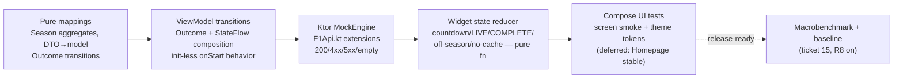
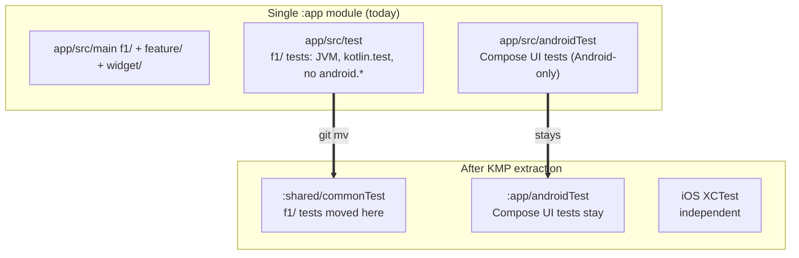

# Testing scope

> **STATUS: Rungs 1–4 partially built; widget reducer + worker gate are now tested.**
> Rungs 1–3 (pure mappings, ViewModel transitions, Ktor `MockEngine`) have been
> shipping as the screens/VMs land. Rung 4 (widget state reducer) shipped with
> ticket 07 — the reducer is a pure function, no Glance/LocalContext in the test
> body, and a separate test pins the worker's adaptive-gate logic. Rung 5
> (Compose UI smoke + theme) and rung 6 (macrobenchmark) are still deferred.

What gets tested, how, where it lives. Decided in ticket 14. Tests are JVM
unit + Compose instrumented; no `:testing` module, no E2E against live APIs.

## Test ladder (priority order)

| Rung | Surface | Test type | Location | Status |
|------|---------|-----------|----------|--------|
| 1 | Pure mappings (Season aggregates, DTO→model, `Outcome` transitions) | JVM unit (`kotlin.test`/JUnit4) | `app/src/test/` | as code lands |
| 2 | ViewModel `Outcome`/`StateFlow` transitions (init-less `onStart`, section independence) | JVM unit (`kotlinx-coroutines-test`) | `app/src/test/` | as code lands |
| 3 | Ktor `MockEngine` stubs on `F1Api.kt` extensions (200/4xx/5xx/empty) | JVM unit (`ktor-client-mock`) | `app/src/test/` | when Ktor lands |
| 4 | Widget render-time state reducer (pure fn, not Glance) | JVM unit | `app/src/test/` | when widget lands |
| 5 | Compose UI smoke + theme-token assertions | Instrumented | `app/src/androidTest/` | deferred: Homepage + theme stabilize |
| 6 | Macrobenchmark + baseline profile | `:benchmark` (or variant) | blocked: real screens exist (ticket 15 closed; R8 on) | release-readiness |

Rung 1–4 are JVM unit; 5–6 are instrumented. No surface is tested before its
production code exists.

## Libraries

Added **as needed**, not up front (deps on a codebase that doesn't have Ktor yet
are speculative).

- **Unit:** `kotlin.test` + JUnit4 (Android default — already in `libs.versions.toml`).
- **Coroutines:** `kotlinx-coroutines-test` (`runTest`, `TestScope`) — added when
  the first `StateFlow`/`combine` test lands. ViewModel tests must set
  `Dispatchers.Main` via `MainCoroutineRule`; `ViewModel.viewModelScope` is
  hard-wired to Main, and without the rule launches from the test body are
  posted to the missing Main dispatcher and never run before assertions.
- **Ktor stubs:** `ktor-client-mock` (`MockEngine`) — added with the first
  Ktor-touching test (ticket 03/04 implementation).
- **No Mockito/MockK.** The `Wiring` + function-reference use cases make
  hand-written fakes cheaper; per the `android-test-doubles` skill preference
  (record the outcome, hand-roll the seam — ViewModel takes `useCase::invoke`,
  so a fake use case is one lambda).

## Placement + KMP portability (the real rule)

`f1/` — domain models, DTOs, mappers, use cases, `F1Api.kt` extensions — the
domain-purity invariant from ticket 01 **applies to its tests too**: zero
`android.*` imports, `kotlin.test` assertions, pure JVM execution. That is the
hedge that lets `f1/` tests move into a future `:shared/commonTest` unchanged.

- **`f1/` tests** (rungs 1–3 when they touch `f1/`): JVM-only today →
  `:shared/commonTest` at port time. Same `git mv` production `f1/` makes;
  rides along for free *if* the invariant holds in test bodies.
- **ViewModel / Compose UI / Glance-render tests** (rungs 2-visible, 5):
  Android-layer, stay `:app` forever. Navigation/Compose/ViewModel rewrite to
  SwiftUI at port time, so these don't need to port — they're per-platform by design.
- **Module placement is the Android default**, not a portability mechanism. The
  invariant on test bodies is the mechanism; placement just moves with the code.

## Widget `[BUILT ticket 07]`

The `CountdownWidget` render-time state — countdown / LIVE NOW / RACE COMPLETE /
off-season (`START_MILLIS == 0L`) / no-cache (no cache + sync fail) — is computed
render-time from `now` vs cached race window via `reduceCountdownState(nowMillis,
snapshot)`. The reducer is tested as a pure function in
`app/src/test/.../widget/countdown/CountdownStateTest.kt` (12 tests, table-driven
over the spec's 6 states plus data-roundtrip assertions), and the worker's
adaptive gate is tested in `CountdownWorkerGateTest.kt` (10 tests, including the
60-min cache-age boundary and the 3d-pre / 3h-post race window). No Glance,
`LocalContext`, or `WorkManager` harness in either test body — they're JVM-only.

## Out of scope

- **Live-API E2E** — manual smoke only; no free-API rate budget for CI.
- **Screenshot golden CI gate** — local-only until ticket 15's release flow.
- **`:testing` module** — premature under the one-module architecture (ticket 01).
  Reopen if a second module needs shared test doubles.
- **Macrobenchmark / baseline profile** — blocked only on real feature
  screens existing (ticket 15 closed; R8 now on, release build signed).
  Generate via the `compose-baseline-profiles` flow when Homepage/
  Schedule/Leaderboard/My Team stabilize. Tracked in
  [../release/build-and-signing.md](../release/build-and-signing.md).
- **Robolectric** — would pull `android.*` into `f1/` tests, breaking the
  invariant. JVM-only with hand-written fakes instead.

## Cross-references

- [../architecture/architecture.md](../architecture/architecture.md) — single
  `:app`, domain-purity invariant, KMP plan.
- [../practices.md](../practices.md) — init-less ViewModel, function-ref use cases.
- [../design-system/theme.md](../design-system/theme.md) — theme tokens Compose
  UI tests would assert (rung 5).
- [../wayfinder/f1app/tickets/14-testing-scope.md](../wayfinder/f1app/tickets/14-testing-scope.md)
  — grilling ticket, closed by this decision.
- [../wayfinder/f1app/tickets/15-release-signing-r8.md](../wayfinder/f1app/tickets/15-release-signing-r8.md)
  — closed; supplies the R8-on release build rung 6 needs.
