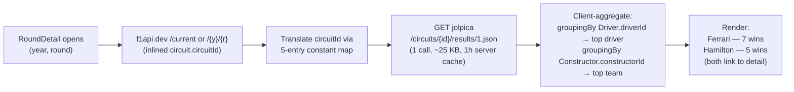

# Circuit stats — most wins (driver + team) at circuit (GAP-B)

Research output of ticket 09. Source of truth for the Round detail screen's
circuit-stats block: "who wins the most from team, then driver" at the
selected circuit.

Detailed API probes, payload sizes, ID translation table, and
aggregation shape live in
[circuit-most-wins-api-wrangling.md](circuit-most-wins-api-wrangling.md).
This file is the *what* and *why*; the sibling is the *how*.

## Decision (current)

**Ship "most wins at circuit" (driver + team) via jolpica
`/circuits/{id}/results/1.json` in the initial build.** One call per
Round-detail open, ~25KB payload, server-cached at 1 hour, Ktor HttpCache
absorbs re-opens. The P1-per-race response is client-aggregated with two
`groupingBy { }.eachCount()` calls — top driver and top team in O(n)
over the circuit's full race history (n ≤ 76 for any current F1 circuit).

## What the design asked for

The Round detail screen's circuit-stats block calls for "who wins the
most from team, then driver" at the selected circuit. That's a
two-line cell:

- **Top team:** `<constructor> — <wins> wins`
- **Top driver:** `<driver> — <wins> wins`

Both want links to the respective `TeamDetail` / `DriverDetail` page.
That makes **canonical IDs** load-bearing — a name-only source forces
a fuzzy match against current standings, which fails for retired
winners (Senna, Schumacher, Fangio, Vettel are top-3 at multiple
circuits).

## Sources at a glance

| Source | Call | Bytes | Canonical IDs? | Pre-aggregated? | Verdict |
|---|---|---|---|---|---|
| **jolpica** `/circuits/{id}/results/1.json` | **1** | ~25KB max | **Yes** (matches f1api.dev) | P1-per-race, single page | **Ship this.** |
| Pit Lane F1 `/circuits/{slug}` | 1 | ~3-7KB | **No** (names only) | driver only; team needs walking `winners_timeline` | **Document as fallback.** |
| OpenF1 tally | 1 sessions + N results | 1+ KB×N | No (name only) | 2023+ only; no aggregation endpoint | **Skip.** |

All probes confirmed live on 2026-07-16. Source-by-source detail
(payload, cache headers, ID shape) in the
[wrangling file](circuit-most-wins-api-wrangling.md#sources-at-a-glance).

## jolpica — the only source that earns its call

Same single-call shape as Pit Lane F1, but the differences are all on
jolpica's side:

- **Canonical `driverId` / `constructorId` that match f1api.dev** →
  free routing to `DriverDetail(id)` and `TeamDetail(id)`. Pit Lane
  F1 returns only display names, forcing a name-fuzzy-match that
  fails for retired drivers.
- **No attribution clause** — jolpica is the Ergast successor, free,
  no license. Pit Lane F1 ships `license: CC-BY-4.0` +
  `attribution_url` in every response.
- **Data agreement** — both sources return the same numbers (verified
  live: Bahrain top-3 = Hamilton 5, Vettel 4, Alonso 3 on both APIs).

The ID story is the deciding factor. The design's "link to detail"
ask trivially fails on a name-only source at exactly the historical
edge the design cares about (retired drivers topping the all-time
list). jolpica is the only source that satisfies the design fully.

### Why not OpenF1

2023+ data range only (per ticket 08). For Bahrain (22 races),
OpenF1 covers 4; for Monza (75 races), OpenF1 covers 2. Useless for
"all-time most wins." Plus no aggregation endpoint (404 on every
candidate path), so per-circuit tally would need 1 sessions + N
results calls — more work than jolpica's 1 call, with strictly less
data.

### Why not fetch-and-tally f1api.dev per-round

f1api.dev has the same per-round `/{year}/{round}/race` shape
jolpica does (and ticket 10 already uses it for Past list podiums).
Tallying all-time at a circuit would mean 1 races-list call + N
per-round calls (N ≤ 76). For 1 call + 25KB on jolpica, that's
strictly more work for the same answer. Plus f1api.dev's
`Driver.driverId` / `Team.teamId` would need to be canonical-checked
against our internal driver/team cache — jolpica's already-verified.

## API wrangling — high level



Full call/response/aggregation detail in
[circuit-most-wins-api-wrangling.md](circuit-most-wins-api-wrangling.md).

## Recommendation

**Ship the two-line "most wins" cell (driver + team) on Round detail,
sourced from jolpica, in the initial build.** Cost: 1 call + 1 use
case + 1 DTO + 2 model classes + a 5-entry `const` map. No new
package (joins the existing `f1/` per ticket 04's "no `jolpica/`
package" rule). HttpCache covers re-opens. Client-side aggregation
is two `groupingBy` calls.

### Implementation contract

- `const val JOLPICA_BASE = "https://api.jolpi.ca/ergast/f1"` in
  `f1/data/F1Api.kt`, alongside `F1API_BASE` (ticket 04 reopen:
  multi-source, per-request base URLs, one `HttpClient` in `Wiring`).
- `suspend fun HttpClient.getCircuitWinners(f1apiCircuitId: String): CircuitWinnersResponseDto`
  — Ktor extension with the 5-entry ID translation inline as a
  `private val` (5 entries, stable, not data-driven).
- `GetCircuitMostWinsUseCase(f1apiCircuitId: String): Outcome<CircuitMostWins>`
  — calls the extension, returns the aggregated model.
- Caller: `GetRoundDetailUseCase` (or whichever use case the Round
  detail screen uses) — invokes `getCircuitMostWins` alongside the
  existing `getRoundResults` f1api.dev call. The Round detail screen
  already fetches `circuit` metadata from `/current`, so the
  `circuitId` is on hand.
- Models: `CircuitMostWins(topDriver, topTeam, totalRaces)`,
  `CircuitMostWinsDriver(driverId, name, wins)`,
  `CircuitMostWinsTeam(teamId, name, wins)`. IDs match f1api.dev's
  namespace, so detail-route links are a one-liner.
- The 5-entry translation map is a private detail of the jolpica
  adapter — the public `circuitId` in the `f1/` domain remains
  f1api.dev's (used everywhere else in the app).
- `Outcome.Failure` on the jolpica call propagates to the screen —
  the design's other circuit-stat cells (`lapRecord`,
  `circuitLength`, etc.) already fail independently per
  `practices.md`. A new `Outcome.Failure` cell renders "—" in the
  wins slot; no composite use case.

### Caching

- **Server-side:** `cache-control: max-age=3600` on jolpica. 1 hour TTL.
- **Client-side:** Ktor `HttpCache` plugin (already wired,
  ~10MB file cache, `max-stale` tolerance for offline cold launch).
  Re-opens of the same circuit within 1 hour cost zero network.
  Cross-circuit, 24 current calendars × ~25KB = ~600KB worst-case
  cache footprint — well under the 10MB ceiling.
- **Pull-to-refresh:** `CacheControl.NO_CACHE` per request (the
  standard `practices.md` pattern) — user-triggered refresh bypasses
  the 1-hour cache. Round detail has a pull-to-refresh already.
- **Offline cold launch:** stale response is served; no fallback
  needed in the design.

### Aggregation (use-case body)

```kotlin
val races = dto.mrData.raceTable.races
val p1Rows = races.map { it.results[0] }

val topDriver = p1Rows.groupingBy { it.driver.driverId }
    .eachCount().maxBy { it.value }
val topTeam = p1Rows.groupingBy { it.constructor.constructorId }
    .eachCount().maxBy { it.value }
```

Trivial, no dependencies, O(n) on races-at-circuit (n ≤ 76).

## Pit Lane F1 — documented fallback, not wired

`GET https://pitlanef1.net/api/v1/public/circuits/{slug}` returns
`most_wins[]` (top driver wins, pre-aggregated) +
`winners_timeline[]` (full chronological list with driver + constructor
names + year) + `total_races`. Same 1-call shape, smaller payload
(~3-7KB). `license: CC-BY-4.0`, `attribution_url: https://pitlanef1.net`.

Documented as the recovery path if jolpica is down long-term — same
shape, no extra wiring, but without canonical IDs the cell degrades
to display-only (no links for retired winners). `ponytail:` ceiling =
no auto-failover; manual swap if jolpica is unreachable for >24h.

## Out of scope (parked elsewhere)

- **GAP-A (top speed)** — ticket 08, closed. Independent cell.
- **GAP-C (full podium on Past list)** — ticket 10, closed. Lives at
  [past-list.md](past-list.md).
- **OpenF1 enrichments** (headshot, weather, race-control flags) —
  ticket-04 follow-up. Not affected by this decision.
- **Pit Lane F1 as a parallel source** — not wired. Documented above
  as the recovery path if jolpica is down long-term.
- **All-time per-round driver stats** (most poles, most podiums,
  most DNFs at circuit) — not asked for by the design. If asked
  later, same jolpica source + same aggregation pattern; add
  endpoints only when needed.

## Cross-references

- Wrangling detail:
  [circuit-most-wins-api-wrangling.md](circuit-most-wins-api-wrangling.md)
  — per-source probes, payload sizes, ID translation table, full
  aggregation shape.
- Ticket 09: `lode/wayfinder/f1app/tickets/09-research-most-wins-at-circuit.md`
  (closed at write time; closes against this file).
- Ticket 04: `lode/wayfinder/f1app/tickets/04-api-client-and-enrichment-scope.md`
  — reopened to multi-source; jolpica wired alongside f1api.dev for
  historical aggregations. The `JOLPICA_BASE` const lives in
  `f1/data/F1Api.kt` per this pattern.
- Ticket 03: `lode/wayfinder/f1app/tickets/03-data-layer-and-refresh.md`
  — use-case shape, `Outcome<T>`, HttpCache + NO_CACHE pull-to-refresh.
- Sibling research: [top-speed.md](top-speed.md) (GAP-A — also jolpica
  rejected, OpenF1 picked; the contrast is informative).
- `lode/terminology.md` and `lode/practices.md` — `Wiring`,
  domain-purity invariant, HttpCache config, per-request base URL.

## Invariants captured

- The "most wins at circuit" stat **must** ship with both driver and
  team. "Team then driver" in the design spec is a visual order, not a
  reason to skip one.
- Both cells **must** link to their detail page (`DriverDetail(id)`,
  `TeamDetail(id)`) — that's why canonical IDs are load-bearing, why
  Pit Lane F1 isn't the primary source, and why jolpica's
  `driverId`/`constructorId` are the only IDs that satisfy the design.
- The Round detail screen's circuit-stats block is **already on the
  per-round use case**; the new `GetCircuitMostWinsUseCase` is called
  alongside `GetRoundResultsUseCase`, not as a separate screen entry.
- The 5-entry ID translation map is **a private detail of the
  jolpica adapter** — the public `circuitId` in the `f1/` domain
  remains f1api.dev's (used everywhere else in the app).
- jolpica's `/circuits/{id}/results/1.json` is the only endpoint we
  use; the `/circuits/{id}/results.json` (full grid, 460 rows for
  Bahrain) and `/circuits/{id}/races.json` (no results) are
  **not** used by this stat. Don't pull them in.
- The 1-hour server cache + Ktor HttpCache mean a Round detail re-open
  within an hour is free. A `ponytail:` ceiling = no in-memory cache
  layer above HttpCache; if user demand ever warrants a "session
  lifetime" override, add it then.

## Lessons learned

- **Always check the `<endpoint>/results/{N}.json` pattern when an API
  serves per-round grids.** Ergast exposed `/results/1.json` (P1-only)
  as a one-call shortcut; jolpica kept it. The same shortcut exists
  for qualifying (`/qualifying/1.json`) and sprint results. Don't
  fetch the full grid and filter client-side if the API gives you the
  P1-only view.
- **ID namespace parity is the single most expensive hidden cost in a
  multi-source design.** f1api.dev and jolpica match on 19 of 24
  inlined circuitIds and ~all driver/team IDs, but the 5 mismatches
  are non-obvious (`austin` → `americas`, not `cota`; `lusail` →
  `losail`, missing the `u`). Build the translation table from the
  actual inlined form, not from documentation. Test the live API.
- **The pre-aggregated third-party (Pit Lane F1's `most_wins`) is the
  wrong rung for a stat that has to link to detail.** Names-only
  sources force a fuzzy-match problem at exactly the historical edge
  the design cares about (retired drivers at the top of the list).
  Prefer the source with the worse schema and the right IDs.
- **OpenF1 is not a catch-all second source.** It's 2023+ and
  session-scoped. For all-time aggregations jolpica is the right
  answer; OpenF1 is the answer only for things that didn't exist
  before 2023 (live telemetry, race-control messages, weather).
