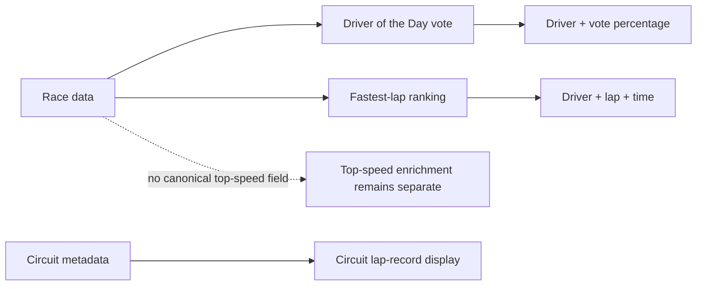

# F1DB data coverage

F1DB is useful as a historical data source for Driver of the Day and fastest
lap results. It is not the source of truth for every performance metric in the
app.

For the shipped artwork slice, revision `v2026.0.1` is imported at build time
from F1DB's circuit SVG collection into local WebP resources. Runtime code
receives only the UI-layer `CircuitArtwork` catalog; it does not parse F1DB
JSON or make an F1DB request.

The generated WebP files retain an alpha channel. The macOS Quick Look
fallback in `tools/f1db/import-circuit-artwork.py` removes its opaque white
rasterization before encoding; otherwise Compose's `SrcIn` tint would color
the entire square instead of only the circuit lines.

## Coverage

| Data | F1DB coverage | App guidance |
|---|---|---|
| Driver of the Day | Yes: vote order, driver, constructor, and vote percentage | Use F1DB when this feature is added |
| Fastest lap time | Yes: per-race driver, lap number, time, ranking, and gaps | Keep `f1api.dev` as the current result source; F1DB is a historical fallback |
| Circuit lap record | Not a single canonical all-time record field | Use the circuit metadata source already selected for Circuit Detail |
| Top speed | No reliable speed-trap/top-speed field | Keep outside F1DB's data contract |
| Circuit artwork | SVG layouts | Import at build time; use local WebP assets at runtime |

F1DB's `driverOfTheDayResults` represents the vote result. A race result can
also carry a `driverOfTheDay` boolean. Its `fastestLaps` collection contains
the fastest-lap ranking and time for each race; a race result can also carry a
`fastestLap` boolean.

```json
{
  "driverOfTheDayResults": [
    {"positionNumber": 1, "driverId": "norris", "percentage": 38.4}
  ],
  "fastestLaps": [
    {"positionNumber": 1, "driverId": "hamilton", "lap": 56,
     "time": "1:30.983", "timeMillis": 90983}
  ]
}
```



## Invariants

- Driver of the Day is a **vote result**, not a race finishing position.
- A fastest lap is tied to a specific race and session context; do not label it
  an all-time circuit record without an explicit aggregation rule.
- F1DB identifiers must be normalized before joining to app driver and
  constructor identifiers.
- Missing Driver of the Day data is a valid empty state, especially for races
  before the vote existed; it is not a network failure.
- Unknown circuit IDs resolve to a neutral local placeholder and never blank a
  surrounding card.

## Implementation shape

When the feature is approved, map F1DB data into a small pure domain model:

```kotlin
data class DriverOfTheDay(
    val driverId: String,
    val constructorId: String?,
    val votePercentage: Double?,
)

data class RaceFastestLap(
    val driverId: String,
    val lap: Int?,
    val time: String?,
    val timeMillis: Long?,
)
```

Keep source DTOs and joins at the data boundary. Screens should receive
domain values and render missing values as an intentional empty state.

## Related lodes

- [Circuit Detail](circuit-most-wins.md)
- [Top-speed semantics](top-speed.md)
- [Race-result source decision](../../decisions/0006-race-results-hybrid-source.md)
- [Project terminology](../../terminology.md)
