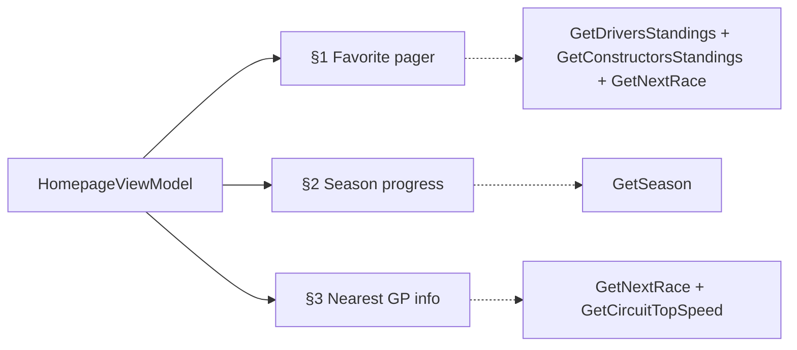

# Homepage — three-section composition

The Homepage (`Homepage` route, the app start destination) is three sections.
Each section fails independently under the ticket-03 ViewModel composition
(4 use cases via `Flow.onStart{load()} + stateIn(WhileSubscribed(5_000))`,
no composite `GetHomepageDataUseCase`).

## Section 1 — Favorite pager (sliding)

A swipeable pager of four cards: **two favorite drivers, one favorite team,
and the nearest-in-date grand prix**. 

- Data: `GetDriversStandingsUseCase` + `GetConstructorsStandingsUseCase`
  (pick the favorited driver/team rows) + `GetNextRaceUseCase` (the GP card).
- Implies a **favorites store** — the user picks 2 drivers + 1 team to pin.
  Storage + picker resolved by ticket 12: `FavoritesCache` DataStore (typed
  keys `FAV_DRIVER_1`/`FAV_DRIVER_2`/`FAV_TEAM`); pick/replace surface is the
  **My Team** top-level tab (tap a slot → `ModalBottomSheet`). First-launch
  default seeds #1 constructor + its two drivers. See
  [tickets/12-design-favorites-picker-ux-storage.md](tickets/12-design-favorites-picker-ux-storage.md).

## Section 2 — Season progress (two vertical blocks)

Left: a **circular progress** showing season-completion percentage. Right:
three cumulative stats — **GP completed, km covered, laps completed**.

- Data: `GetSeasonUseCase` → `Season` model with pre-computed aggregates
  (`completedGp` / `totalKm` / `totalLaps` / `progressPercent`, per ticket 03).
- `totalKm` and `totalLaps` are **client-side sums** over completed rounds
  (`circuitLength` × laps per completed race). Not a free API field.
  `circuitLength` arrives as `"7004km"` on `/current*` — strip non-digits,
  per ticket-03 schema noise. The pre-computation lives in the `Season`
  model mapping, not in a new use case.
- `progressPercent` = `completedGp / scheduledGp`. Circular gauge UI from M3
  or a custom `Canvas` arc — pick at implementation.

## Section 3 — Nearest-date GP info

A card for the next race: **round number, GP name, lap count, corner count,
and the circuit's top speed record**.

- Data: `GetNextRaceUseCase` (round, name, circuit) + a top-speed fetch.
- **Lap count + corner count** — inlined in `GetNextRace`'s race/circuit
  block (`laps: Int`, `circuit.corners: Int`). No extra call.
- **Top speed record** — the live one. f1api.dev has no speed field; the real
  km/h comes from OpenF1 `/v1/laps` `st_speed` (ticket 04 reopened to
  multi-source; ticket 08 closed on this). Requires a `session_key` join.
- New use case: `GetCircuitTopSpeedUseCase(circuitId, year?)` — fetches the
  OpenF1 session for the circuit, then `/v1/laps`, returns `max(st_speed)`.
  Cache strategy: HttpCache (10-min server TTL on OpenF1). The circuit's
  all-time record (vs the latest session's peak) is an open question — see
  [top-speed.md](top-speed.md) for the `st_speed` vs `car_data` trade.

## Use-case surface after this

Ticket 03 named 8 use cases; §3 adds one:

- `GetCircuitTopSpeedUseCase(circuitId, year?)` — OpenF1 `/v1/sessions` +
  `/v1/laps`, returns peak `st_speed` (km/h). Callers: Homepage §3,
  Round-detail top-speed cell.

§1's favorites store is a DataStore concern, not a use case, until a
picker screen exists.

## Data sources cross-reference

| Section | Source | Endpoints |
|---|---|---|
| §1 driver cards | f1api.dev | `/current/drivers-championship` |
| §1 team card | f1api.dev | `/current/constructors-championship` |
| §1 next-GP card + §3 round/name/laps/corners | f1api.dev | `/current/next` |
| §2 aggregates | f1api.dev | `/current` (client-side sum) |
| §3 top speed | OpenF1 | `/v1/sessions` + `/v1/laps` (`st_speed`) |

## Open questions (not blockers)

- **Top speed = latest session peak vs all-time circuit record.** The
  design says "record." OpenF1 `/v1/laps` cannot serve all-time across
  seasons without an N-year scan. Latest-session peak ships first; the
  all-time label is a follow-up or a stat-relabel. See [top-speed.md](top-speed.md).
- **Circular gauge implementation** — M3 component vs custom `Canvas`. Pick
  at implementation, not a spec decision.

## Cross-references

- Ticket 03: `lode/wayfinder/f1app/tickets/03-data-layer-and-refresh.md` —
  use-case table, ViewModel composition, `Season` aggregates.
- Ticket 04: `lode/wayfinder/f1app/tickets/04-api-client-and-enrichment-scope.md`
  — multi-source wiring; one `HttpClient`, per-request base URL.
- Ticket 08: `lode/wayfinder/f1app/top-speed.md` — top-speed API wrangling.
- Architecture: `lode/architecture/architecture.md` — `Homepage` route,
  ViewModel pattern.
