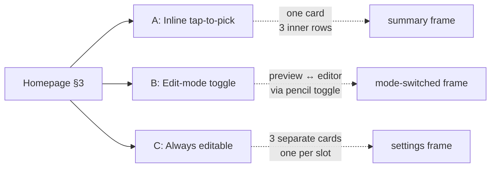

# My Team content on Homepage §3

Research output of the v1 polish pass question: *"if the My Team tab goes
away, where does favorites management live?"* This is a **finding**, not a
decision — the user has explored three variants via prototype and is
evaluating. Commit to a variant when ready; this file captures the
question, the variants, and the structural insight so the decision is
made with the prototype's full context in view.

## Question (verbatim)

> "On subpages, do we need app bar to shown back button or not? Persistent
> bottom nav bar is new for me and i wonder if it suits this kind of app.
> Okay lets try move my team content tab to homepage."

The bottom-nav question produced a separate insight (the bottom nav fits;
see [../summary.md](../summary.md) for the standing position). The
follow-up — fold My Team into Homepage §3 — is what this file tracks.

The honest framing: **the 4th tab doesn't earn its slot for a casual
fan who configures favorites once**. The My Team tab is a settings
surface, used a handful of times in the app's lifetime, while Homepage
§3 already renders a read-only favorites summary. The question is
*where editing lives* once the tab is gone.

## Prototype artifact (throwaway)

`app/src/main/java/com/anpurnama/f1_app/feature/homepage/prototype/MyTeamInlinePrototype.kt`
mounted in place of `HomepageScreen` via a one-line swap in
`NavShell.kt`. Self-contained picker, local-only mutations (no writes to
`FavoritesCache`), floating switcher at the bottom cycling
`A → B → C → A`. Revert is one line: `MyTeamInlinePrototype()` → the
original `HomepageScreen(onPickFavorites = ...)` call. **Delete when
the variant decision is captured.**

**Status: deleted 2026-07-25** (ahead of the build, at user request).
The prototype served its purpose; the file and `NavShell.kt` swap are
gone. The two `private` → `internal` visibility changes on
`Section1Countdown` and `Section2Season` (made to let the prototype
reuse the real §1+§2 as backdrop) are also reverted. The throwaway
phase is closed; the build is the next step.

## Variants

Three structurally different treatments of §3, each answering "where
does editing live?" differently. §1 (countdown) and §2 (season
aggregates) are unchanged across all three — they're the backdrop for
the comparison.

### A — Inline tap-to-pick

§3 is the existing compact preview card (one `Card` containing three
rows). Each row is tappable; tapping a row opens the picker for that
slot directly. No mode toggle. "Change" label on the right of each
row is the affordance.

- **Default appearance:** same as today's §3.
- **Empty state:** three placeholder rows inside the one card, each
  tappable to pick that slot.
- **Visual weight:** light (one card).
- **Reads as:** "summary that happens to be tappable" — the page is
  *showing* you your favorites; editing is one tap away per row.

### B — Edit-mode toggle

§3 has a header with an "Edit" / "Done" text button (top-right). Default
state is the read-only preview (rows not tappable); tapping Edit swaps
the card body into the editor — three full slot cards (the shape of
today's My Team cards), each tappable. Tapping Done returns to the
preview.

- **Default appearance:** preview (read-only) — same shape as A but
  rows don't respond to taps.
- **Empty state:** three placeholder rows in preview; entering Edit
  shows three empty slot cards.
- **Visual weight:** light by default, can become heavy when in Edit
  mode.
- **Reads as:** "summary, with an explicit 'I'm editing now' mode" —
  the page distinguishes *looking* from *changing*.

### C — Always editable

§3 is always the editor — three slot cards stacked, no preview state,
no toggle. Tapping any row opens the picker for that slot.

- **Default appearance:** the slot-card shape (what today's My Team
  cards look like).
- **Empty state:** three empty slot cards (looks like today's My Team
  empty state).
- **Visual weight:** heavy (three cards).
- **Reads as:** "settings surface, right here on home" — the page
  hosts your favorites config without hiding it.

## Structural insight — A vs C is the real axis

A and C look similar in the prototype's switcher (same affordance, same
picker, same data, same accent bar), but the *frame* is different:

| | A | C |
|---|---|---|
| **Container shape** | One card, three rows inside | Three separate cards |
| **Page-center-of-gravity** | Stays on the hero/aggregates | Shifts toward a settings surface |
| **§1 hero reads as** | Magazine-cover hero with supporting data | Decoration on a settings page |
| **§3 reads as** | Personal *data* on an impersonal page | Personal *config* on the same page |

The A↔C trade is not about how editing works — both are "tap a row,
pick." It's about **what the homepage is telling you about itself**.
A keeps §3 in the *results* family with §1 and §2. C promotes §3 to the
*settings* family — three equal-weight cards stacked on a hero and
aggregates. The bleed-to-top aesthetic and the §1 hero treatment
(ADR 0008) are tuned for the results-family reading; C fights that.

B is the hybrid: pay the mode-switch cost once, get the lighter
default. It's a reasonable answer if "I want explicit edit mode" is a
real user need, but the cost (one extra tap for every change, plus
state to remember) is high for a surface the user touches a handful
of times per season.

## Decision (committed 2026-07-25)

Variant A is committed. The §3 favorites card becomes the management
surface (one card, three tappable rows). The `Route.MyTeam` `data
object` and the 4th `NavigationBarItem` are removed; the app has
3 top-level tabs. The empty state is three placeholder rows inside
one card, each tappable to pick that slot — no `Button` CTA.

The artifacts that landed at commit time:

1. **ADR 0010** — `lode/decisions/0010-my-team-content-into-homepage-§3.md`
   (accepted). The load-bearing artifact: someone proposing to add a
   4th tab back in six months hits this first.
2. **Wayfinder ticket 24** — `lode/wayfinder/f1app/tickets/24-favorites-on-homepage.md`
   (closed). The planning decision, references the ADR + this topical
   file.
3. **Build ticket 11** — `lode/plans/f1app-build/tickets/11-favorites-on-homepage.md`
   (ready). The actual code work — delete prototype, revert
   `NavShell.kt`, fold A into `HomepageScreen.kt`, delete
   `MyTeamScreen.kt`, drop the My Team tab from the bottom nav.
4. **`my-team/summary.md`** — marked superseded.
5. **`lode-map.md`** — new entries for the ADR, wayfinder ticket,
   and build ticket.

Open questions that remain after commit (deferred to build + field):

- **Discoverability.** A relies on the per-row "Change" label to
  signal that rows are tappable. First-time users who haven't picked
  any favorites yet will see three placeholder rows inside one card.
  If "Change" proves insufficient, B (edit-mode toggle) is the
  natural fallback — the prototype's B variant composable is gone,
  but the pattern is small enough to rebuild.
- **Empty-state CTA removed.** The "Pick favorites" `Button` goes
  away. The three placeholder rows are themselves the prompt; if
  that's a measurable loss in the field, the build ticket notes it
  as a follow-up.
- **C is rejected for this surface.** A standalone decision to "ship
  C" would imply committing to a settings-first homepage, which is
  a different product than the v1 spec describes.

## Cross-references

- Prototype: `app/src/main/java/com/anpurnama/f1_app/feature/homepage/prototype/MyTeamInlinePrototype.kt`
  (throwaway; delete at commit).
- NavShell swap: `app/src/main/java/com/anpurnama/f1_app/core/navigation/NavShell.kt`
  — `Route.Homepage` entry.
- §1 / §2 backdrop: `app/src/main/java/com/anpurnama/f1_app/feature/homepage/HomepageScreen.kt`
  — `Section1Countdown` / `Section2Season` made `internal` for the
  prototype's reuse; reversible.
- Existing favorites storage: `lode/wayfinder/f1app/tickets/12-design-favorites-picker-ux-storage.md`.
- §3 favorites shape (locked): `lode/wayfinder/f1app/tickets/18-section-3-favorites-shape.md`.
- Bleed-to-top rationale: `lode/decisions/0008-screen-inset-bottom-only-top-bleeds.md`.
- Multi-backstack tab shape: `lode/decisions/0004-multi-backstack-tab-navigation.md`.
- My Team tab (potentially superseded at commit): `lode/my-team/summary.md`.

## Invariants captured (preliminary)

- §1 (countdown) and §2 (season aggregates) stay unchanged across all
  three variants; the variants are isolated to §3.
- The picker (the `ModalBottomSheet` listing current standings with
  "Already selected" disabled state) is the same shape across all
  three variants.
- Favorites mutations during prototype evaluation do not write to
  `FavoritesCache` — the prototype uses a local shadow state.
- The `Route.MyTeam` `data object` and its `entry<Route.MyTeam>` in
  `NavShell.kt` are not removed by this finding; that decision is
  separate and lands at commit time.

## Lessons learned (preliminary)

- A-vs-C is the real design axis, not A-vs-B. B-vs-C is a different
  conversation (mode toggle vs always-on). The prototype's switcher
  was ordered A → B → C, which obscured that A and B share the same
  "preview" frame; a future prototype should consider A/B in one
  group and C in another, or A/B/C in that order with the A↔C
  contrast highlighted.
- The `FavoritesSection` composable in `HomepageScreen.kt` is
  `internal` but the `FavoriteEntry` it uses is `private`. A future
  tappable-§3 refactor would need to either re-expose `FavoriteEntry`
  or duplicate its row rendering in `HomepageScreen.kt`. The
  prototype's row duplication is acceptable for throwaway; the
  real refactor should consider which composable owns the row.
- The bottom-nav discussion that produced this question (4 tabs
  for a widget-first app where the widget is the primary entry) is
  a separate insight worth capturing once the dust settles on
  whether the My Team tab is removed.
