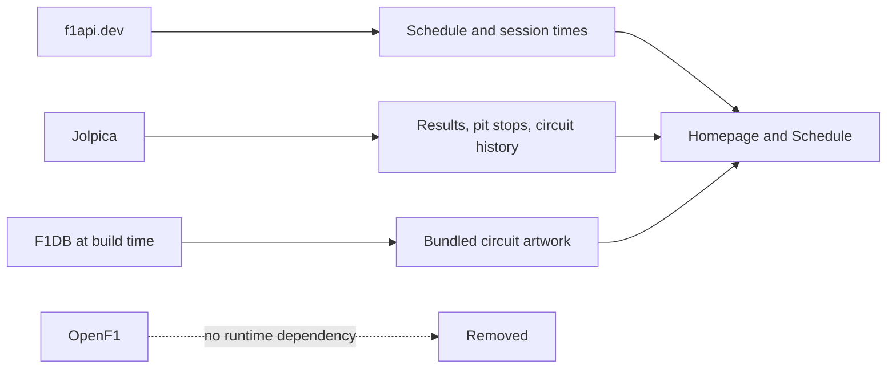

# OpenF1 removal and replacement sources

The app must not depend on OpenF1 at runtime. The replacement keeps the
existing free-source split while making the homepage and enrichment features
available without OpenF1 authentication or paid-tier availability.

## Source ownership

| Feature | Canonical source |
|---|---|
| Countdown sessions | `f1api.dev /current` schedule fields |
| Circuit artwork | F1DB SVG assets bundled at build time |
| Race and session results | Existing `f1api.dev` + Jolpica split |
| Fastest pit stop | Jolpica pit-stop `duration` |
| Circuit history and stats | Jolpica |
| Top speed | Removed from v1, unless later supplied by a build-time FastF1 import |



## Countdown

`RaceSchedule` from `f1api.dev /current` is the only schedule input. Its
non-null session slots are converted to the canonical weekend model and then
used for `nextUpcoming(now)`.

```kotlin
internal fun RaceSchedule.toWeekendSchedule(): WeekendSchedule? =
    WeekendSchedule(activeSessions().mapNotNull { session ->
        session.slot.toInstantOrNull()?.let { SessionTime(session.type, it) }
    }).takeIf { it.sessions.isNotEmpty() }
```

The conversion must preserve UTC instants and must not use country-based
session joins. A missing or partial schedule renders the existing empty or
loading state.

## Circuit artwork

F1DB artwork is imported during development/build time. The app ships a
manifest that maps the primary API's circuit IDs to local resources; it does
not request an image from OpenF1 or another image API.

The bundled catalog should cover all known current, historical, and rotating
F1 circuits represented by F1DB, not copies of each circuit for every season.
The import records the pinned F1DB revision and preserves CC BY 4.0
attribution in the app's third-party notices. Generated WebP files must retain
transparency so the UI can apply the circuit accent with `BlendMode.SrcIn`.

```kotlin
object CircuitArtwork {
    @DrawableRes
    fun forId(id: String): Int? = when (id) {
        "bahrain" -> R.drawable.circuit_bahrain
        "jeddah" -> R.drawable.circuit_jeddah
        "albert_park" -> R.drawable.circuit_albert_park
        else -> null
    }
}
```

Lookup uses circuit ID, never country or round. Returning circuits reuse the
same asset in later seasons. Unknown circuits use the neutral placeholder and
must not fail the surrounding card. A future build-time refresh may add newly
created venues; runtime F1DB/GitHub refresh is not part of v1.

## Enrichments

Jolpica pit-stop records provide a published total `duration`. The replacement
must label and interpret this as pit-stop duration rather than OpenF1's
stationary-time measurement. Missing records hide the optional card.

The current OpenF1 top-speed value has no equivalent in `f1api.dev` or
Jolpica. V1 removes that stat rather than presenting an unsupported
substitute. A later build-time FastF1 importer may generate a checked-in JSON
of official speed-trap values, but FastF1 is not an Android runtime source.

## Removal boundary

Implementation removes `OPENF1_BASE`, OpenF1 DTOs and Ktor extensions,
`GetRaceWeekendScheduleUseCase`, `GetCircuitImageUseCase`,
`GetCircuitTopSpeedUseCase`, OpenF1 country mappings, and the homepage image
loading atom. `GetFastestPitstopUseCase` is rewritten against Jolpica. Coil
can be removed if no other feature uses it.

## Invariants and rationale

- No production code imports or calls OpenF1.
- Schedule identity comes from `f1api.dev`; no country-only circuit join is
  allowed.
- Circuit artwork is deterministic and available offline for the bundled
  catalog.
- Optional data failure never blanks the primary schedule or result surface.
- Top speed is not shown unless its source and measurement semantics are
  explicit.

This is the smallest reliable design: it removes the paid-tier risk without
introducing a second runtime artwork service. See
[homepage.md](homepage.md), [top-speed.md](top-speed.md),
[ticket 03](tickets/03-data-layer-and-refresh.md), and
[ticket 04](tickets/04-api-client-and-enrichment-scope.md). This document
records the shipped source boundary; older research notes that mention OpenF1
remain historical context only.
