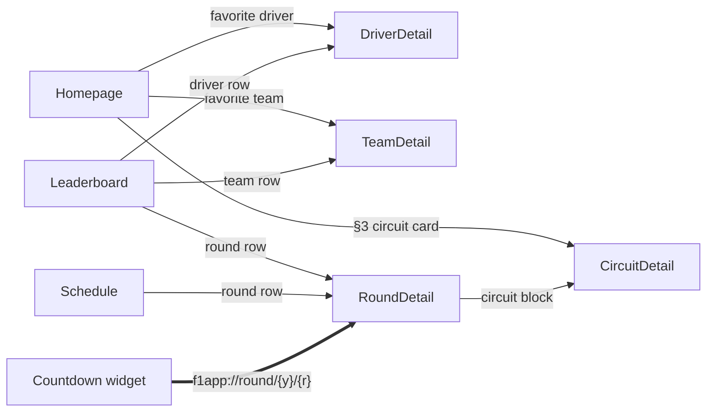

## Decision

Navigation 3 (locked by ticket 01). Seven nav routes, one custom-scheme deep
link from the Countdown widget.

### Routes

`@Serializable` `NavKey` route objects in `core/navigation/`:

- `data object Homepage : NavKey` — start destination
- `data object Schedule : NavKey`
- `data object Leaderboard : NavKey`
- `data class DriverDetail(val driverId: String) : NavKey`
- `data class TeamDetail(val teamId: String) : NavKey`
- `data class RoundDetail(val year: Int, val round: Int) : NavKey`
- `data class CircuitDetail(val circuitId: String) : NavKey` — opened from
  RoundDetail's circuit block, the home for the two circuit-scoped research
  stats (top speed — ticket 08; most-wins — ticket 09). Not a homepage entry
  point.

Entry points:

### Deep link (widget → RoundDetail)

- **Custom scheme:** `f1app://round/{year}/{round}`.
- **Construction:** the Countdown `RemoteViews`/Glance widget builds a
  `PendingIntent` from a `Intent.ACTION_VIEW` with data
  `f1app://round/{year}/{round}`, read from `NextRaceCache` (fields
  `NEXT_RACE_SEASON` / `NEXT_RACE_ROUND` already written by `CountdownWorker`).
- **Parsing:** `MainActivity` reads `intent.data` and, if the host is
  `round`, parses `{year}` / `{round}` path segments → `RoundDetail` nav key,
  pushes it onto the Navigator. No config activity (matches the reference).
- **Backstack:** Homepage is always the backstack root. A deep-link cold launch
  seeds `[Homepage, RoundDetail]`; back from `RoundDetail` lands on Homepage,
  not on exit. A warm-launch deep link pushes `RoundDetail` onto the existing
  root.
- **Scope:** custom scheme only — no App Links / `autoVerify` (no web domain
  to verify against; this is a single-app deep link, not a public URL).

### Nav graph wiring

- `NavDisplay` host in `MainActivity` content slot renders the current nav
  key from `NavigationState`.
- Transitions: default Navigation 3 `NavDisplay` transitions (no custom
  per-route transition for the initial build — YAGNI; revisit if the detail
  screens feel flat).
- No nested nav graphs — 7 flat routes with no shared subgraphs.

## Rationale

- The open sections of this ticket's original framing (Navigation-Compose vs
  Navigation 3; module placement of nav) were closed by ticket 01: Navigation
  3, nav code in `core/navigation` inside the single `:app`.
- The only live product decision was the widget deep-link target: Dashboard
  (Homepage) vs `RoundDetail`. Chose `RoundDetail` — the widget already
  knows the next race via `NextRaceCache`, so the args are free; landing the
  user on the race being counted down to is the more useful UX.
- `CircuitDetail` added after the original route list because both
  circuit-scoped research use cases (08 top speed, 09 most wins at circuit)
  need a screen. Landing on `RoundDetail → CircuitDetail` gives those two
  stats a home without inventing a nav-graph rewrite. `getCircuit(id)` was
  already specified as an extension on `F1Api.kt` in ticket 03 with "no use
  case until a standalone screen" — this is that screen.
- Custom scheme (no App Links) because the deep link is single-app only;
  adding `autoVerify` + a `.well-known` file would be ceremony for no public
  entry point.

## Out of scope (parking)

- **Driver Timeline Graph widget** — already ruled out at the map level.
- **Other widget deep links** — only Countdown is in scope; the 7 secondary
  widget types are out of scope.
- **App Links / `autoVerify`** — not needed without a public web domain.

## Reference

- [../../architecture.md](../../../architecture/architecture.md) — Navigation 3
  decision, `core/navigation` location, route objects.
- [../../map.md](../map.md) — destination spec, scope, nav route list.
- Ticket 01: `lode/wayfinder/f1app/tickets/01-architecture-and-modules.md`.
- Ticket 03: `lode/wayfinder/f1app/tickets/03-data-layer-and-refresh.md` —
  `getCircuit(id)` extension, `NextRaceCache` keys.
- Ticket 06: `lode/wayfinder/f1app/tickets/06-widget-technology.md` — the
  widget side of the `PendingIntent` (Glance vs RemoteViews).
